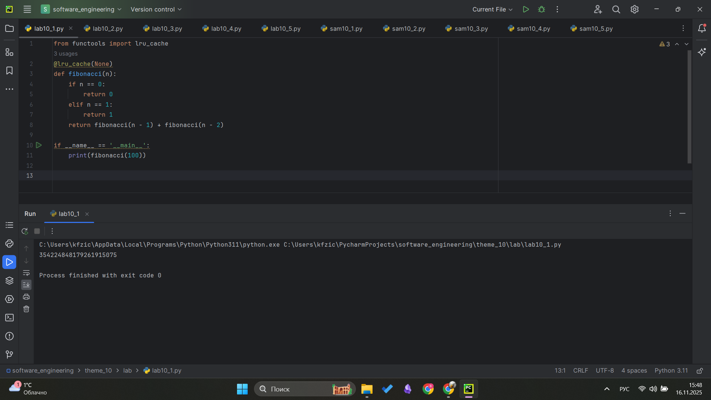
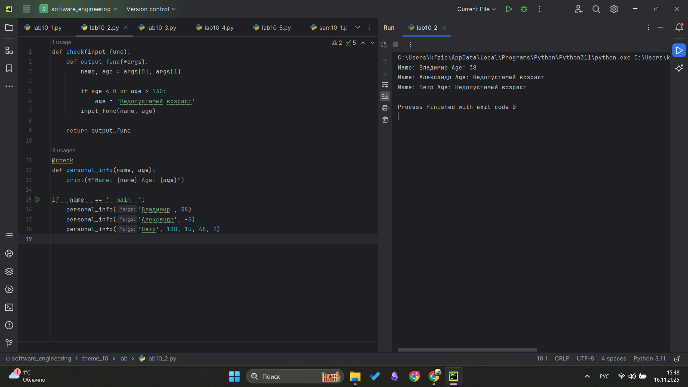
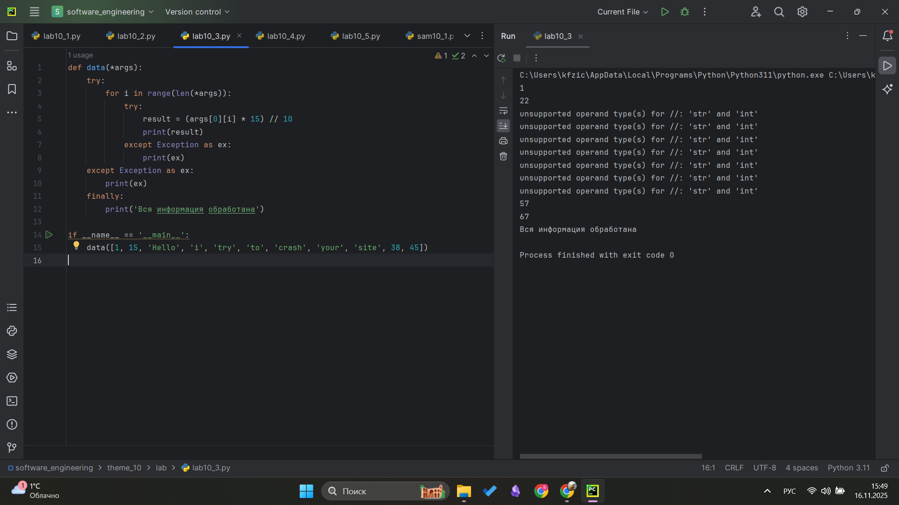
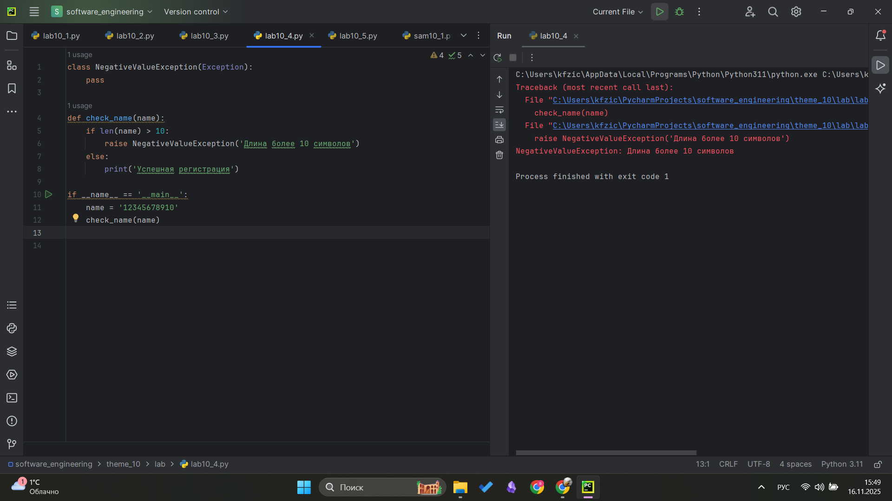
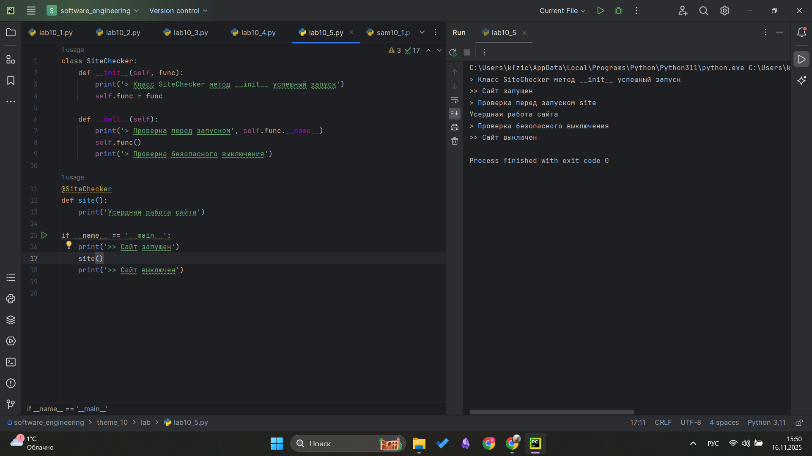
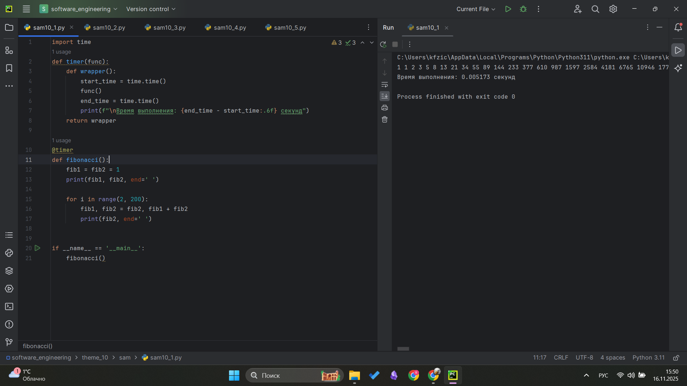
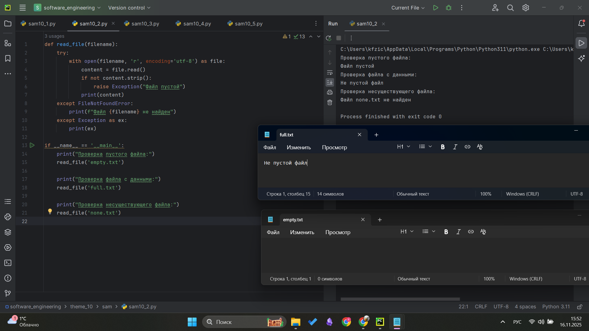
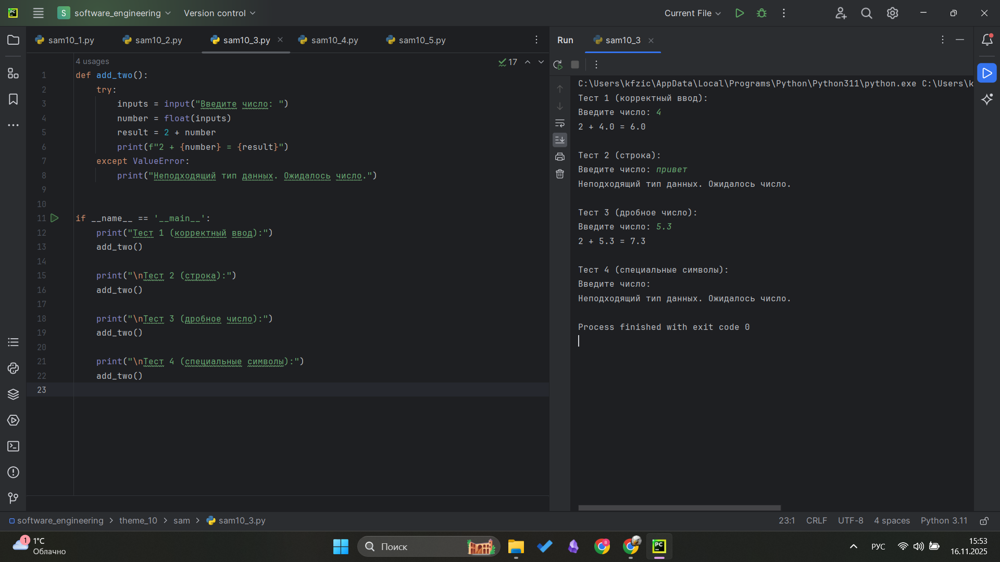
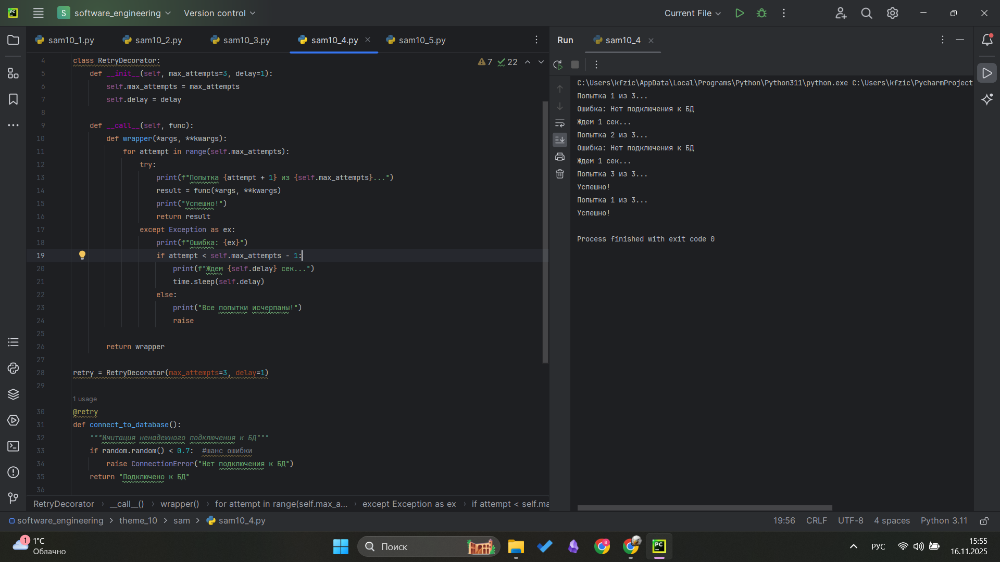
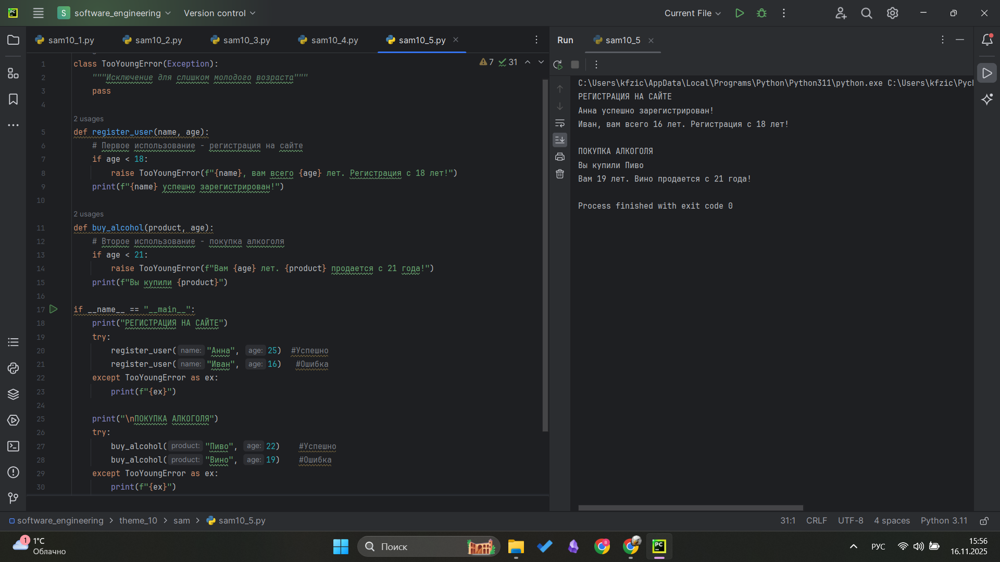

# Тема 10. Декораторы и исключения
Отчет по Теме #10 выполнил(а):
- Фомин Владислав Андреевич
- ПИЭ-23-1

| Задание | Лаб_раб | Сам_раб |
| ------ | ------ | ------ |
| Задание 1 | + | + |
| Задание 2 | + | + |
| Задание 3 | + | + |
| Задание 4 | + | + |
| Задание 5 | + | + |


Работу проверили:
- к.э.н., доцент Панов М.А.

## Лабораторная работа №1
### Наверняка вы думаете, что декораторы — это какая-то бесполезная вещь, которая вам никогда не пригодится, но тут вдруг на паре по математике преподаватель просит всех посчитать число Фибоначчи для 100. Кто-то будет считать вручную (так точно не нужно), кто-то посчитает на калькуляторе, а кто-то подумает, что он самый крутой и напишет рекурсивную программу на Python и немного огорчится, потому что данная программа будет достаточно долго считаться, если ее просто так запускать. Но именно тут к вам на помощь приходят декораторы, например @lru_cache (он предназначен для решения задач динамическим программированием, если простыми словами, то этот декоратор запоминает промежуточные результаты и при рекурсивном вызове функции программа не будет считать одни и те же значения, а просто "возьмёт их из этого декоратора"). Вам нужно написать программу, которая будет считать числа Фибоначчи для 100 и запустить ее без этого декоратора и с ним, посмотреть на разницу во времени решения поставленной задачи.
```python
from functools import lru_cache
@lru_cache(None)
def fibonacci(n):
    if n == 0:
        return 0
    elif n == 1:
        return 1
    return fibonacci(n - 1) + fibonacci(n - 2)

if __name__ == '__main__':
    print(fibonacci(100))
```
### Результат.


## Выводы
Изучил работу декортаторов на примере @lru_cache, который значительно ускоряет вычисление фибоначчи

## Лабораторная работа №2
### Илья пишет свой сайт и ему необходимо сделать минимальную проверку ввода данных пользователя при регистрации. Для этого он реализовал функцию, которая выводит данные пользователя на экран и решил, что будет проверять правильность введённых данных при помощи декоратора, но в этом ему потребовалась ваша помощь. Напишите декоратор для функции, который будет принимать все параметры вызываемой функции (имя, возраст) и проверять чтобы возраст был больше 0 и меньше 130. Причем заметьте, что неважно сколько пользователь введет данных на сайт к Илье, будут обрабатываться только первые 2 аргумента.
```python
def check(input_func):
    def output_func(*args):
        name, age = args[0], args[1]

        if age < 0 or age > 130:
            age = 'Недопустимый возраст'
        input_func(name, age)

    return output_func

@check
def personal_info(name, age):
    print(f"Name: {name} Age: {age}")

if __name__ == '__main__':
    personal_info('Владимир', 38)
    personal_info('Александр', -5)
    personal_info('Петр', 138, 15, 48, 2)
```
### Результат.


## Выводы
Был написан декоратор который проверяет входные данные функции и обрабатывают только нужные аргументы

## Лабораторная работа №3
### Вам понравилась идея Ильи с сайтом, и вы решили дальше работать вместе с ним. Но вот в вашем проекте появилась проблема, кто-то пытается сломать вашу функцию с получением данных для сайта. Эта функция работает только с данными integer, а какой-то недохакер пытается все сломать и вместо нужного типа данных отправляет string. Воспользуйтесь исключениями, чтобы неподходящий тип данных не ломал ваш сайт. Также дополнительно можете обернуть весь код функции в try/except/finally для того, чтобы программа вас оповестила о том, что выявлена какая-то ошибка или программа успешно выполнена.
```python
def data(*args):
    try:
        for i in range(len(*args)):
            try:
                result = (args[0][i] * 15) // 10
                print(result)
            except Exception as ex:
                print(ex)
    except Exception as ex:
        print(ex)
    finally:
        print('Вся информация обработана')

if __name__ == '__main__':
    data([1, 15, 'Hello', 'i', 'try', 'to', 'crash', 'your', 'site', 38, 45])
```
### Результат.


## Выводы
Была изучена обработка исключений для защиты программы от некорректных данных

## Лабораторная работа №4
### Продолжая работу над сайтом, вы решили написать собственное исключение, которое будет вызываться в случае, если в функцию проверки имени при регистрации передана строка длиннее десяти символов, а если имя имеет допустимую длину, то в консоль выводиться "Успешная регистрация"

```python
class NegativeValueException(Exception):
    pass

def check_name(name):
    if len(name) > 10:
        raise NegativeValueException('Длина более 10 символов')
    else:
        print('Успешная регистрация')

if __name__ == '__main__':
    name = '12345678910'
    check_name(name)
```
### Результат.


## Выводы
Написано собственное исключение через класс

## Лабораторная работа №5
### После запуска сайта вы поняли, что вам необходимо добавить логгер, для отслеживания его работы. Готовыми вариантами вы не захотели пользоваться, и поэтому решили создать очень простую пародию. Для этого создали две функции: __init__() (вызывается при создании класса декоратора в программе) и _call__() (вызывается при вызове декоратора). Создайте необходимый вам декоратор. Выведите все логи в консоль.

```python
class SiteChecker:
    def __init__(self, func):
        print('> Класс SiteChecker метод __init__ успешный запуск')
        self.func = func

    def __call__(self):
        print('> Проверка перед запуском', self.func.__name__)
        self.func()
        print('> Проверка безопасного выключения')

@SiteChecker
def site():
    print('Усердная работа сайта')

if __name__ == '__main__':
    print('>> Сайт запущен')
    site()
    print('>> Сайт выключен')
```
### Результат.


## Выводы
Научился создавать декораторы через класс, используя методы init и call

## Самостоятельная работа №1
### Вовочка решил заняться спортивным программированием на python, но для этого он должен знать за какое время выполняется его программа. Он решил, что для этого ему идеально подойдет декоратор для функции, который будет выяснять за какое время выполняется та или иная функция. Помогите Вовочке в его начинаниях и напишите такой декоратор. Подсказка: необходимо использовать модуль time Декоратор необходимо использовать для этой функции:
```python
import time
def timer(func):
    def wrapper():
        start_time = time.time()
        func()
        end_time = time.time()
        print(f"\nВремя выполнения: {end_time - start_time:.6f} секунд")
    return wrapper

@timer
def fibonacci():
    fib1 = fib2 = 1
    print(fib1, fib2, end=' ')

    for i in range(2, 200):
        fib1, fib2 = fib2, fib1 + fib2
        print(fib2, end=' ')


if __name__ == '__main__':
    fibonacci()
```
### Результат.


## Выводы
Научился использовать декораторы для измерения скорости работы программы, убедился что циклы работают быстрее рекурсии

## Самостоятельная работа №2
### СПосмотрев на Вовочку, вы также загорелись идеей спортивного программирования, начав тренировки вы узнали, что для решения некоторых задач необходимо считывать данные из файлов. Но через некоторое время вы столкнулись с проблемой что файлы бывают пустыми, и вы не получаете вводные данные для решения задачи. После этого вы решили не просто считывать данные из файла, а всю конструкцию оборачивать в исключения, чтобы избежать такой проблемы. Создайте пустой файл и файл, в котором есть какая-то информация. Напишите код программы. Если файл пустой, то, нужно вызвать исключение (“бросить исключение") и вывести в консоль "файл пустой", а если он не пустой, то вывести информацию из файла.
```python
def read_file(filename):
    try:
        with open(filename, 'r', encoding='utf-8') as file:
            content = file.read()
            if not content.strip():
                raise Exception("Файл пустой")
            print(content)
    except FileNotFoundError:
        print(f"Файл {filename} не найден")
    except Exception as ex:
        print(ex)

if __name__ == '__main__':
    print("Проверка пустого файла:")
    read_file('empty.txt')

    print("Проверка файла с данными:")
    read_file('full.txt')

    print("Проверка несуществующего файла:")
    read_file('none.txt')
```
### Результат.


## Выводы
Попробовал обработать исключения при работе с файлами

## Самостоятельная работа №3
### Напишите функцию, которая будет складывать 2 и введенное пользователем число, но если пользователь введет строку или другой неподходящий тип данных, то в консоль выведется ошибка "Неподходящий тип данных. Ожидалось число.". Реализовать функционал программы необходимо через try/except и подобрать правильный тип исключения. Создавать собственное исключение нельзя. Проведите несколько тестов, в которых исключение вызывается и нет. Результатом выполнения задачи будет листинг кода и получившийся вывод в консоль
```python
def add_two():
    try:
        inputs = input("Введите число: ")
        number = float(inputs)
        result = 2 + number
        print(f"2 + {number} = {result}")
    except ValueError:
        print("Неподходящий тип данных. Ожидалось число.")


if __name__ == '__main__':
    print("Тест 1 (корректный ввод):")
    add_two()

    print("\nТест 2 (строка):")
    add_two()

    print("\nТест 3 (дробное число):")
    add_two()

    print("\nТест 4 (специальные символы):")
    add_two()
```
### Результат.


## Выводы
Научился обрабатывать исключение ValueError

## Самостоятельная работа №4
### Создайте собственный декоратор, который будет использоваться для двух любых вами придуманных функций. Декораторы, которые использовались ранее в работе нельзя воссоздавать. Результатом выполнения задачи будет: класс декоратора, две как-то связанными с ним функциями, скриншот консоли с выполненной программой и подробные комментарии, которые будут описывать работу вашего кода. Декоратор автоматически перезапускает функции при ошибках. Он полезен для операций, которые могут временно не работать - например, подключение к интернету или базе данных. Функция connect_to_database() имитирует подключение к базе данных. Функция download_file() имитирует загрузку файла. Декоратор пытается выполнить функцию несколько раз. Если первая попытка неудачна, он ждет и пробует снова. Так продолжается, пока операция не выполнится или не кончатся попытки.

```python
import time
import random

class RetryDecorator:
    def __init__(self, max_attempts=3, delay=1):
        self.max_attempts = max_attempts
        self.delay = delay

    def __call__(self, func):
        def wrapper(*args, **kwargs):
            for attempt in range(self.max_attempts):
                try:
                    print(f"Попытка {attempt + 1} из {self.max_attempts}...")
                    result = func(*args, **kwargs)
                    print("Успешно!")
                    return result
                except Exception as ex:
                    print(f"Ошибка: {ex}")
                    if attempt < self.max_attempts - 1:
                        print(f"Ждем {self.delay} сек...")
                        time.sleep(self.delay)
                    else:
                        print("Все попытки исчерпаны!")
                        raise

        return wrapper

retry = RetryDecorator(max_attempts=3, delay=1)

@retry
def connect_to_database():
    """Имитация ненадежного подключения к БД"""
    if random.random() < 0.7:  #шанс ошибки
        raise ConnectionError("Нет подключения к БД")
    return "Подключено к БД"

@retry
def download_file(url):
    """Имитация ненадежной загрузки"""
    if random.random() < 0.6:  #шанс ошибки
        raise TimeoutError("Таймаут загрузки")
    return f"Файл {url} загружен"

if __name__ == "__main__":
    connect_to_database()
    download_file("https://example.com/file.txt")
```
### Результат.


## Выводы
Написал декоратор для обработки временных сбоев, который автоматически повторяет выполнение функций при ошибках.

## Самостоятельная работа №5
### Создайте собственное исключение, которое будет использоваться в двух любых фрагментах кода. Исключения, которые использовались ранее в работе нельзя воссоздавать. Результатом выполнения задачи будет: класс исключения, код к котором в двух местах используется это исключение, скриншот консоли с выполненной программой и подробные комментарии, которые будут описывать работу вашего кода. Программа проверяет возрастные ограничения через собственное исключение TooYoungError. Две функции используют это исключение для контроля доступа - регистрация на сайте (с 18 лет) и покупка алкоголя (с 21 года)

```python
class TooYoungError(Exception):
    """Исключение для слишком молодого возраста"""
    pass

def register_user(name, age):
    # Первое использование - регистрация на сайте
    if age < 18:
        raise TooYoungError(f"{name}, вам всего {age} лет. Регистрация с 18 лет!")
    print(f"{name} успешно зарегистрирован!")

def buy_alcohol(product, age):
    # Второе использование - покупка алкоголя
    if age < 21:
        raise TooYoungError(f"Вам {age} лет. {product} продается с 21 года!")
    print(f"Вы купили {product}")

if __name__ == "__main__":
    print("РЕГИСТРАЦИЯ НА САЙТЕ")
    try:
        register_user("Анна", 25)  #Успешно
        register_user("Иван", 16)   #Ошибка
    except TooYoungError as ex:
        print(f"{ex}")

    print("\nПОКУПКА АЛКОГОЛЯ")
    try:
        buy_alcohol("Пиво", 22)    #Успешно
        buy_alcohol("Вино", 19)    #Ошибка
    except TooYoungError as ex:
        print(f"{ex}")
```
### Результат.


## Выводы
Научился создавать собственные исключения для проверки конкретных условий

## Общие выводы по теме
В ходе работы я освоил создание и применение декораторов для оптимизации и мониторинга кода, а также научился обрабатывать ошибки с помощью встроенных и собственных исключений, чтобы делать программы надежнее.
