# Тема 2. Базовые операции языка Python
Отчет по Теме #2 выполнил(а):
- Фомин Владислав Андреевич
- Пиэ-23-1

| Задание | Лаб_раб | Сам_раб |
| ------ | ------ | ------ |
| Задание 1 | + | + |
| Задание 2 | + | + |
| Задание 3 | + | + |
| Задание 4 | + | + |
| Задание 5 | + | + |
| Задание 6 | + | + |
| Задание 7 | + | + |
| Задание 8 | + | + |
| Задание 9 | + | + |
| Задание 10 | + | + |

Работу проверили:
- к.э.н., доцент Панов М.А.

## Лабораторная работа №1
### Выведите в консоль три строки. Первая – любое число. Вторая – любое число в виде строки. Третья – любое число с плавающей точкой.

```python
print(123)
print('123')
print('1.23')
```

### Результат.
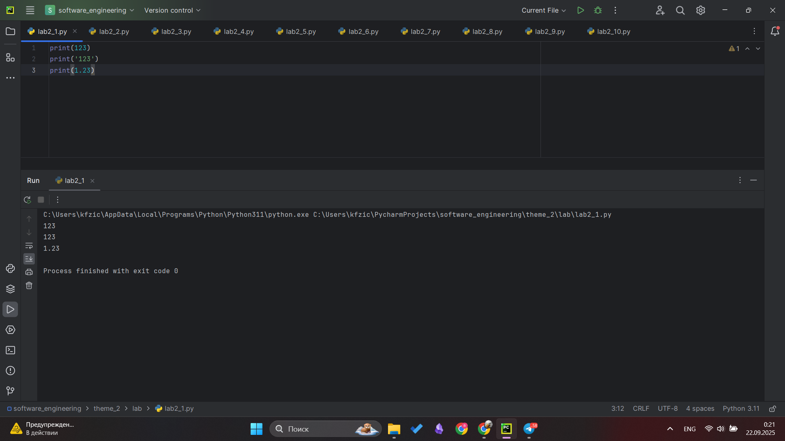

## Выводы
Ознакомился с базовой функцией print для вывода(str,int,float)

## Лабораторная работа №2
### Выведите в консоль три строки. Первая – результат сложения или вычитания минимум двух переменных типа int. Вторая – результат сложения или вычитания минимум двух переменных типа float. Третья – результат сложения или вычитания минимум двух переменных типа int и float.

```python
print(1823 - 486)
print(5.1 + 8.27)
print(3 + 7.04 + 1 + 2.33)
```

### Результат.
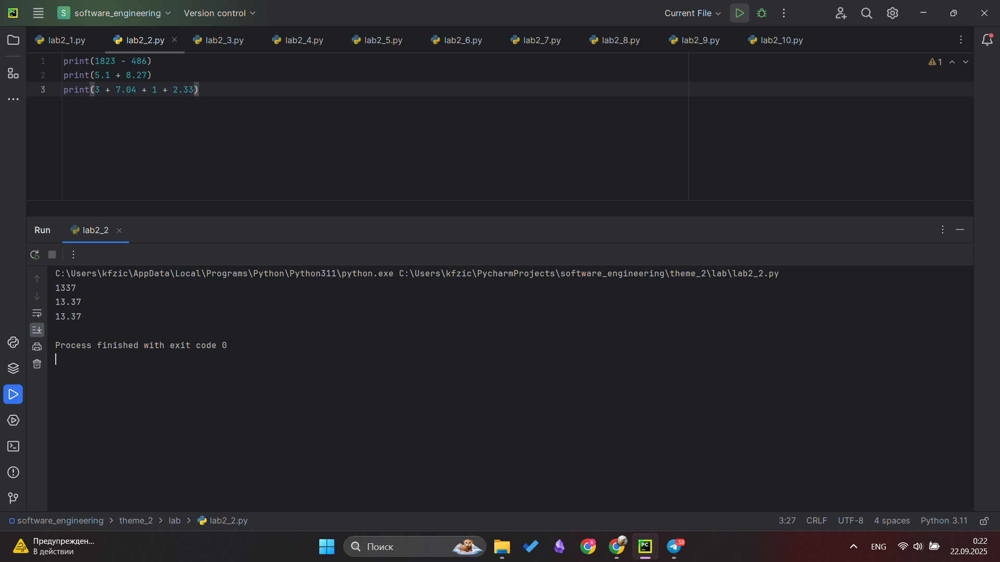

## Выводы
Ознакомился с базовой функцией print для вывода. Действия при выводе с int, float

## Лабораторная работа №3
### Выведите в консоль три строки. Первая – обычная строка. Вторая – F строка с использованием заранее объявленной переменной. Третья – сложите две или более строк в одну.

```python
print('Привет, Мир!')

world = 'Мир'
print(f"Привет, {world}!")

one = 'Привет, '
two = 'Мир!'
print(one + two)
```

### Результат.
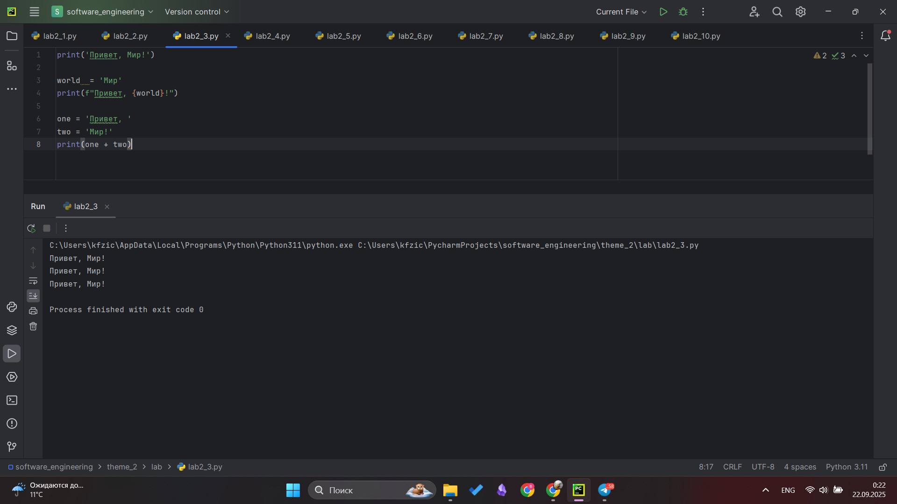

## Выводы
Ознакомился с базовой функцией print для вывода: прямой вывод строки, использование f-строк, сложение двух строк

## Лабораторная работа №4
### Выведите в консоль три строки. Первая – трансформация любого типа переменной в bool. Вторая – трансформация любого типа переменной в float или int. Третья – трансформация любого типа переменной в str.

```python
one = 'Hello'
print(bool(one))

two = 142
print(float(two))

three = None
print(str(three))
```

### Результат.
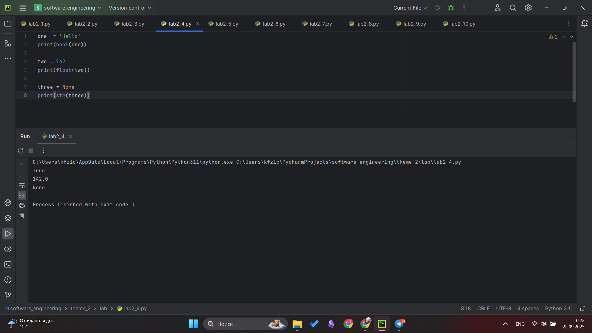

## Выводы
Изучил как различные данные преобразовываются в другой тип(boolean, float, str)

## Лабораторная работа №5
### Присвойте трем переменным различные значения, воспользовавшись функцией input().

```python
one = input('one: ')
two = input('two: ')
three = input('three: ')
print(one, two, three)
```

### Результат.
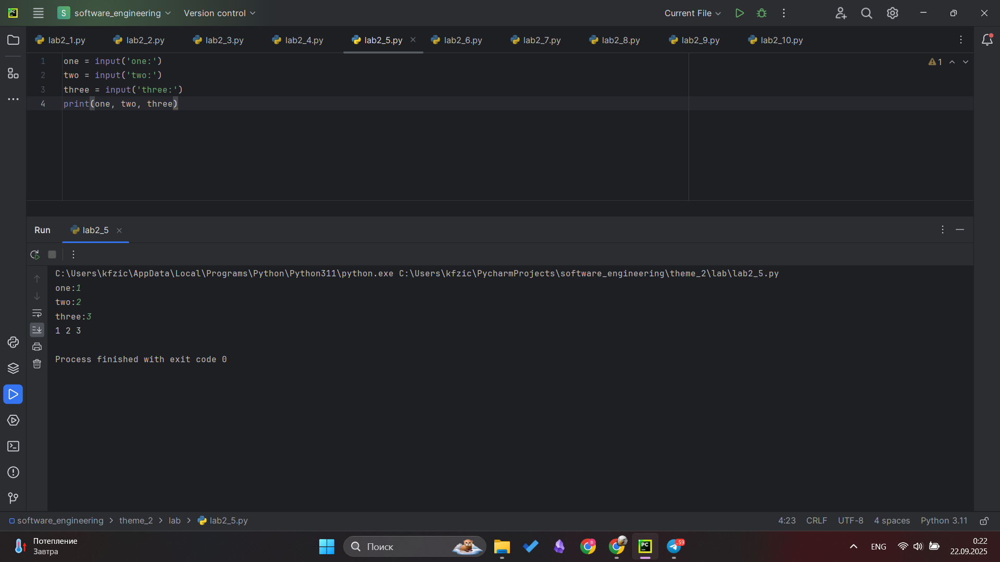

## Выводы
Изучил как работает ф-я input и проверил вывод с помощью print

## Лабораторная работа №6
### Создайте две любые числовые переменные и выполните над ними несколько математических операций: возведение в степень, обычное деление, целочисленное деление, нахождение остатка от деления.

```python
a = 12
b = 5
print('Возведение в степень: ', a ** b)
print('Обычное деление: ', a / b)
print('Целочисленное деление: ', a // b)
print('Нахождение остатка от деления: ', a % b)
```

### Результат.
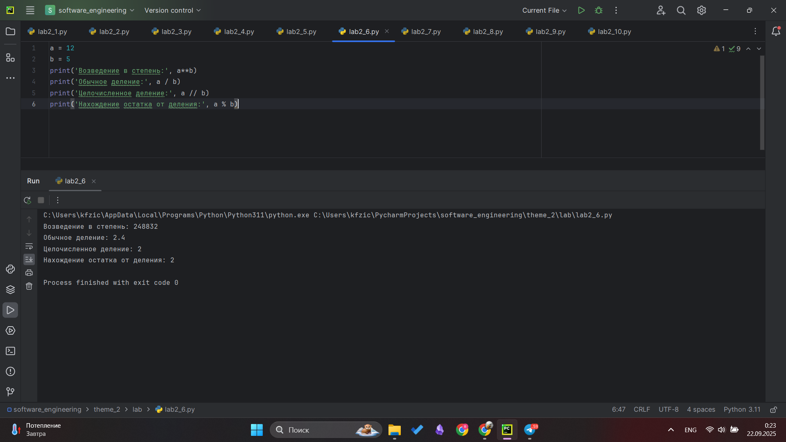

## Выводы
Произвел различные арифметически операции

## Лабораторная работа №7
### Создайте любую строковую переменную и произведите над ней математическое действие умножение на любое число.

```python
line = 'Hello!'
print(line * 6)
```

### Результат.
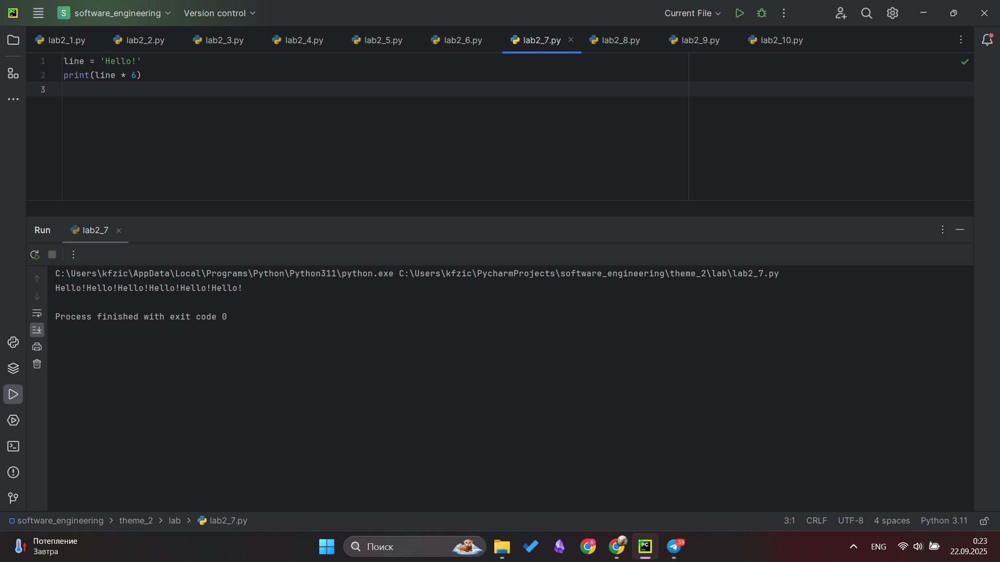

## Выводы
Узнал как реализовавается действие умножение над строковыми типами данных при выводе

## Лабораторная работа №8
### Посчитайте сколько раз символ ‘o’ встречается в строке ‘Hello World’.

```python
sentence = 'Hello World'
print(sentence.count('o'))
```

### Результат.


## Выводы
Изучил встроенную функцию count для подсчета опр символов в строке

## Лабораторная работа №9
### Напишите предложение ‘Hello World’ в две строкы. Написанная программа должна занимать одну строку в редакторе кода.

```python
print('Hello\nWorld')
```

### Результат.
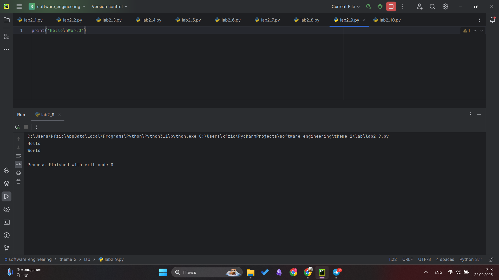

## Выводы
Изучен символ для переноса на новую строку при выводе

## Лабораторная работа №10
### Из предложения ‘Hello World’ выведите в консоль только 2 символ, а затем выведите слово ‘Hello’

```python
sentence = 'Hello World'
print(sentence[1])
print(sentence[:5])
```

### Результат.


## Выводы
Изучена операция среза для извлечения отдельных символов

## Самостоятельная работа №1
### Выведите в консоль булевую переменную False, не используя слово False в строке или изначально присвоенную булевую переменную. Программа должна занимать не более двух строк редактора кода.

```python
print(1 == 2)
```

### Результат.
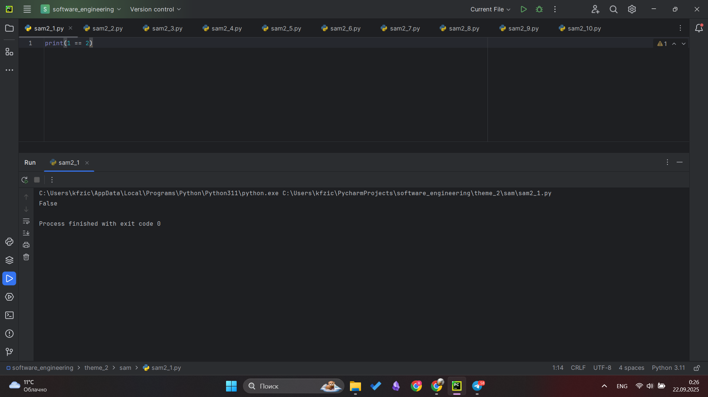

## Выводы
Получил булева значение используя только ф-ю вывода

## Самостоятельная работа №2
### Присвоить значения трем переменным и вывести их в консоль, используя только две строки редактора кода

```python
a, b, c = 1, 2, 3
print(a, b, c)
```

### Результат.
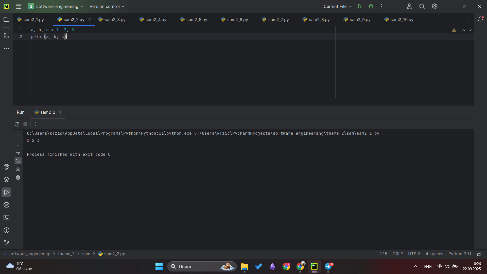

## Выводы
Присвоил значение сразу нескольким переменным в одной строке

## Самостоятельная работа №3
### Реализуйте ввод данных в программу, через консоль, в виде только целых чисел (тип данных int). То есть при вводе буквенных символов в консоль, программа не должна работать. Программа должна занимать не более двух строк редактора кода.

```python
a = int(input())
print(a)
```

### Результат.
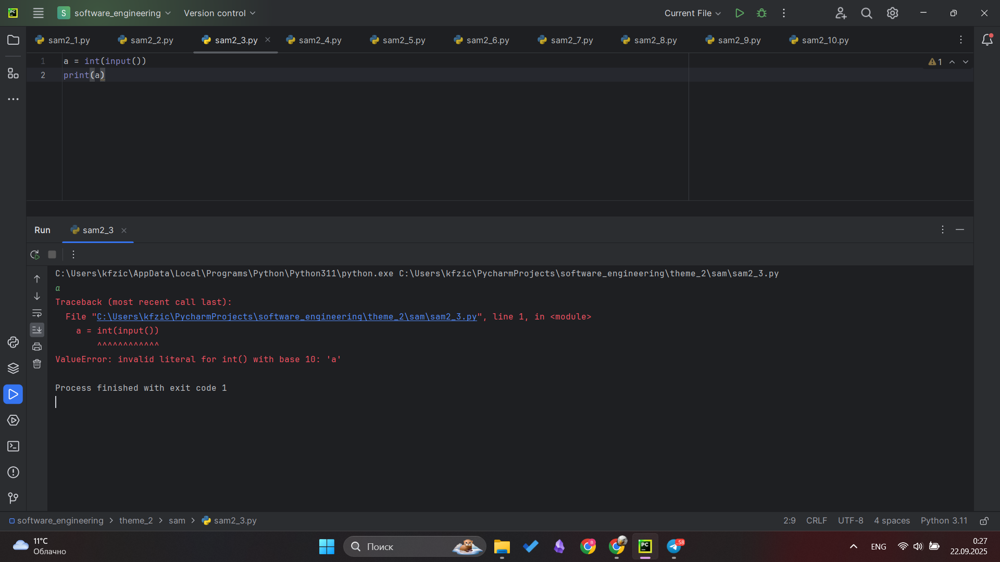

## Выводы
Реализовал ввод данных с клавиатуры, чтобы могли ввести только int

## Самостоятельная работа №4
### Создайте только одну строковую переменную. Длина строки должна не превышать 5 символов. На выходе мы должны получить строку длиной не менее 16 символов. Программа должна занимать не более двух строк редактора кода.

```python
str = 'test1'
print(str*4)
```

### Результат.
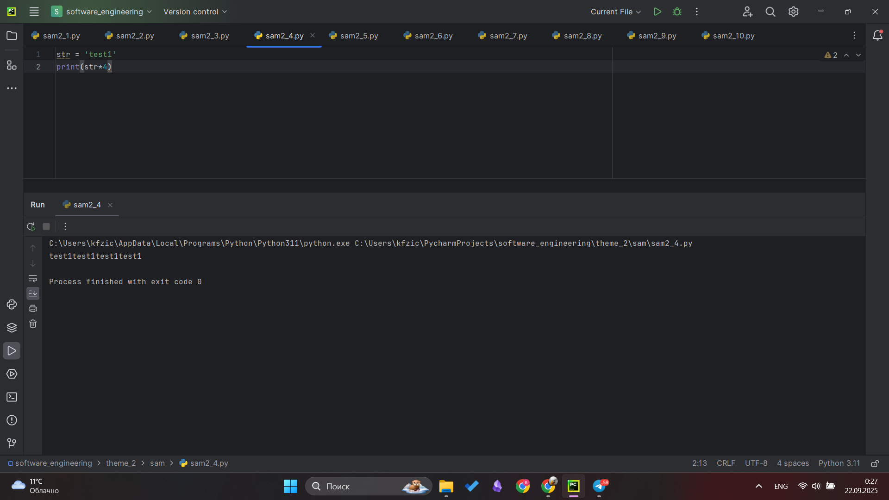

## Выводы
Использовал ф-ю умножения для вывода строки в которой 5 символов, для вывода в 16+ символов

## Самостоятельная работа №5
### Создайте три переменные: день (тип данных - числовой), месяц (тип данных - строка), год (тип данных - числовой) и выведите в консоль текущую дату в формате: "Сегодня день месяц год. Всего хорошего!" используя F строку и оператор end внутри print(), в котором вы должны написать фразу "Всего хорошего!". Программа должна занимать не более двух строк редактора кода.

```python
day, month, year = 10, 'september', 2025
print(f"Сегодня {day} {month} {year}.", end=" Всего хорошего!")
```

### Результат.
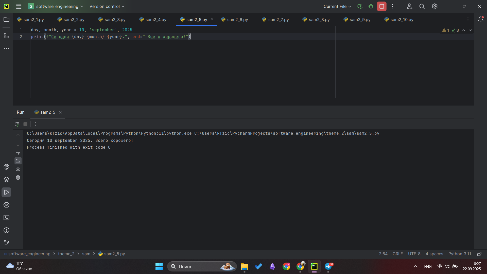

## Выводы
Реализовал решение через F строку и end

## Самостоятельная работа №6
### В предложении 'Hello World' вставьте 'my' между двумя словами. Выведите полученное предложение в консоль в одну строку. Программа должна занимать не более двух строк редактора кода.

```python
str = 'Hello world'
print(str[:6] + "my " + str[6:])
```

### Результат.
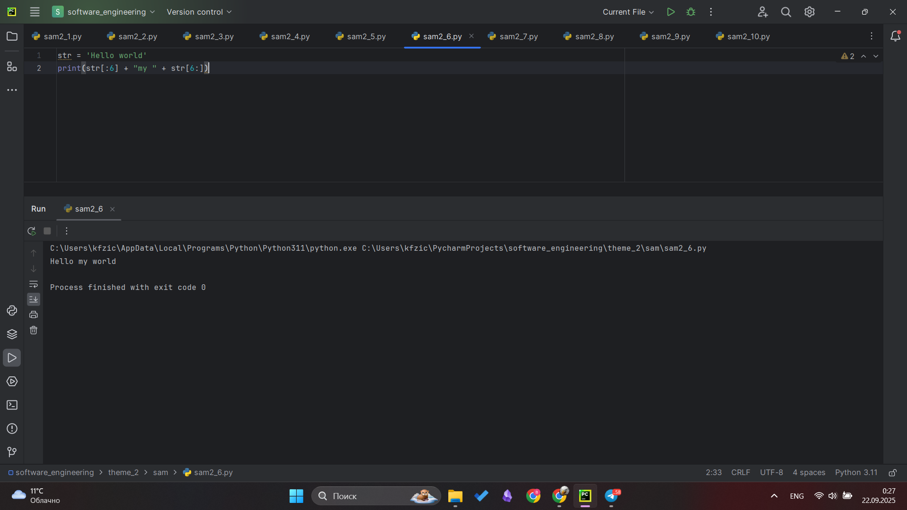

## Выводы
Решил данную задачу при помощи разбиения строки

## Самостоятельная работа №7
### Узнайте длину предложения 'Hello World', результат выведите в консоль. Программа должна занимать не более двух строк редактора кода.

```python
str = 'Hello world'
print(len(str))
```

### Результат.


## Выводы
Использовал встроенную ф-ю len для опредения длины строки.

## Самостоятельная работа №8
### Переведите предложение 'HELLO WORLD' в нижний регистр. Программа должна занимать не более двух строк редактора кода.

```python
str = 'HELLO WORLD'
print(str.lower())
```

### Результат.


## Выводы
Использовал для решения встроенную ф-ю lower()

## Самостоятельная работа №9
### Самостоятельно придумайте задачу по проходимой теме и решите ее. Задача должна быть связанна со взаимодействием с числовыми значениями. 
#Найти сумму квадратов двух чисел, введенных с клавиатуры

```python
a, b = map(int, input().split())
print(a**2 + b**2)
```

### Результат.
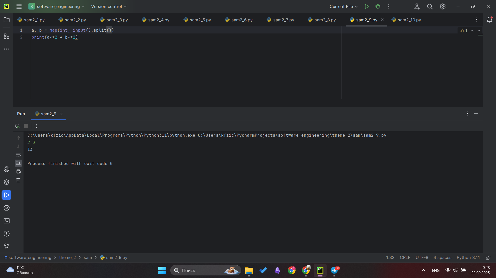

## Выводы
Узнал о том как ввести в клавиатуры сразу несколько значений для переменный с помощью map(), а split() позволяет ввести данные для каждой переменной отдельно через пробел


## Самостоятельная работа №10
### Самостоятельно придумайте задачу по проходимой теме и решите ее. Задача должна быть связанна со взаимодействием со строковыми значениями.
#Проверить является ли строка палиндромом

```python
str = input()
print(str == str[::-1])
```

### Результат.
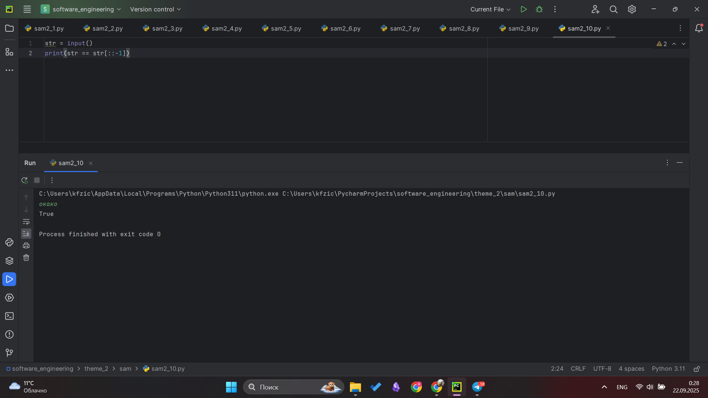

## Выводы
Использовал метод разделения строки для решения [::-1] - переворачивает строку и если она равна изначально строке выводит true

## Общие выводы по теме
В ходе изучения темы были освоены базовые операции языка Python: работа с ключевыми типами данных — числами (int, float), строками (str), булевыми значениями (bool), а также арифметические операции и методы обработки строк. Особенно полезными оказались f-строки, метод разделения строки  и гибкие возможности функции print(), позволяющие управлять выводом. Эти знания формируют прочную базу для дальнейшего продвижения в программировании на Python и разработки более сложных приложений. Практика помогла лучше понять принципы динамической типизации и особенности преобразования типов в языке
