# Тема 4. Функции и модули
Отчет по Теме #3 выполнил(а):
- Фомин Владислав Андреевич
- ПИЭ-23-1

| Задание | Лаб_раб | Сам_раб |
| ------ | ------ | ------ |
| Задание 1 | + | + |
| Задание 2 | + | + |
| Задание 3 | + | + |
| Задание 4 | + | + |
| Задание 5 | + | + |
| Задание 6 | + |  |
| Задание 7 | + |  |
| Задание 8 | + |  |
| Задание 9 | + |  |
| Задание 10 | + |  |

Работу проверили:
- к.э.н., доцент Панов М.А.

## Лабораторная работа №1
### Напишите функцию, которая выполняет любые арифметические действия и выводит результат в консоль. Вызовите функцию используя "точку входа".
```python
def main():
    print(2+2)

if __name__ == '__main__':
    main()
```
### Результат.
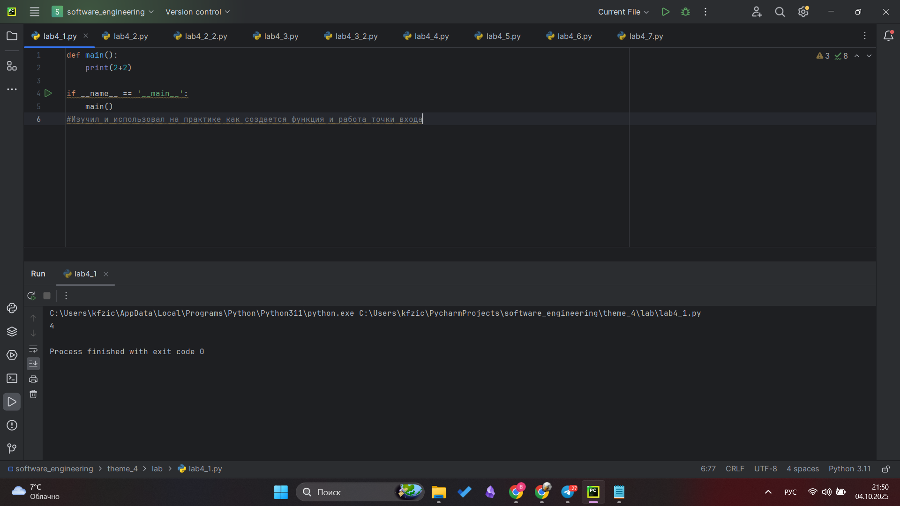

## Выводы
Изучил и использовал на практике как создается функция и работа точки входа

## Лабораторная работа №2
### Напишите функцию, которая выполняет любые арифметические действия, возвращает при помощи return значение в место, откуда вызывали функцию. Выведите результат в консоль. Вызовите функцию используя "точку входа".
```python
def main():
    return 2+2

if __name__ == '__main__':
    print(main())

def main():
    result = 2 + 2
    return result

if __name__ == '__main__':
    answer = main()
    print(answer)
```
### Результат.
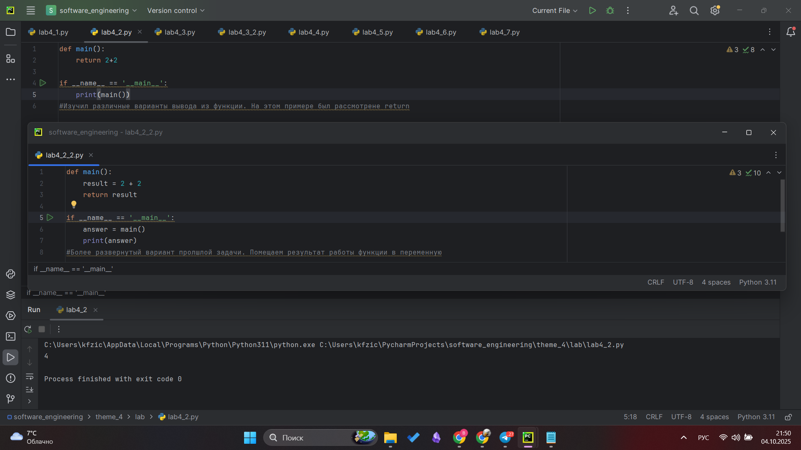

## Выводы
Изучил различные варианты вывода из функции. На этом примере был рассмотрене return

## Лабораторная работа №3
### Напишите функцию, в которую передаются два аргумента, над ними производится арифметическое действие, результат возвращается туда, откуда эту функцию вызывали. Выведите результат в консоль.Вызовите функцию в любом небольшом цикле.

```python
def main(one, two):
    result = one + two
    return result

for i in range(5):
    x = 1
    y = 10
    answer = main(x, y)
    print(answer)

def main(one, two):
    return one + two

for i in range(5):
    answer = main(one = 1, two = 5)
    print(answer)
```
### Результат.
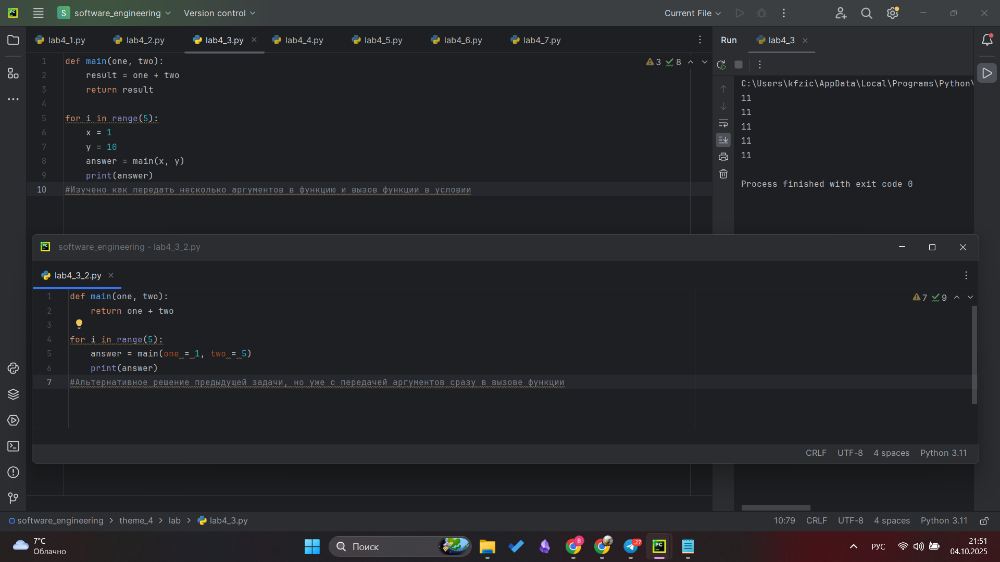

## Выводы
Изучено как передать несколько аргументов в функцию и вызов функции в условии

## Лабораторная работа №4
### Напишите функцию, на вход которой подается какое-то изначальное неизвестное количество аргументов, над которыми будет производится арифметические действия. Для выполнения задания необходимо использовать кортеж "*args". На скриншоте ниже приведен пример такой программы с комментариями.

```python
def main(x, *args):
    one = x
    two = sum(args)
    three = float(len(args))
    print(f"one={one}\ntwo={two}\nthree={three}")
    return x + sum(args) / float(len(args))

if __name__ == '__main__':
    result = main(10,0,1,2,-1,0,-1,1,2)
    print(f"\nresult={result}")
```
### Результат.
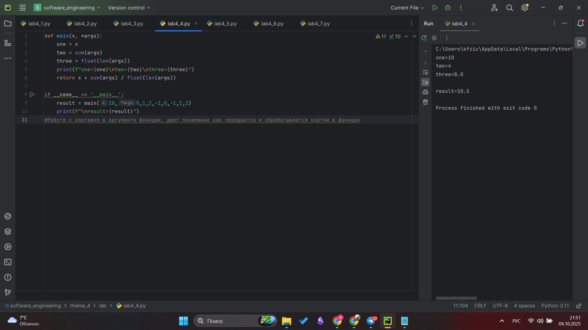

## Выводы
Работа с кортежом в аргументе функции, дает понимание как передается и обрабатывается кортеж в функции

## Лабораторная работа №5
### Напишите функцию, которая на вход получает кортеж "**kwargs" и при помощи цикла выводит значения, поступившие в функцию. На скриншоте ниже указаны два варианта вызова функции с "**kwargs" и два варианта работы с данными, поступившими в эту функцию.

```python
def main(**kwargs):
    for i in kwargs.items():
        print(i[0], i[1])

    print()

    for key in kwargs:
        print(f"{key} = {kwargs[key]}")

if __name__ == '__main__':
    main(x = [1,2,3], y = [3,3,0], z = [2,3,0], q = [3,3,0], w = [3,3,0])
    print()
    main(**{'x': [1,2,3], 'y': [3,3,0]})
```
### Результат.
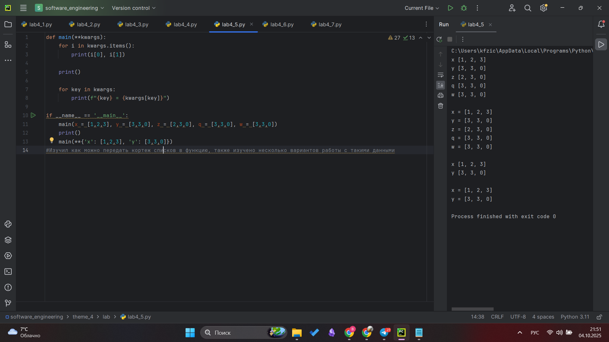

## Выводы
Изучил как можно передать кортеж списков в функцию, также изучено несколько вариантов работы с такими данными

## Лабораторная работа №6
### Напишите две функции. Первая получает в виде параметра "**kwargs". Вторая считает среднее арифметическое из значений первой функции. Вызовите первую функцию используя "точку входа" и минимум 4 аргумента.
```python
def main(**kwargs):
    for i, j in kwargs.items():
        print(f"{i}. Mean = {mean(j)}")

def mean(data):
    return sum(data) / float(len(data))

if __name__ == '__main__':
    main(x=[1,2,3], y=[3,3,0])
```
### Результат.
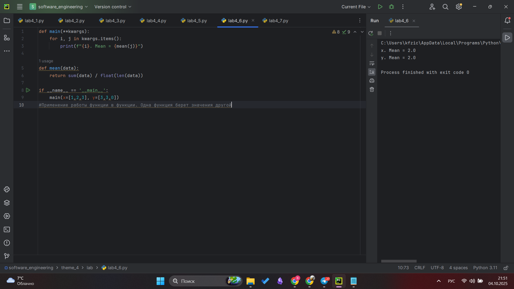

## Выводы
Применение работы функции в функции. Одна функция берет значения другой

## Лабораторная работа №7
### Создайте дополнительный файл.ру. Напишите в нем любую функцию, которая будет что угодно выводить в консоль, но не вызывайте ее в нем. Откройте файл main.py, импортируйте в него функцию из нового файла и при помощи "точки входа" вызовите эту функцию.
```python
def say_hello():
    print('Hello students!')

from for_import import say_hello

if __name__ == '__main__':
    say_hello()
```
### Результат.
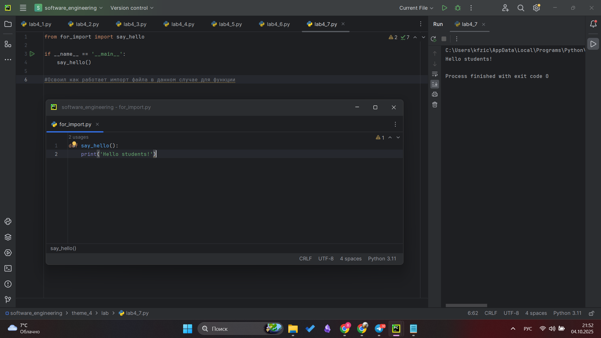

## Выводы
Освоил как работает импорт файла в данном случае для функции

## Лабораторная работа №8
### Напишите программу, которая будет выводить корень, синус, косинус полученного от пользователя числа.
```python
import math
def main():
    value = int(input('Введите значение: '))
    print(math.sqrt(value))
    print(math.sin(value))
    print(math.cos(value))

if __name__ == '__main__':
    main()
```
### Результат.
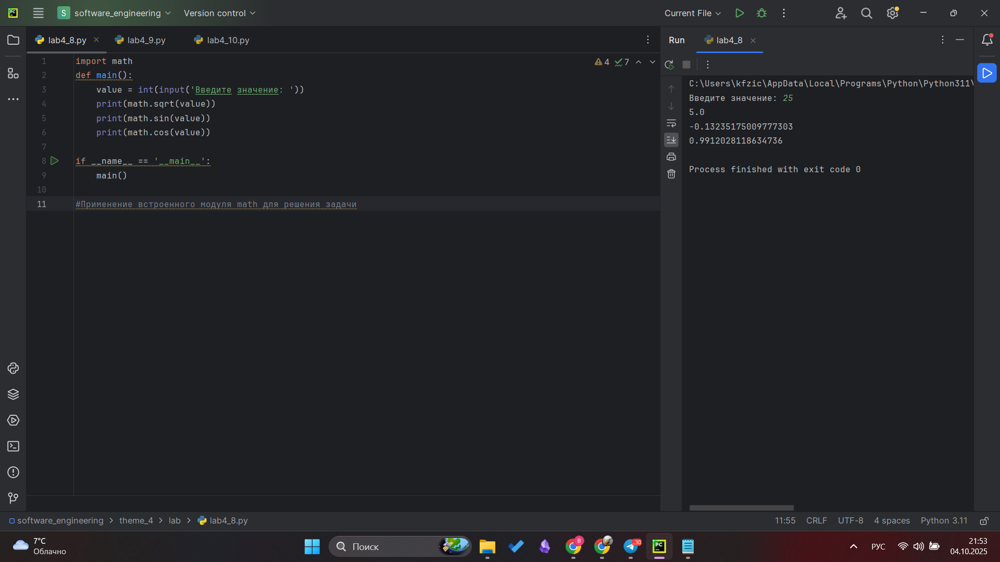

## Выводы
Применение встроенного модуля math для решения задачи

## Лабораторная работа №9
### Напишите программу с использованием вложенных циклов и одной проверкой внутри них. Самое главное, не забудьте, что нельзя использовать одинаковые имена итерируемых переменных, когда вы используете вложенные циклы.
```python
from datetime import datetime as dt, timedelta as td

def main():
    print(
        f"Сегодня {dt.today().date()}. "
        f"День недели - {dt.today().isoweekday()}"
    )
    n = int(input('Введите количество дней: '))
    today = dt.today()
    result = today + td(days=n)
    print(
        f"Через {n} дней будет {result.date()}. "
        f"День недели - {result.isoweekday()}"
    )

if __name__ == '__main__':
    main()
```
### Результат.
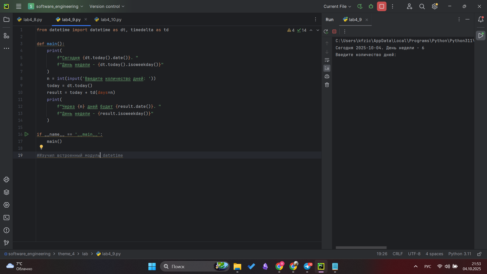

## Выводы
Изучил встроенный модуль datetime

## Лабораторная работа №10
### Напишите программу с использованием глобальных переменных, которая будет считать площадь треугольника или прямоугольника в зависимости от того, что выберет пользователь. Получение всей необходимой информации реализовать через input(), а подсчет площадей выполнить при помощи функций. Результатом программы будет число, равное площади, необходимой фигуры.
```python
global result

def rectangle():
    a = float(input("Ширина = "))
    b = float(input("Высота = "))
    global result
    result = a * b

def triangle():
    a = float(input("Основание = "))
    h = float(input("Высота= "))
    global result
    result = 0.5 * a * h

figure = input("1-прямоугольник, 2-треугольник: ")
if figure == '1':
    rectangle()
elif figure == '2':
    triangle()

print(f"Площадь: {result}")
```
### Результат.
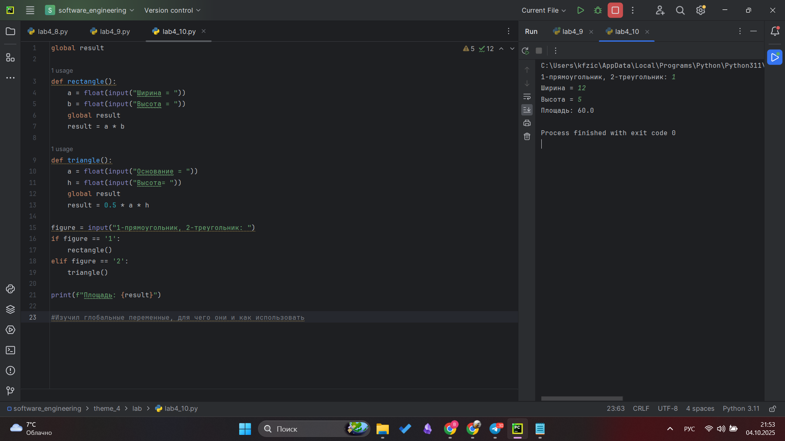

## Выводы
Изучил глобальные переменные, для чего они и как использовать

## Самостоятельная работа №1
### Дайте подробный комментарий для кода, написанного ниже.Комментарий нужен для каждой строчки кода, нужно описать что она делает. Не забудьте, что функции комментируются по-особенному.
```python
from datetime import datetime #импорт модуля datetime
from math import sqrt #импорт модуля math

def main(**kwargs): #объявление ф-ии
    """
    ф-ия принимает произвольное количество аргументов (kwargs)
    каждый аргумент — это список из двух чисел [x, y]
    для каждого аргумента вычисляется длина вектора (гипотенуза) по формуле sqrt(x² + y²)
    и выводится результат
    """
    for key in kwargs.items(): #перебираем все элементы krwargs
        result = sqrt(key[1][0] ** 2 + key[1][1] ** 2) #гипотенуза
        print(result) #вывод результата

if __name__ == '__main__': #точка входа
    start_time = datetime.now() #время начала выполнения программы
    main(
        one = [10,3],
        two = [5,4],
        three = [15,13],
        four = [93,53],
        five = [133,15]
    ) #передаем значения в аргументы
    time_costs = datetime.now() - start_time # вычисляем, сколько времени заняло выполнение программы
    print(f"Время выполнения программы - {time_costs}") # выводим время выполнения

```
### Результат.
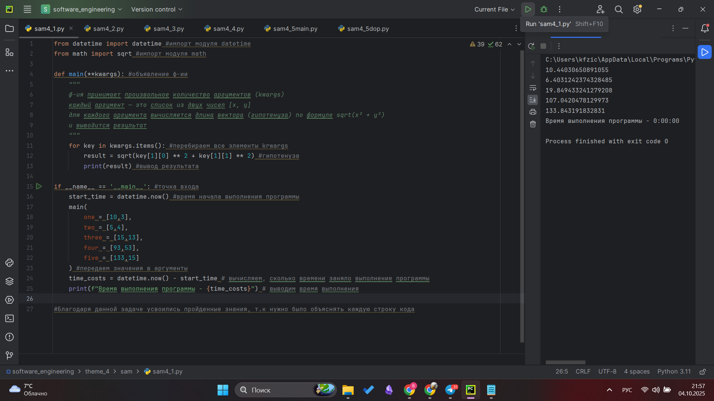

## Выводы
Благодаря данной задаче усвоились пройденные знания, т.к нужно было объяснять каждую строку кода

## Самостоятельная работа №2
### Напишите программу, которая будет заменять игральную кость с 6 гранями. Если значение равно 5 или 6, то в консоль выводится «Вы победили», если значения 3 или 4, то вы рекурсивно должны вызвать эту же функцию, если значение 1 или 2, то в консоль выводится «Вы проиграли». При этом каждый вызов функции необходимо выводить в консоль значение "кубика". Для выполнения задания необходимо использовать стандартную библиотеку random. Программу нужно написать, используя одну функцию и "точку входа"
```python
from random import randint
def kubik():
    value = randint(1,6)
    print(f"Выпало: {value}")
    if value == 5 or value == 6:
        print("Вы победили")
    elif value == 1 or value == 2:
        print("Вы проиграли")
    else:
        kubik()

if __name__ == '__main__':
    kubik()
```
### Результат.
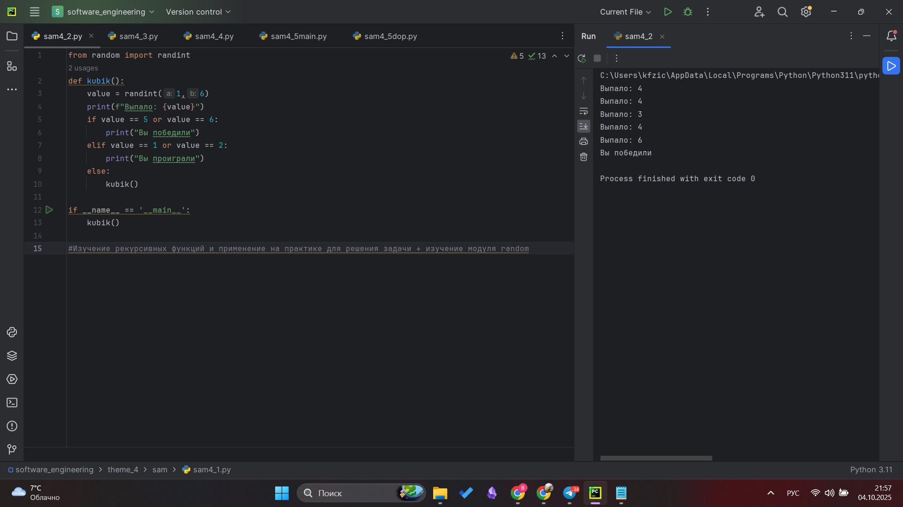

## Выводы
Изучение рекурсивных функций и применение на практике для решения задачи + изучение модуля random

## Самостоятельная работа №3
### Напишите программу, которая будет выводить текущее время, с точностью до секунд на протяжении 5 секунд. Программу нужно написать с использованием цикла. Подсказка: необходимо использовать модуль datetime и time, а также вам необходимо как-то "усыплять" программу на 1 секунду.
```python
from datetime import datetime
from time import sleep

def show_time():
    for i in range(5):
        now = datetime.now().strftime("%H:%M:%S")
        print(now)
        sleep(1)

if __name__ == "__main__":
    show_time()
```
### Результат.
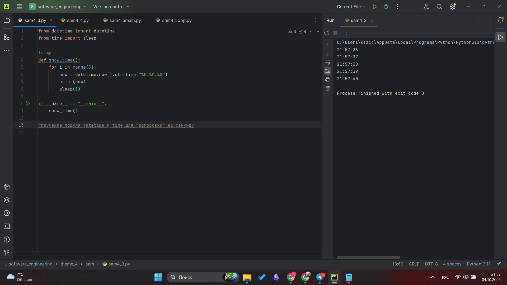

## Выводы
Изучение модуля datetime и time для "заморозки" на секунду

## Самостоятельная работа №4
### Напишите программу, которая считает среднее арифметическое от аргументов вызываемое функции, с условием того, что изначальное количество этих аргументов неизвестно. Программу необходимо реализовать используя одну функцию и "точку входа".
```python
def average(*args):
    return sum(args) / len(args)

if __name__ == '__main__':
    print(average(1,5,3,2,-1,0))
```
### Результат.
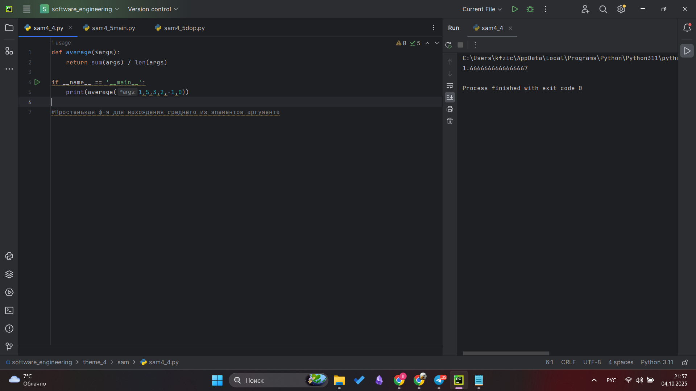

## Выводы
Простенькая ф-я для нахождения среднего из элементов аргумента

## Самостоятельная работа №5
### Создайте два Python файла, в одном будет выполняться вычисление площади треугольника при помощи формулы Герона (необходимо реализовать через функцию), а во втором будет происходить взаимодействие с пользователем (получение всей необходимой информации и вывод результатов). Напишите эту программу и выведите в консоль полученную площадь.
```python
from math import sqrt
def heron_area(a, b, c):
    if a + b <= c or a + c <= b or b + c <= a:
        return None
    p = (a + b + c) / 2
    s = sqrt(p * (p - a) * (p - b) * (p - c))
    return s

from sam4_5dop import heron_area

if __name__ == "__main__":
    print("Введите длины сторон треугольника")
    a = float(input("Сторона a: "))
    b = float(input("Сторона b: "))
    c = float(input("Сторона c: "))

    result = heron_area(a, b, c)

    if result is None:
        print("Треугольник с такими сторонами не существует")
    else:
        print(f"Площадь треугольника = {result}")
```
### Результат.
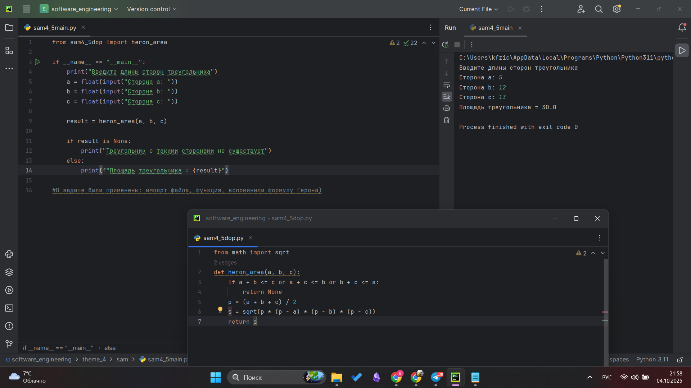

## Выводы
В задаче были применены: импорт файла, функция, вспоминили формулу Герона)

## Общие выводы по теме
В ходе выполнения работы я изучил основы создания и использования функций в Python, работу с аргументами, возврат значений через return, а также применение встроенных модулей (math, datetime, time, random). Освоил принципы импорта функций из других файлов и использование точки входа. На практике закрепил понятия области видимости переменных, рекурсии и модульности кода. Полученные знания позволяют писать более структурированные, читаемые и универсальные программы.
