# Тема 5. Базовые коллекции: строки и списки
Отчет по Теме #5 выполнил(а):
- Фомин Владислав Андреевич
- ПИЭ-23-1

| Задание | Лаб_раб | Сам_раб |
| ------ | ------ | ------ |
| Задание 1 | + | + |
| Задание 2 | + | + |
| Задание 3 | + | + |
| Задание 4 | + | + |
| Задание 5 | + | + |
| Задание 6 | + |  |
| Задание 7 | + |  |
| Задание 8 | + |  |
| Задание 9 | + |  |
| Задание 10 | + |  |

Работу проверили:
- к.э.н., доцент Панов М.А.

## Лабораторная работа №1
### Друзья предложили вам поиграть в игру "найди отличия и убери повторения (версия для программистов)". Суть игры состоит в том, что на вход программы поступает два множества, а ваша задача вывести все элементы первого, которых нет во втором. А вы как раз недавно прошли множества и знаете их возможности, поэтому это не составит для вас труда.
```python
set_1 = {'White', 'Black', 'Red', 'Pink'}
set_2 = {'Red', 'Green', 'Blue', 'Red'}
print('1', set_1 - set_2)

set_1 = {'White', 'Black', 'Red', 'Pink', 'Black', 'White'}
set_2 = {'Red', 'Green', 'Blue', 'Red'}
print('2', set_1 - set_2)

set_1 = {'White', 'Black', 'Red', 'Pink', 'Red', 'Red'}
set_2 = {'Red', 'Green', 'Blue', 'Red', 'Red', 'Red'}
print('3', set_1 - set_2)
```
### Результат.
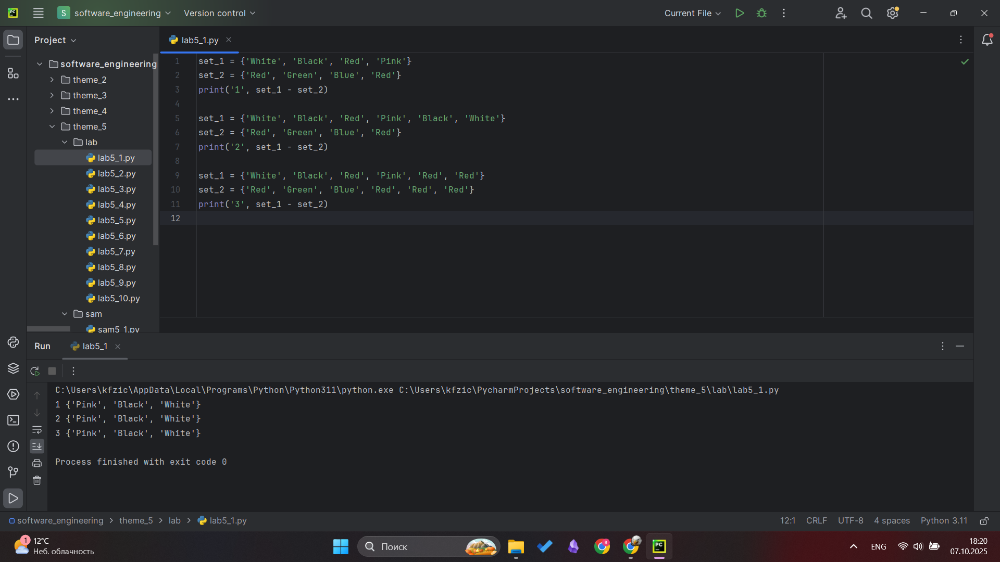

## Выводы
Изучил как работает разность множеств на различных вариантах

## Лабораторная работа №2
### Напишите две одинаковые программы, только одна будет использовать set(), а вторая frozenset() и попробуйте к исходному множеству добавить несколько элементов, например, через цикл.
```python
a = set('abcdefg')
print(a)
for i in range(1, 5):
    a.add(i)
print(a)

b = frozenset('abcdefg')
print(b)
for i in range(1,5):
    b.add(i)
print(b)
```
### Результат.
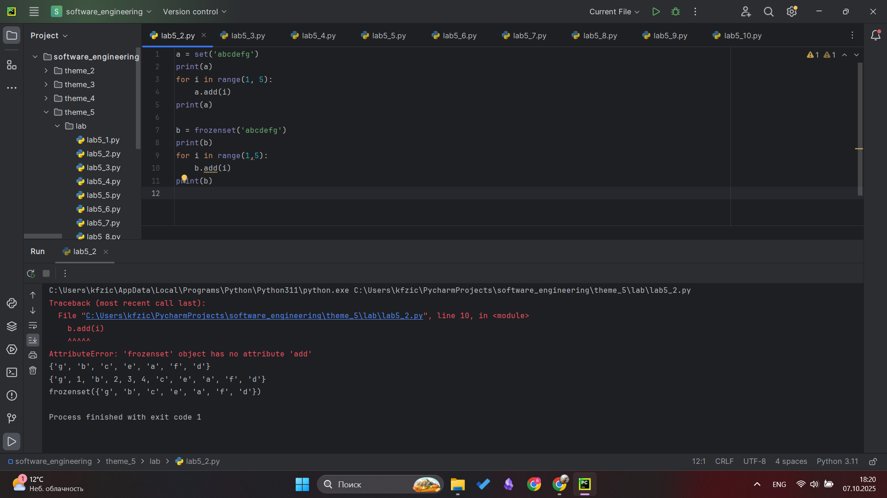

## Выводы
Изучил как работает множество frozenset и метод add для добавление элементов в множество

## Лабораторная работа №3
### На вход в программу поступает список (минимальной длиной 2 символа). Напишите программу, которая будет менять первый и последний элемент списка.

```python
def replace(input_list):
    memory = input_list[0]
    input_list[0] = input_list[-1]
    input_list[-1] = memory
    return input_list
print(replace([1,2,3,4,5]))
```
### Результат.
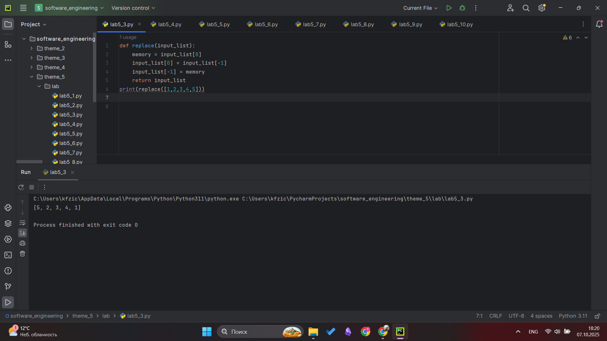

## Выводы
Выполнил перестановку эл списка местами(первый с последним) при помощи временной переменной

## Лабораторная работа №4
### На вход в программу поступает список (минимальной длиной 10 символов). Напишите программу, которая выводит элементы с индексами от 2 до 6. В программе необходимо использовать "срез".

```python
a = [12, 54, 32, 57, 843, 2346, 765, 75, 25, 234, 756, 23]
print(a[2:6])
```
### Результат.
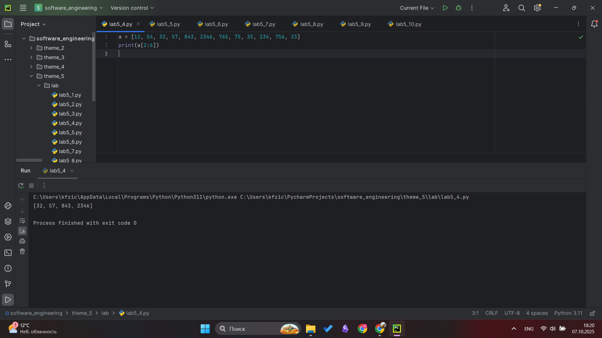

## Выводы
Изучил работу срезов

## Лабораторная работа №5
### Иван задумался о поиске «бесполезного» числа, полученного из списка. Суть поиска в следующем: он берет произвольный список чисел, находит самое большое из них, а затем делит его на длину списка. Студент пока не придумал, где может пригодиться подобное значение, но ищет у вас помощи в реализации такой функции useless().

```python
def useless(lst):
    return max(lst) / len(lst)

print(useless([3, 5, 7, 3, 33]))
print(useless([-12.5, 54, 77.3, 0, -36, 98.2, -63, 21.7, 47, -89.6]))
print(useless([-25.8, 86, 12.5, -56, 73.2, 0, 43, -91.5, 65.9, -7]))
#Изучение и примение на практике методов max и len для работы со списка
```
### Результат.
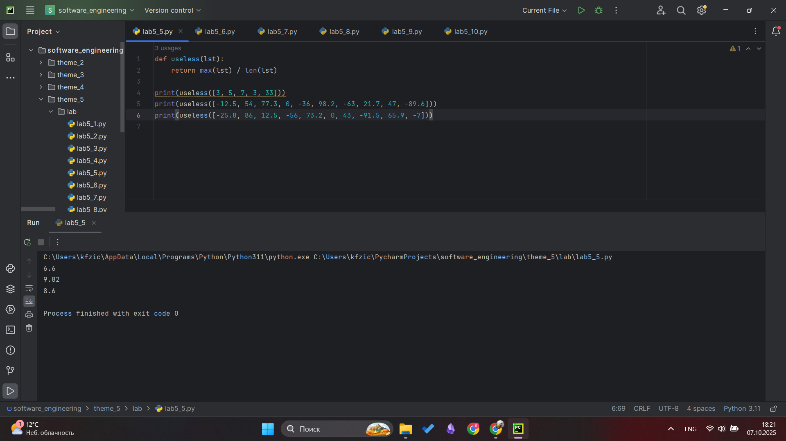

## Выводы
Изучение и примение на практике методов max и len для работы со списками

## Лабораторная работа №6
### Ребята не могут определится каким супергероем они хотят стать. У них есть случайно составленный список супергероев, и вы должны определить кто из ребят будет каким супергероем. Необходимо использовать разделение списков.
```python
superheroes = ['superman', 'spiderman', 'batman']
nikolay, vasiliy, ivan = superheroes
print('Николай -', nikolay)
print('Василий -', vasiliy)
print('Иван -', ivan)
```
### Результат.
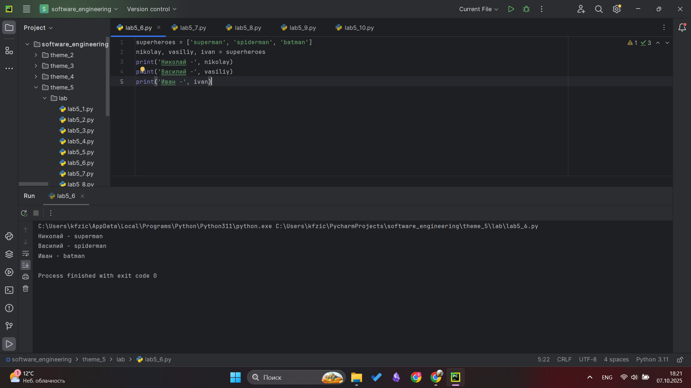

## Выводы
Изучил как работает присвоение переменным элементы списка

## Лабораторная работа №7
### Вовочка, насмотревшись передачи "Слабое звено" решил написать программу, которая также будет находить самое слабое звено (минимальный элемент) и удалять его, только делать он это хочет не с людьми, а со списком. Помогите Вовочке с реализацией программы.
```python
a = [-25.8, 86, 12.5, -56, 73.2, 0, 43, -91.5, 65.9, -7]
a.sort()
print('Отсротированный спиок:\n', a)
a.pop(0)
print('Отсортированный список без наименьшего элемента:\n', a)
```
### Результат.
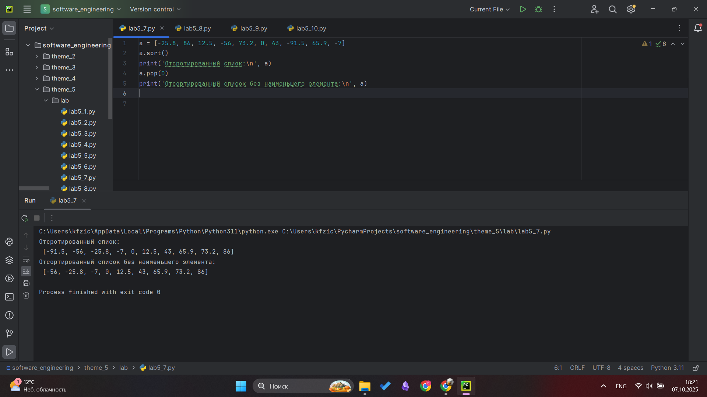

## Выводы
Изучил как работает метод сорт для сортировки списка и метод pop для удаления элемента по индексу

## Лабораторная работа №8
### Михаил решил создать большой п-мерный список, для этого он случайным образом создал несколько списков, состоящих минимум из 3, а максимум из 10 элементов и поместил их в один большой список. Он также как и Иван не знает зачем ему это сейчас нужно, но надеется на то, что это пригодится ему в будущем.
```python
from random import randint
def list_maker():
    a = [randint(1,100)] * randint(3,10)
    return a

if __name__ == '__main__':
    result = []
    for i in range(randint(1,5)):
        result.append(list_maker())

    print(result)
```
### Результат.
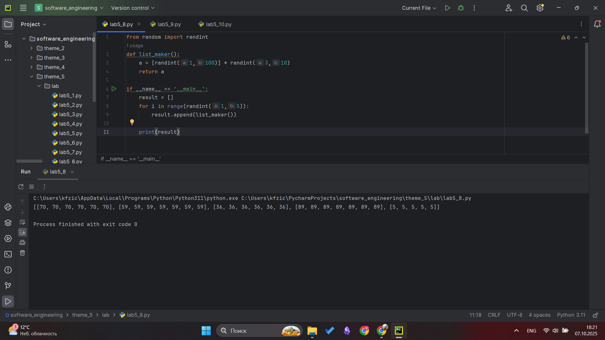

## Выводы
Изучил метод append для добавления элементов в список

## Лабораторная работа №9
### Вы работаете в ресторане и отвечает за статистику покупок, ваша задача сравнить между собой заказы покупателей, которые указаны в разном порядке. Реализуйте функцию superset(), которая принимает 2 множества. Результат работы функции: вывод в консоль одного из сообщений в зависимости от ситуации:
1 - «Супермножество не обнаружено»
2 – «Объект {X} является чистым супермножеством» -
3 - «Множества равны»
```python
def superset(set_1, set_2):
    if set_1 > set_2:
        print(f'Объект {set_1} является чистым супермножеством')
    elif set_1 == set_2:
        print('Множества равны')
    else:
        print('Супермножество не обнаружено')

if __name__ == '__main__':
    superset({1,8,3,5}, {3,5})
    superset({1,8,3,5}, {5,3,8,1})
    superset({3,5}, {5,3,8,1})
    superset({90,100}, {3,5})
```
### Результат.
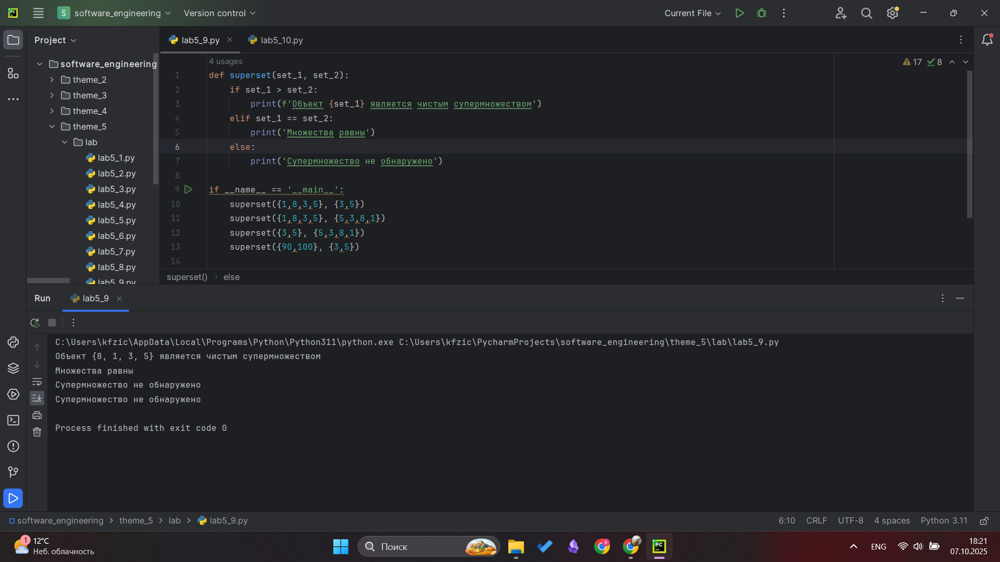

## Выводы
Изучил работу с множествами и их сравнение

## Лабораторная работа №10
### Предположим, что вам нужно разобрать стопку бумаг, но нужно начать работу с нижней, “переверните стопку". Вам дан произвольный список. Представьте его в обратном порядке. Программа должна занимать не более двух строк в редакторе кода.
```python
my_list = [2, 5, 8, 3]
print(my_list[::-1])
```
### Результат.
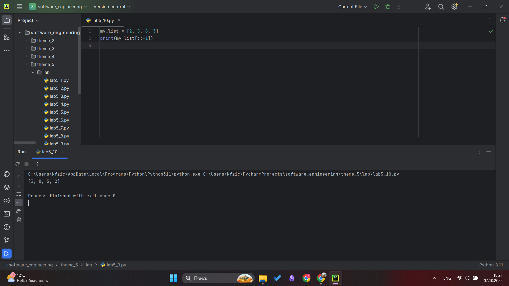

## Выводы
Изучил как с помощью среза можно перевернуть список

## Самостоятельная работа №1
### Ресторан на предприятии ведет учет посещений за неделю при помощи кода работника. У них есть список со всеми посещениями за неделю.

Ваша задача почитать:
Сколько было выдано чеков
Сколько разных людей посетило ресторан
Какой работник посетил ресторан больше всех раз

Список выданных чеков за неделю:
[8734, 2345, 8201, 6621, 9999, 1234, 5678, 8201, 8888, 4321, 3365, 1478, 9865, 5555, 7777, 9998, 1111, 2222, 3333, 4444, 5556, 6666, 5410, 7778, 8889, 4445, 1439, 9604, 8201, 3365, 7502, 3016, 4928, 5837, 8201, 2643, 5017, 9682, 8530, 3250, 7193, 9051, 4506, 1987, 3365, 5410, 7168, 7777, 9865, 5678, 8201, 4445, 3016, 4506, 4506]

Результатом выполнения задачи будет: листинг кода, и вывод в консоль, в котором будет указана вся необходимая информация.
```python
lst = [8734, 2345, 8201, 6621, 9999, 1234, 5678, 8201, 8888, 4321, 3365,
       1478, 9865, 5555, 7777, 9998, 1111, 2222, 3333, 4444, 5556, 6666,
       5410, 7778, 8889, 4445, 1439, 9604, 8201, 3365, 7502, 3016, 4928,
       5837, 8201, 2643, 5017, 9682, 8530, 3250, 7193, 9051, 4506, 1987,
       3365, 5410, 7168, 7777, 9865, 5678, 8201, 4445, 3016, 4506, 4506]
k = len(lst)
skolko = len(set(lst))
who = max(set(lst), key = lst.count)

print(f"Кол-во выданных чеков: {k}\nКоличество разных людей: {skolko}\nКто посетил больше остальных: {who}")
```
### Результат.
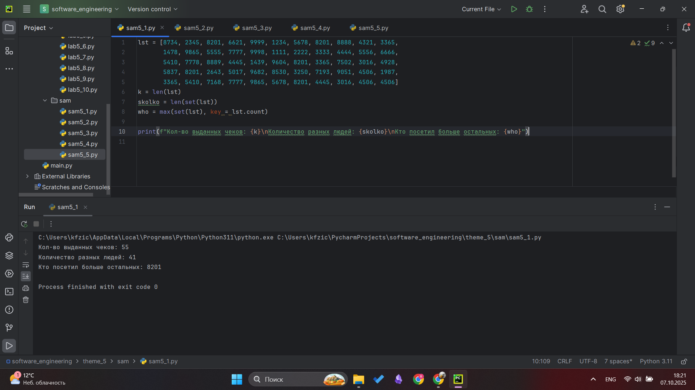

## Выводы
Для решении задачи было использованы только полученые знания по работе со списками и множествами. Для поиска кол-ва чеков len, количество уникальных значений - len(set) - переделали список в множество и узнали длинну(т.к в множестве содержатся только уникальные значени), чтобы узнать кто был больше всех использован метод max

## Самостоятельная работа №2
### На физкультуре студенты сдавали бег, у преподавателя физкультуры есть список всех результатов, ему нужно узнать
Три лучшие результата
Три худшие результата
Все результаты начиная с 10

Ваша задача помочь ему в этом.
Список результатов бега:
[10.2, 14.8, 19.3, 22.7, 12.5, 33.1, 38.9, 21.6, 26.4, 17.1, 30.2, 35.7, 16.9, 27.8, 24.5, 16.3, 18.7, 31.9, 12.9, 37.4]

```python
lst = [10.2, 14.8, 19.3, 22.7, 12.5, 33.1, 38.9, 21.6, 26.4, 17.1,
       30.2, 35.7, 16.9, 27.8, 24.5, 16.3, 18.7, 31.9, 12.9, 37.4]
best = sorted(lst)[-3:]
worst = sorted(lst)[:3]
a = lst[9:]
print(f"Три лучшие результата: {best}\nТри худшие результата: {worst}\nВсе результаты начиная с 10: {a}")
```
### Результат.
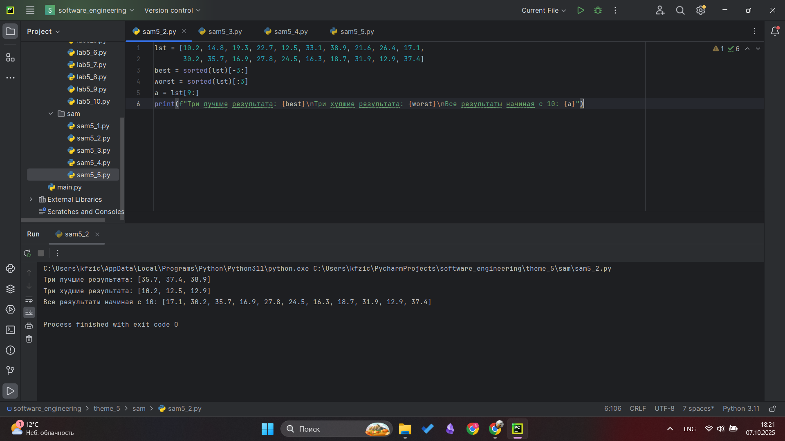

## Выводы
Для решении задачи было применены: срезы, sorted

## Самостоятельная работа №3
### Преподаватель по математике придумал странную задачку. У вас есть три списка с элементами, каждый элемент которых длина стороны треугольника, ваша задача найти площади двух треугольников, составленные из максимальных и минимальных элементов полученных списков. Результатом выполнения задачи будет: листинг кода, и вывод в консоль, в котором будут указаны два этих значения.
Три списка:
one = [12, 25, 3, 48, 71]
two = [5, 18, 40, 62, 98]
three = [4, 21, 37, 56, 84]
```python
import math
def triangle_area(a, b, c):
    p = (a + b + c) / 2
    return math.sqrt(p * (p - a) * (p - b) * (p - c))

one = [12, 25, 3, 48, 71]
two = [5, 18, 40, 62, 98]
three = [4, 21, 37, 56, 84]

max_a, max_b, max_c = max(one), max(two), max(three)
min_a, min_b, min_c = min(one), min(two), min(three)

max_area = triangle_area(max_a, max_b, max_c)
min_area = triangle_area(min_a, min_b, min_c)
print(f"Площадь треугольника с максимальными стороными: {max_area}\nПлощадь треугольника с минимальными стороными: {min_area}")
```
### Результат.
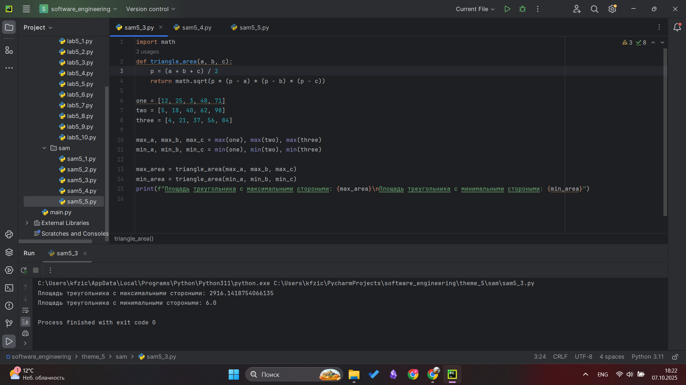

## Выводы
Изучены методы max и min. Для решения написал функцию для поиска площади, с ее помощью и max min была решена задача

## Самостоятельная работа №4
### Никто не любит получать плохие оценки, поэтому Борис решил это исправить. Допустим, что все оценки студента за семестр хранятся в одном списке. Ваша задача удалить из этого списка все двойки, а все тройки заменить на четверки.
Списки оценок (проверить работу программы на всех трех вариантах):
[2, 3, 4, 5, 3, 4, 5, 2, 2, 5, 3, 4, 3, 5, 4]
[4, 2, 3, 5, 3, 5, 4, 2, 2, 5, 4, 3, 5, 3, 4]
[5, 4, 3, 3, 4, 3, 3, 5, 5, 3, 3, 3, 3, 4, 4]
```python
def marks(lst):
    for i in range(len(lst)):
        if lst[i] == 3:
            lst[i] = 4
    while 2 in lst:
        lst.remove(2)
    return lst

a = [2, 3, 4, 5, 3, 4, 5, 2, 2, 5, 3, 4, 3, 5, 4]
b = [4, 2, 3, 5, 3, 5, 4, 2, 2, 5, 4, 3, 5, 3, 4]
c = [5, 4, 3, 3, 4, 3, 3, 5, 5, 3, 3, 3, 3, 4]

print(f"Изначальные оценки: {a} После изменения: {marks(a)}\nИзначальные оценки: {b} После изменения: {marks(b)}\nИзначальные оценки: {c} После изменения: {marks(c)}")
```
### Результат.
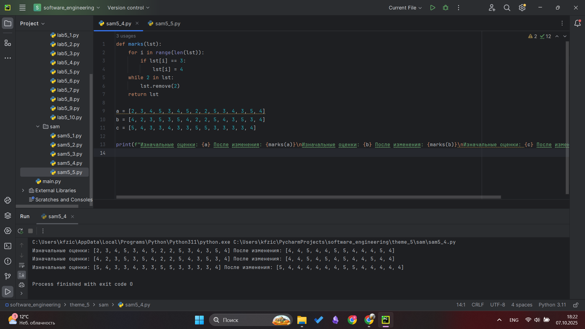

## Выводы
Изучен метод remove для удаления элементов из массива

## Самостоятельная работа №5
### Вам предоставлены списки натуральных чисел, из них необходимо сформировать множества. При этом следует соблюдать это правило: если какое-либо число повторяется, то преобразовать его в строку по следующему образцу: например, если число 4 повторяется 3 раза, то в множестве будет следующая запись: само число 4, строка «44», строка «444».
Множества для теста:
список_1 = [1, 1, 3, 3, 3, 1]
список_2 [5, 5, 5, 5, 5, 5, 5]
список_3 = [2, 2, 1, 2, 2, 5, 6, 7, 1, 3, 2, 2]

Результаты вывода (порядок может отличаться, поскольку мы работаем c set()):
{'11', 1, 3, '33', '111'}
{5, '5555', '555555', '55555', '555', '55', '5555555'}
{'11', 1, 3, 2, 5, 6, '222222', '222', 7, '2222', '22222', '22'}
```python
def name(lst):
    result_set = set()
    for num in set(lst):
        count = lst.count(num)
        result_set.add(num)
        if count > 1:
            for i in range(2, count + 1):
                result_set.add(str(num) * i)

    return result_set

list_1 = [1, 1, 3, 3, 1]
list_2 = [5, 5, 5, 5, 5, 5, 5]
list_3 = [2, 2, 1, 2, 2, 5, 6, 7, 1, 3, 2, 2]

print(f"Первый список: {list_1} После изменений: {name(list_1)}\n"
      f"Первый список: {list_2} После изменений: {name(list_2)}\n"
      f"Первый список: {list_3} После изменений: {name(list_3)}\n")
```
### Результат.


## Выводы
Изучены методы работы с множествами и списками

## Общие выводы по теме
В ходе работы были успешно освоены основные операции со строками, списками и множествами в Python. На практике изучены методы работы с коллекциями, включая срезы, сортировку, добавление и удаление элементов. Полученные навыки позволяют эффективно манипулировать данными, решая задачи по их обработке и анализу. Работа закрепила понимание важности выбора подходящего типа коллекции для оптимизации решения конкретных задач.
