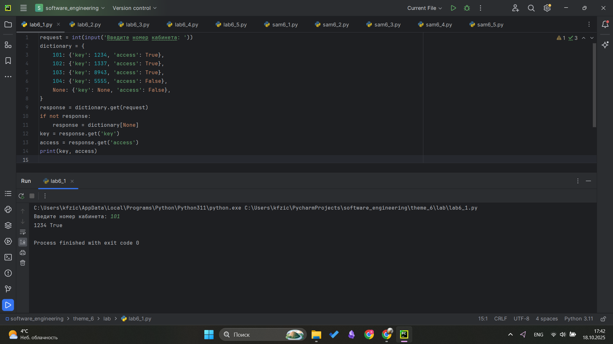
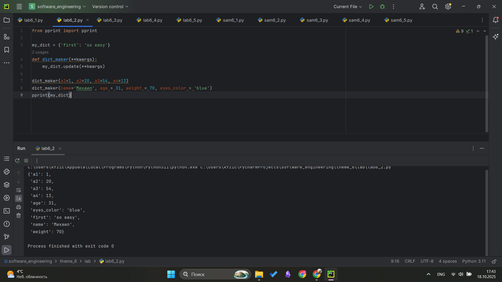
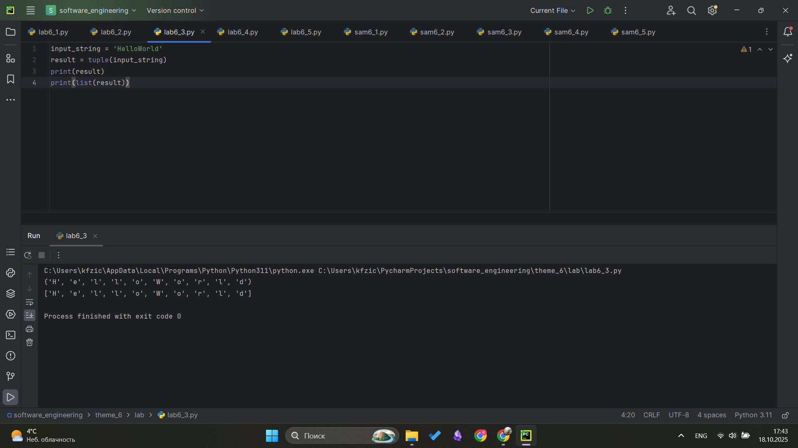
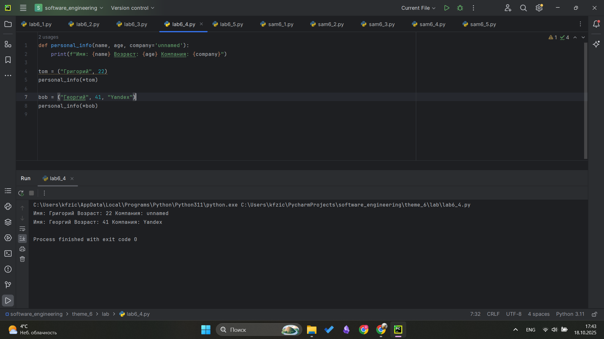
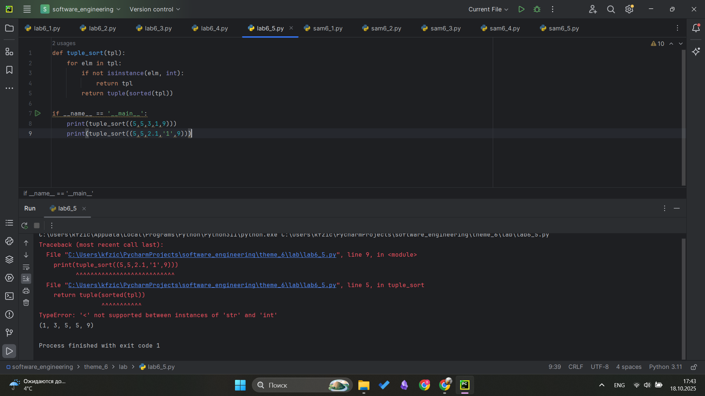
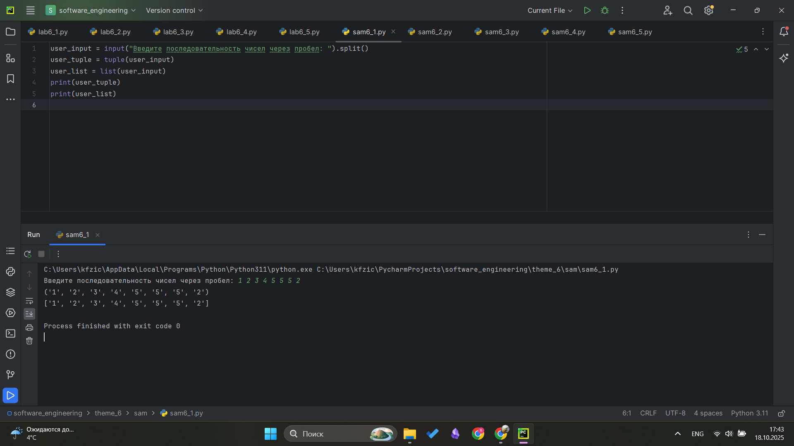
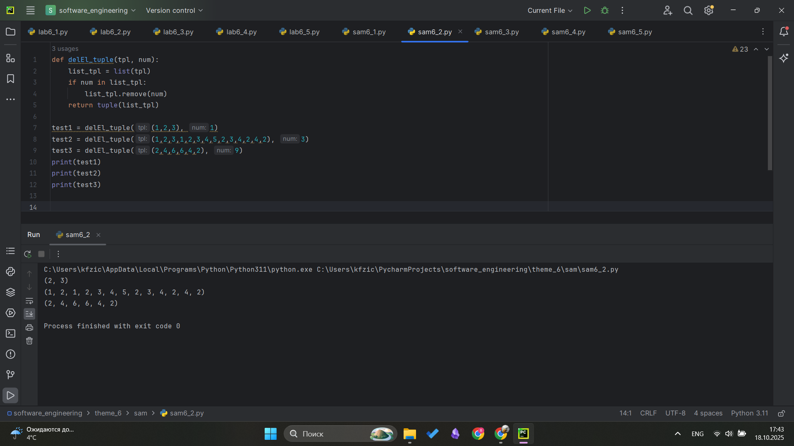
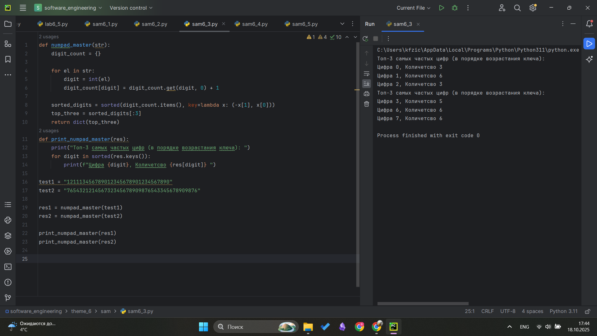
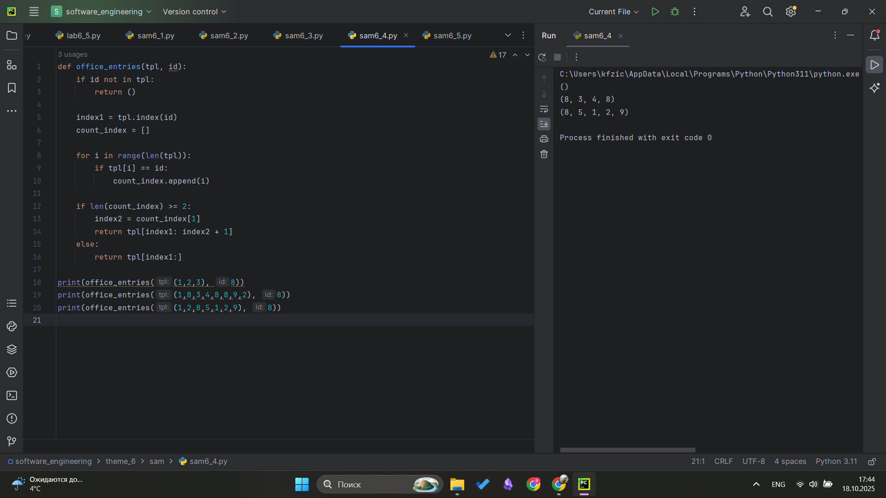
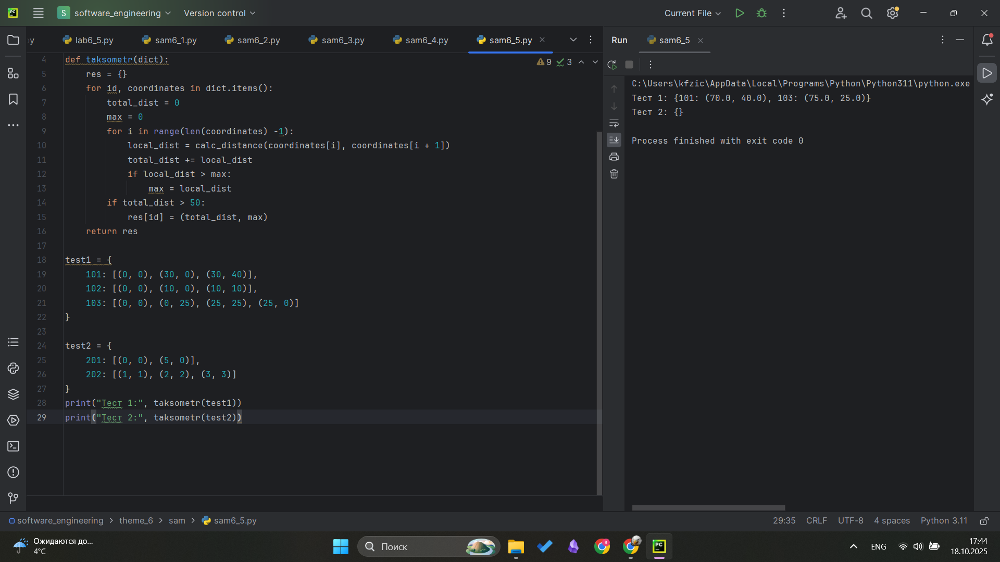

# Тема 6. Базовые коллекции: словари, кортежи
Отчет по Теме #6 выполнил(а):
- Фомин Владислав Андреевич
- ПИЭ-23-1

| Задание | Лаб_раб | Сам_раб |
| ------ | ------ | ------ |
| Задание 1 | + | + |
| Задание 2 | + | + |
| Задание 3 | + | + |
| Задание 4 | + | + |
| Задание 5 | + | + |


Работу проверили:
- к.э.н., доцент Панов М.А.

## Лабораторная работа №1
### В школе, где вы учились, узнали, что вы крутой программист и попросили написать программу для учителей, которая будет при вводе кабинета писать для него ключ доступа и статус, занят кабинет или нет. При написании программы необходимо использовать словарь (dict), который на вход получает номер кабинета, а выводит необходимую информацию. Если кабинета, который вы ввели нет в словаре, то в консоль в виде значения ключа нужно вывести “None” и виде статуса вывести "False".
```python
request = int(input('Введите номер кабинета: '))
dictionary = {
    101: {'key': 1234, 'access': True},
    102: {'key': 1337, 'access': True},
    103: {'key': 8943, 'access': True},
    104: {'key': 5555, 'access': False},
    None: {'key': None, 'access': False},
}
response = dictionary.get(request)
if not response:
    response = dictionary[None]
key = response.get('key')
access = response.get('access')
print(key, access))
```
### Результат.


## Выводы
Изучено как работают словари: задаются, используются проверки, получение элементов с помощью get()

## Лабораторная работа №2
### Алексей решил создать самый большой словарь в мире. Для этого он придумал функцию dict_maker (**kwargs), которая принимает неограниченное количество параметров «ключ: значение» и обновляет созданный им словарь my_dict, состоящий всего из одного элемента «first» со значением «so easy». Помогите Алексею создать данную функцию.
```python
from pprint import pprint

my_dict = {'first': 'so easy'}
def dict_maker(**kwargs):
    my_dict.update(**kwargs)

dict_maker(a1=1, a2=20, a3=54, a4=13)
dict_maker(name='Михаил', age = 31, weight = 70, eyes_color = 'blue')
pprint(my_dict)
```
### Результат.


## Выводы
Изучено как можно изменять словари, и модуль pprint для вывода больших значений

## Лабораторная работа №3
### Для решения некоторых задач бывает необходимо разложить строку на отдельные символы. Мы знаем что это можно сделать при помощи split(), у которого более гибкая настройка для разделения для этого, но если нам нужно посимвольно разделить строку без всяких условий, то для этого мы можем использовать кортежи (tuple). Для этого напишем любую строку, которую будем делить и “обвернем” ее в tuple и дальше мы можем как нам угодно с ней работать, например, сделать ее списком (тогда получится полный аналог split()) или же работать с ним дальше, как с кортежем.

```python
input_string = 'HelloWorld'
result = tuple(input_string)
print(result)
print(list(result))
```
### Результат.


## Выводы
Изучены кортежи и их свойства, также освоили как с помощью кортежа можно разбить строку посимвольно, неиспользуя split()й

## Лабораторная работа №4
### Вовочка решил написать крутую функцию, которая будет писать имя, возраст и место работы, но при этом на вход этой функции будет поступать кортеж. Помогите Вовочке написать эту программу.

```python
def personal_info(name, age, company='unnamed'):
    print(f"Имя: {name} Возраст: {age} Компания: {company}")

tom = ("Григорий", 22)
personal_info(*tom)

bob = ("Георгий", 41, "Yandex")
personal_info(*bob)
```
### Результат.


## Выводы
Функция которая обрабатывает данные из кортежа

## Лабораторная работа №5
### Для сопровождения первых лиц государства Х нужен кортеж, но никто не может определиться с порядком машин, поэтому вам нужно написать функцию, которая будет сортировать кортеж, состоящий из целых чисел по возрастанию, и возвращает его. Если хотя бы один элемент не является целым числом, то функция возвращает исходный кортеж.

```python
def tuple_sort(tpl):
    for elm in tpl:
        if not isinstance(elm, int):
            return tpl
        return tuple(sorted(tpl))

if __name__ == '__main__':
    print(tuple_sort((5,5,3,1,9)))
    print(tuple_sort((5,5,2.1,'1',9)))
```
### Результат.


## Выводы
Изучен метод isinstance для проверки что значение кортежа только int + sorted для кортежей

## Самостоятельная работа №1
### При создании сайта у вас возникла потребность обрабатывать данные пользователя в странной форме, а потом переводить их в нужные вам форматы. Вы хотите принимать от пользователя последовательность чисел, разделенных пробелом, а после переформатировать эти данные в список и кортеж. Реализуйте вашу задумку. Для получения начальных данных используйте input(). Результатом программы будет выведенный список и кортеж из начальных данных.

```python
user_input = input("Введите последовательность чисел через пробел: ").split()
user_tuple = tuple(user_input)
user_list = list(user_input)
print(user_tuple)
print(user_list)
```
### Результат.


## Выводы
Получение значений через Input и преобразование в формы списка и кортежа через встроенные функции

## Самостоятельная работа №2
### Николай знает, что кортежи являются неизменяемыми, но он очень упрямый и всегда хочет доказать, что он прав. Студент решил создать функцию, которая будет удалять первое появление определенного элемента из кортежа по значению и возвращать кортеж без него. Попробуйте повторить шедевр не признающего авторитеты начинающего программиста. Но учтите, что Николай не всегда уверен в наличии элемента в кортеже (в этом случае кортеж вернется функцией в исходном виде).

Входные данные:
(1, 2, 3), 1)
(1, 2, 3, 1, 2, 3, 4, 5, 2, 3, 4, 2, 4, 2), 3)
(2, 4, 6, 6, 4, 2), 9)

Ожидаемый результат:
(2, 3)
(1, 2, 1, 2, 3, 4, 5, 2, 3, 4, 2, 4, 2)
(2, 4, 6, 6, 4, 2)

```python
def delEl_tuple(tpl, num):
    list_tpl = list(tpl)
    if num in list_tpl:
        list_tpl.remove(num)
    return tuple(list_tpl)

test1 = delEl_tuple((1,2,3), 1)
test2 = delEl_tuple((1,2,3,1,2,3,4,5,2,3,4,2,4,2), 3)
test3 = delEl_tuple((2,4,6,6,4,2), 9)
print(test1)
print(test2)
print(test3)
```
### Результат.


## Выводы
Для рещения задачи: в функции преобразовали кортеж в список проверили вхождение элемента и удалили его, вернули обратно кортеж, обратно преобразовав.

## Самостоятельная работа №3
### Ребята поспорили кто из них одним нажатием на numpad наберет больше повторяющихся цифр, но не понимают, как узнать победителя. Вам им нужно в этом помочь. Дана строка в виде случайной последовательности чисел от 0 до 9 (длина строки минимум 15 символов). Требуется создать словарь, который в качестве ключей будет принимать данные числа (т. е. ключи будут типом int), а в качестве значений - количество этих чисел в имеющейся последовательности. Для построения словаря создайте функцию, принимающую строку из цифр. Функция должна возвратить словарь из 3-х самых часто встречаемых чисел, также эти значения нужно вывести в порядке возрастания ключа.
```python
def numpad_master(str):
    digit_count = {}

    for el in str:
        digit = int(el)
        digit_count[digit] = digit_count.get(digit, 0) + 1

    sorted_digits = sorted(digit_count.items(), key=lambda x: (-x[1], x[0]))
    top_three = sorted_digits[:3]
    return dict(top_three)
def print_numpad_master(res):
    print("Топ-3 самых частых цифр (в порядке возрастания ключа): ")
    for digit in sorted(res.keys()):
        print(f"Цифра {digit}, Количетсво {res[digit]} ")

test1 = "121113456789012345678901234567890"
test2 = "765432121456732345678909876543345678909876"

res1 = numpad_master(test1)
res2 = numpad_master(test2)

print_numpad_master(res1)
print_numpad_master(res2)
```
### Результат.


## Выводы
Для решения было использовано: подсчет цифр через словарь с методом get, сортировка по ключу ч-з sorted вывод лучших трех через срез. Отдельная функция для вывода данных написана для удобства

## Самостоятельная работа №4
### Ваш хороший друг владеет офисом со входом по электронным картам, ему нужно чтобы вы написали программу, которая показывала в каком порядке сотрудники входили и выходили из офиса. Определение сотрудника происходит по id. Напишите функцию, которая на вход принимает кортеж и случайный элемент (id), его можно придумать самостоятельно. Требуется вернуть новый кортеж, начинающийся с первого появления элемента в нем и заканчивающийся вторым его появлением включительно. Если элемента нет вовсе вернуть пустой кортеж. Если элемент встречается только один раз, то вернуть кортеж, который начинается с него и идет до конца исходного.

Входные данные:
(1, 2, 3), 8)
(1, 8, 3, 4, 8, 8, 9, 2), 8)
(1, 2, 8, 5, 1, 2, 9), 8)

Ожидаемый результат: 
()
(8, 3, 4, 8)
(8, 5, 1, 2, 9) 1, 2, 9)

```python
def office_entries(tpl, id):
    if id not in tpl:
        return ()

    index1 = tpl.index(id)
    count_index = []

    for i in range(len(tpl)):
        if tpl[i] == id:
            count_index.append(i)

    if len(count_index) >= 2:
        index2 = count_index[1]
        return tpl[index1: index2 + 1]
    else:
        return tpl[index1:]

print(office_entries((1,2,3), 8))
print(office_entries((1,8,3,4,8,8,9,2), 8))
print(office_entries((1,2,8,5,1,2,9), 8))
```
### Результат.


## Выводы
Для решения задачи использовал различные проверки на вхождение id и поиск индексов для вывода нового кортежа по индексам(точкам вхлождения Id) в изначальном кортеже

## Самостоятельная работа №5
### Самостоятельно придумайте и решите задачу, в которой будут обязательно использоваться кортеж или список. Проведите минимум три теста для проверки работоспособности вашей задачи.

Задача: 

Разработайте программу для анализа маршрутов такси. Исходные данные представляют собой кортеж кортежей, где каждый внутренний кортеж содержит ID водителя и кортеж с координатами точек маршрута.

Необходимо:
Для каждого водителя вычислить общее расстояние маршрута
Найти водителей, у которых общее расстояние больше 50 км
Для отобранных водителей определить самую длинную поездку между двумя точками
Вернуть список кортежей в формате (ID_водителя, общее_расстояние, самая_длинная_поездка)

```python
import math
def calc_distance(num1, num2):
    return math.sqrt((num2[0] - num1[0])**2 + (num2[1] - num1[1])**2)
def taksometr(dict):
    res = {}
    for id, coordinates in dict.items():
        total_dist = 0
        max = 0
        for i in range(len(coordinates) -1):
            local_dist = calc_distance(coordinates[i], coordinates[i + 1])
            total_dist += local_dist
            if local_dist > max:
                max = local_dist
        if total_dist > 50:
            res[id] = (total_dist, max)
    return res

test1 = {
    101: [(0, 0), (30, 0), (30, 40)],
    102: [(0, 0), (10, 0), (10, 10)],
    103: [(0, 0), (0, 25), (25, 25), (25, 0)]
}

test2 = {
    201: [(0, 0), (5, 0)],
    202: [(1, 1), (2, 2), (3, 3)]
}
print("Тест 1:", taksometr(test1))
print("Тест 2:", taksometr(test2))
```
### Результат.


## Выводы
Первая ф-я находит расстояние между точками координат. Вторая ищет все остальное что нужно по задаче. Для решения были применены знания кортежей

## Общие выводы по теме
В ходе выполнения работы были изучены и практически применены основные структуры данных Python - словари и кортежи. Освоены методы работы со словарями: создание, обновление, получение значений, а также приемы обработки кортежей, включая преобразование в другие типы данных и обратно. Полученные навыки позволяют эффективно решать задачи, связанные с хранением, обработкой и анализом структурированной информации.
