# Тема 7. Работа с файлами(ввод, вывод)
Отчет по Теме #7 выполнил(а):
- Фомин Владислав Андреевич
- ПИЭ-23-1

| Задание | Лаб_раб | Сам_раб |
| ------ | ------ | ------ |
| Задание 1 | + | + |
| Задание 2 | + | + |
| Задание 3 | + | + |
| Задание 4 | + | + |
| Задание 5 | + | + |
| Задание 6 | + |  |
| Задание 7 | + |  |
| Задание 8 | + |  |
| Задание 9 | + |  |
| Задание 10 | + |  |

Работу проверили:
- к.э.н., доцент Панов М.А.

## Лабораторная работа №1
### Составьте текстовый файл и положите его в одну директорию с программой на Python. Текстовый файл должен состоять минимум из двух строк.

### Результат.
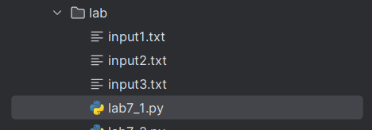

## Лабораторная работа №2
### Напишите программу, которая выведет только первую строку из вашего файла, при этом используйте конструкцию open()/close().
```python
f = open('input1.txt', 'r')
print(f.readline())
f.close()
```
### Результат.
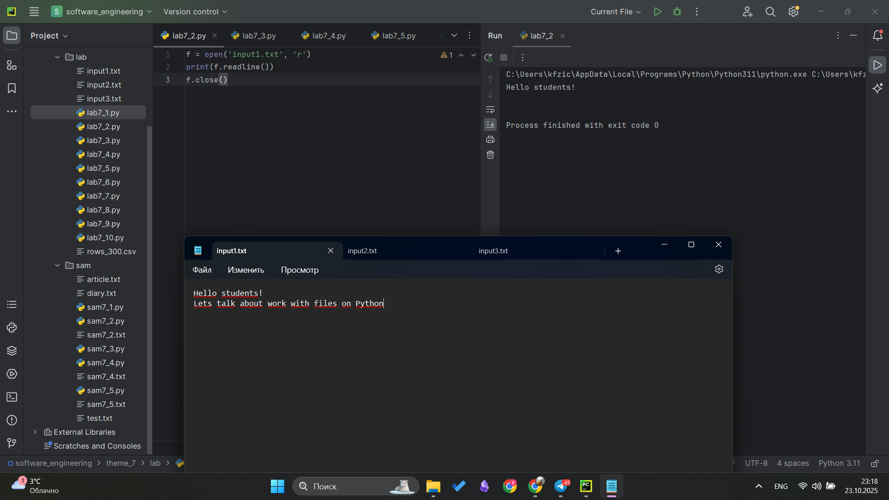

## Выводы
Изучили как открыть файл и прочитать первую его строку через readline, при данном способе чтения данные получаем как строку

## Лабораторная работа №3
### Напишите программу, которая выведет все строки из вашего файла в массиве, при этом используйте конструкцию open()/close().

```python
f = open('input1.txt', 'r')
print(f.readlines())
f.close()
```
### Результат.
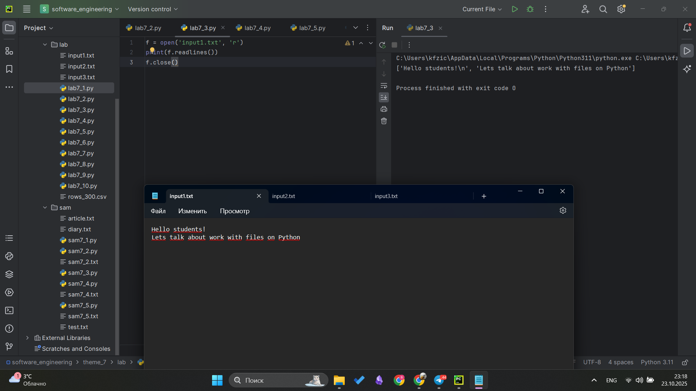

## Выводы
Изучили как получить данные из файла при помощи readlines(), в таком случае данные в виде списка

## Лабораторная работа №4
### Напишите программу, которая выведет все строки из вашего файла в массиве, при этом используйте конструкцию with open().

```python
with open('input1.txt') as f:
    print(f.readlines())
```
### Результат.
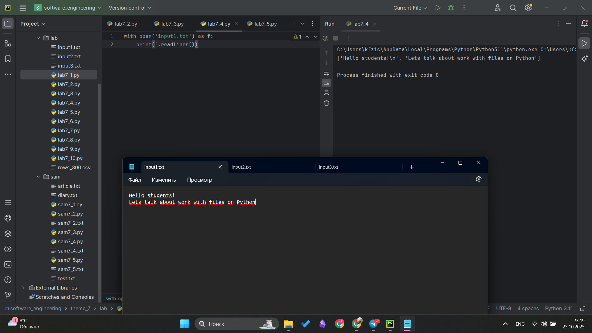

## Выводы
Изучена конструкция with open() для работы с файлами

## Лабораторная работа №5
### Напишите программу, которая выведет каждую строку из вашего файла отдельно, при этом используйте конструкцию with open().

```python
with open('input1.txt') as f:
    for line in f:
        print(line)
```
### Результат.
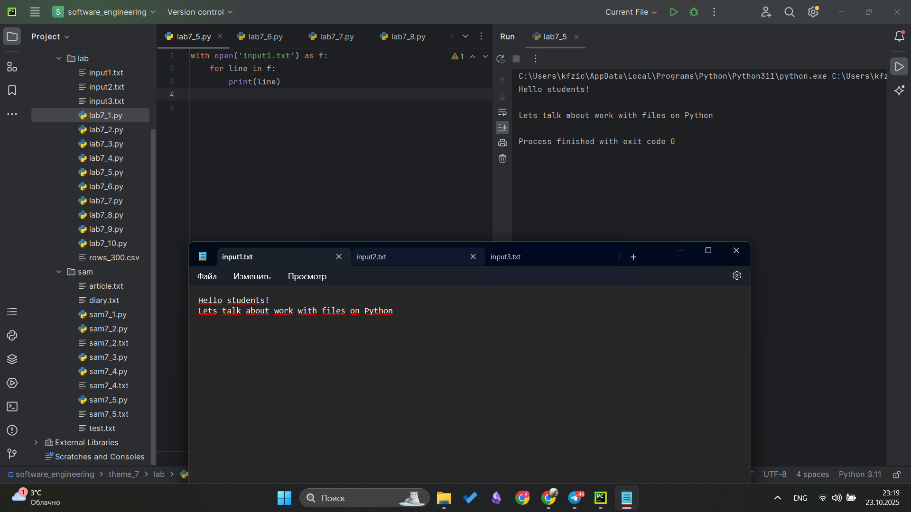

## Выводы
Изучен один из способов вывода содержимого файла построчно при помощи конструкции with open()

## Лабораторная работа №6
### Напишите программу, которая будет добавлять новую строку в ваш файл, а потом выведет полученный файл в консоль. Вывод можно осуществлять любым способом. Обязательно проверьте сам файл, чтобы изменения в нем тоже отображались.
```python
with open('input1.txt', 'a+') as f:
    f.write('\nIm additional line')

with open('input.txt', 'r') as f:
    result = f.readlines()
    print(result)
```
### Результат.
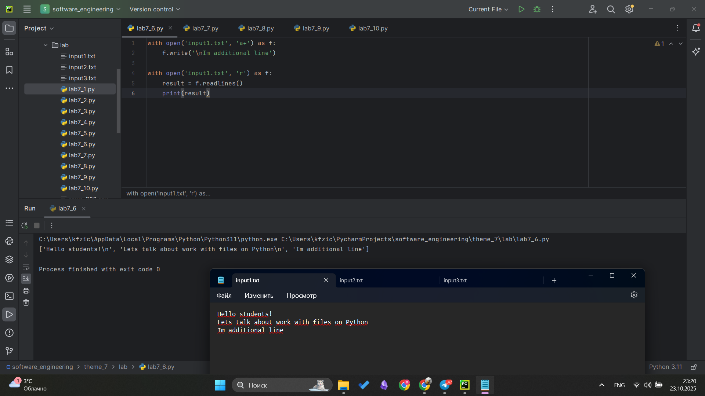

## Выводы
Изучен способ добавления значений в файл через write() + при объявлении файла указываем 'a' для добавления значений

## Лабораторная работа №7
### Напишите программу, которая перепишет всю информацию, которая была у вас в файле до этого, например напишет любые данные из произвольно вами составленного списка. Также не забудьте проверить что измененная вами информация сохранилась в файле.
```python
lines = ['one', 'two', 'three']
with open('input2.txt', 'w') as f:
    for line in lines:
        f.write('\nCycle run ' + line)
    print('Done!')
```
### Результат.
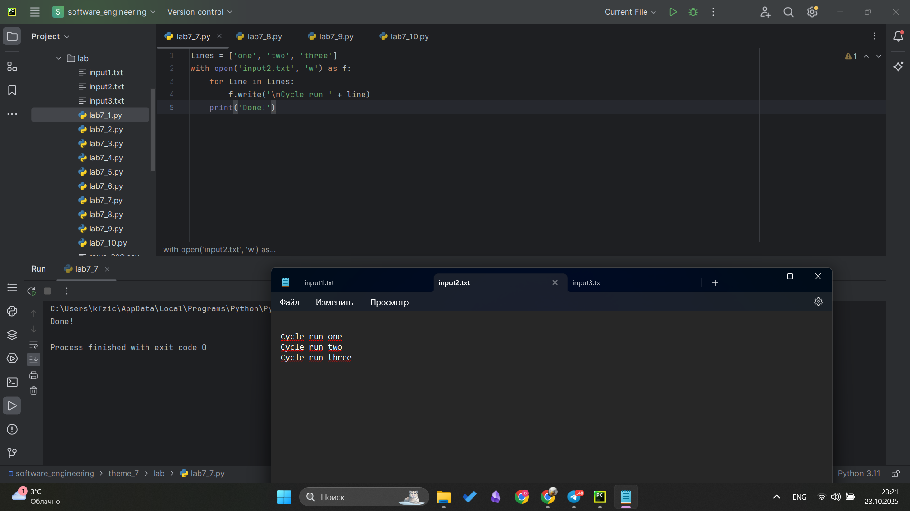

## Выводы
Изучили как перезаписать данные файла и добавить значения из массива в файл посторочно

## Лабораторная работа №8
### Выберите любую папку на своем компьютере, имеющую вложенные директории. Выведите на печать в терминал ее содержимое, как и всех подкаталогов при помощи функции print_docs(directory).
```python
import os
def print_docs(directory):
    all_files = os.walk(directory)
    for catalog in all_files:
        print(f'Папка {catalog[0]} содержит:')
    print(f'Директории: {", ".join([folder for folder in catalog[1]])}')
    print(f'Файлы: {", ".join([file for file in catalog[2]])}')
    print('-' * 40)

print_docs('C:/Users/kfzic/PycharmProjects/software_engineering/theme_7')
```
### Результат.
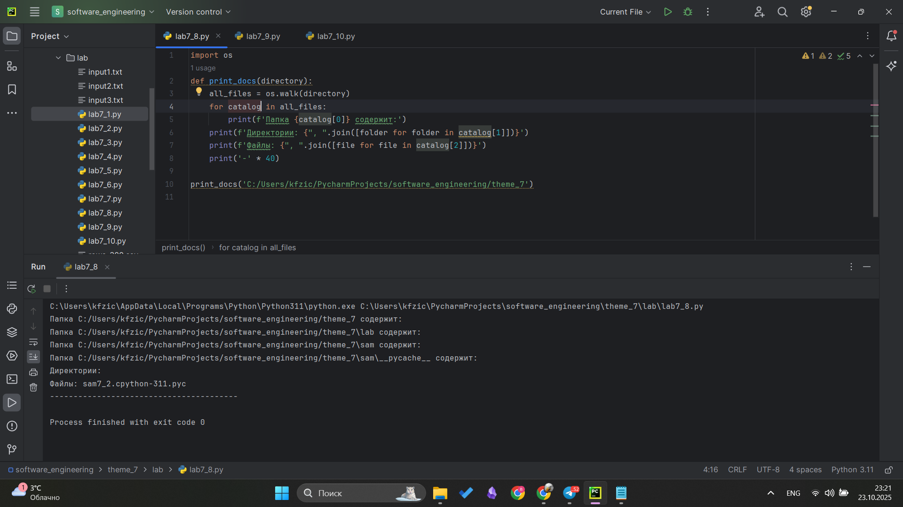

## Выводы
Изучил как работает библиотека os и некоторые ее возможности

## Лабораторная работа №9
### Требуется реализовать функцию, которая выводит слово, имеющее максимальную длину (или список слов, если таковых несколько).

```python
def longest_words(file):
    with open(file, encoding='utf-8') as f:
        words = f.read().split()
        max_length = len(max(words, key = len))
        for word in words:
            if len(word) == max_length:
                sought_words = word

        if len(sought_words) == 1:
            return sought_words[0]
        return sought_words

print(longest_words('input3.txt'))
```
### Результат.
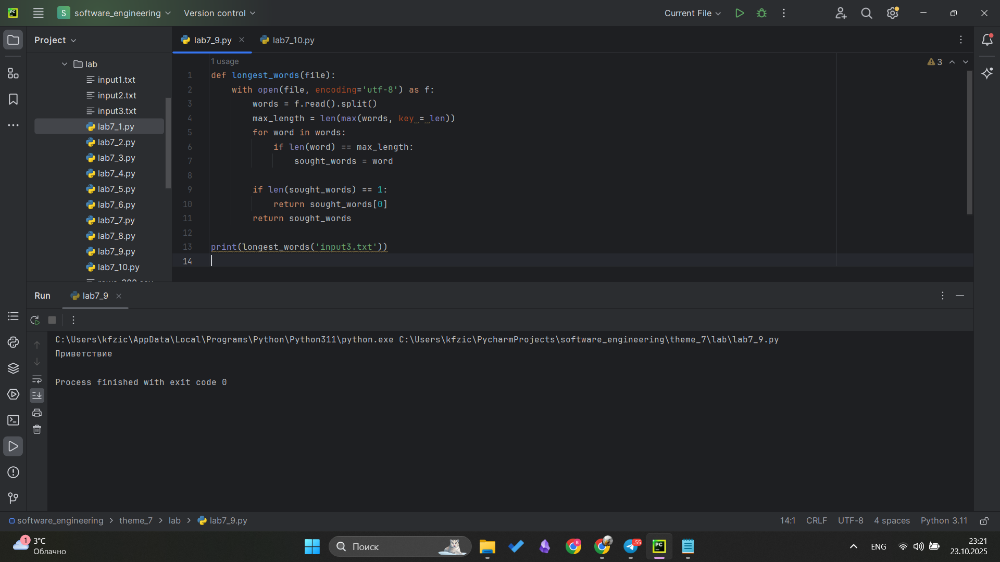

## Выводы
Более обширно поработал с файлом благодаря этой задаче

## Лабораторная работа №10
### Требуется создать csv-файл «rows_300.csv» со следующими столбцами:
№ - номер по порядку (от 1 до 300);
Секунда - текущая секунда на вашем ПК;
Микросекунда текущая миллисекунда на часах.
Для наглядности на каждой итерации цикла искусственно приостанавливайте скрипт на 0,01 секунды.
```python
import csv
import datetime
import time

with open('rows_300.csv', 'w', encoding='utf-8', newline='') as f:
    writer = csv.writer(f)
    writer.writerow(['№', 'Секунда', 'Микросекунда'])
    for line in range(1, 301):
        writer.writerow([line, datetime.datetime.now().second,
                         datetime.datetime.now().microsecond])
        time.sleep(0.01)
```
### Результат.
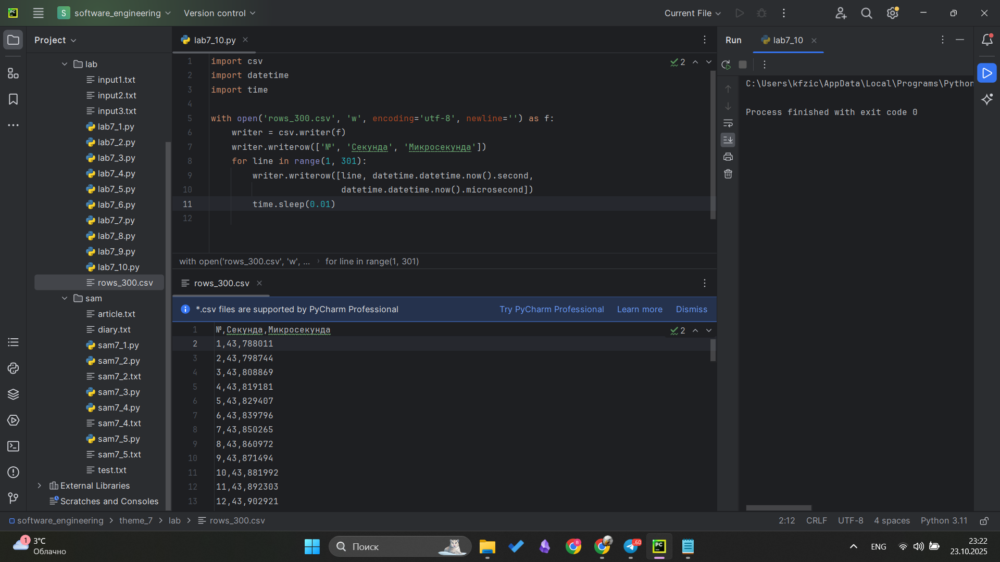

## Выводы
В ходе решения данной задачи я изучил работу с модулем CSV для записи данных в файл, получение текущего времени и использование функции задержки выполнения программы

## Самостоятельная работа №1
### Найдите в интернете любую статью (объем статьи не менее 200 слов), скопируйте ее содержимое в файл и напишите программу, которая считает количество слов в текстовом файле и определит самое часто встречающееся слово. Результатом выполнения задачи будет: скриншот файла со статьей, листинг кода, и вывод в консоль, в котором будет указана вся необходимая информация.
```python
with open('article.txt', 'r', encoding='utf-8') as f:
    text = f.read()

words = text.split()
count_words = len(words)
cleaned_words = []
for word in words:
    cleaned_word = word.strip('.,!?;:"()[]{}«»—_- \n\t')
    cleaned_word = cleaned_word.lower()
    if cleaned_word:
        cleaned_words.append(cleaned_word)

word_frequency = {}
for word in cleaned_words:
    if word in word_frequency:
        word_frequency[word] += 1
    else:
        word_frequency[word] = 1

most_word = None
max = 0

for word, count in word_frequency.items():
    if count > max:
        max = count
        most_word = word

print(f"Количество слов - {count_words}")

if most_word:
    print(f"\nСамое частое слово: '{most_word}'")
    print(f"Количество повторений: {max}")
```
### Результат.
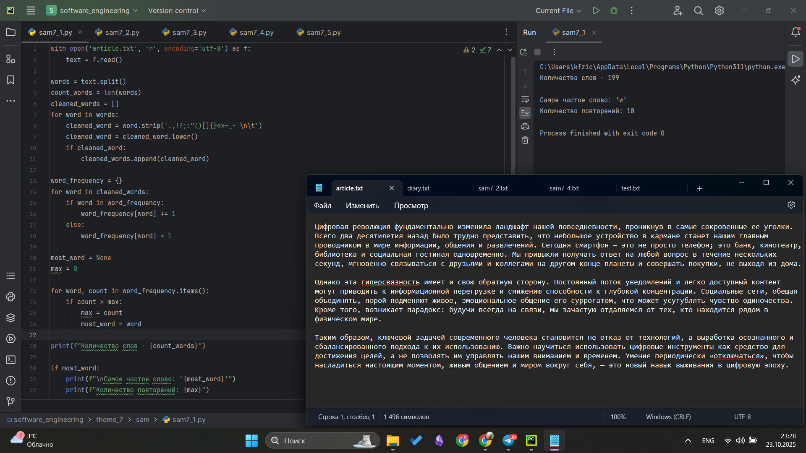

## Выводы
В ходе решения задачи были применены только полученные знания по теме - работа с файлами, а именно: чтение файла

## Самостоятельная работа №2
### У вас появилась потребность в ведении книги расходов, посмотрев все существующие варианты вы пришли к выводу что вас ничего не устраивает и нужно все делать самому. Напишите программу для учета расходов. Программа должна позволять вводить информацию о расходах, сохранять ее в файл и выводить существующие данные в консоль. Ввод информации происходит через консоль. Результатом выполнения задачи будет: скриншот файла с учетом расходов, листинг кода, и вывод в консоль, с демонстрацией работоспособности программы.

```python
def readFile(file):
    with open(file, 'r', encoding='utf-8') as f:
        text = [line.strip() for line in f]
    return text

def updateFile(file):
    new_text = input("Введите новые данные: ")
    with open(file, 'a', encoding='utf-8') as f:
        f.write(new_text + '\n')
    return readFile(file)

while True:
    print('1 - Посмотреть файл')
    print('2 - Добавить данные')
    print('3 - Выход')
    choice = input("Выберите действие: ")
    if choice == '1':
        print(readFile('sam7_2.txt'))
    elif choice == '2':
        print(updateFile('sam7_2.txt'))
    elif choice == '3':
        break
    else:
        print("Неверный выбор")

```
### Результат.
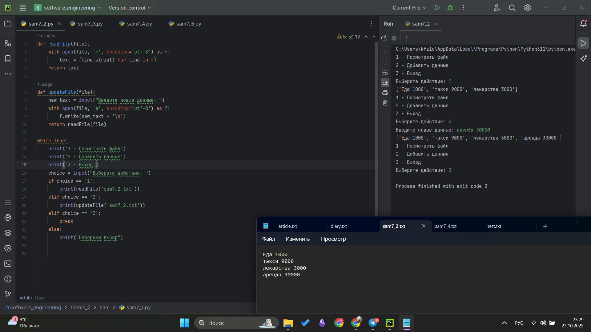

## Выводы
В ходе решения задачи были применены только полученные знания по теме - работа с файлами, а именно: чтение файла, запись в файл. Написан небольшой алгоритм позволяющий вносить новые данные и отслеживать текущие записи файла

## Самостоятельная работа №3
### Имеется файл input.txt с текстом на латинице. Напишите программу, которая выводит следующую статистику по тексту: количество букв латинского алфавита; число слов; число строк.
```python
def file_statistics(file):
    with open(file, 'r') as f:
        text = f.read()

    letter_count = 0
    for char in text:
        if char.isalpha():
            letter_count += 1
    word_count = len(text.split())
    line_count = text.count('\n') + 1 if text else 0

    print('Статистика файла:')
    print(letter_count, 'букв')
    print(word_count, 'слов')
    print(line_count, 'строк')

file_statistics('test.txt')
```
### Результат.
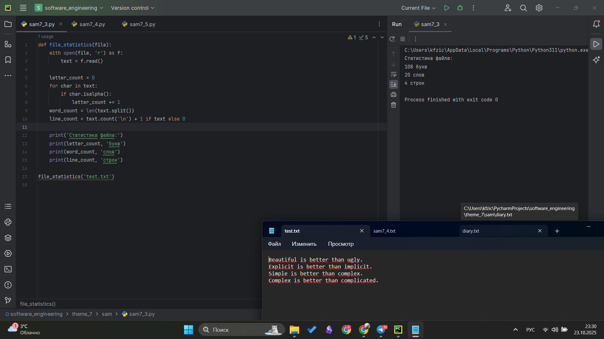

## Выводы
Написан алгоритм позволяющий отслеживать статистику файла, а именно: количество букв, слов и строк.

## Самостоятельная работа №4
### Напишите программу, которая получает на вход предложение, выводит его в терминал, заменяя все запрещенные слова звездочками * (количество звездочек равно количеству букв в слове). Запрещенные слова, разделенные символом пробела, хранятся в текстовом файле input.txt. Все слова в этом файле записаны в нижнем регистре. Программа должна заменить запрещенные слова, где бы они ни встречались, даже в середине другого слова. Замена производится независимо от регистра.
```python
def readFile(file):
    with open(file, 'r') as f:
        text = f.read().strip()
        words = text.split()
    return words
def censor_text(text, forbidden_words):
    new_text = []
    i = 0
    while i < len(text):
        found = False
        for word in forbidden_words:
            forbidden_lower = word.lower()
            if i + len(word) <= len(text):
                substring = text[i:i + len(word)].lower()
                if substring == forbidden_lower:
                    new_text.append('*' * len(word))
                    i += len(word)
                    found = True
                    break
        if not found:
            new_text.append(text[i])
            i += 1

    return ''.join(new_text)

forbidden_words = readFile('sam7_4.txt')
print("Запрещенные слова:", forbidden_words)
text = input("Введите предложение: ")
censored_text = censor_text(text, forbidden_words)
print(f"Результат после цензуры: {censored_text}")
```
### Результат.
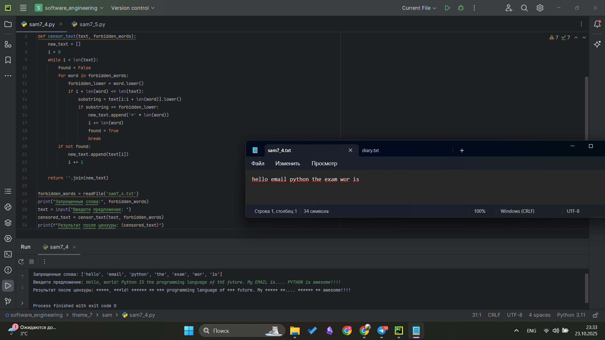

## Выводы
Написан алгоритм который проверяет наличие запрещенных слов, которые написанные в файле, читается файл через программу соответсвенно. Для решения вопросом с регистром, мы переводим всю строку в нижний регистр.

## Самостоятельная работа №5
### Создайте программу для ведения дневника настроения

```python
import datetime

def show_diary():
    with open('diary.txt', 'r', encoding='utf-8') as file:
        entries = file.readlines()

    print("\nМОЙ ДНЕВНИК")
    for i, entry in enumerate(entries, 1):
        parts = entry.strip().split('|')
        if len(parts) == 4:
            date, mood, text, tag = parts
            if tag:
                print(f"{i}. {date} [{tag}] - {text} (настроение: {mood}/5)")
            else:
                print(f"{i}. {date} - {text} (настроение: {mood}/5)")
        else:  # Старый формат без тега
            date, mood, text = parts[0], parts[1], ' '.join(parts[2:])
            print(f"{i}. {date} - {text} (настроение: {mood}/5)")

def add_entry():
    print("\nНОВАЯ ЗАПИСЬ")
    date = input("Дата (дд.мм.гггг или Enter для сегодня): ")
    if not date:
        date = datetime.datetime.now().strftime("%d.%m.%Y")

    mood = input("Настроение (1-5): ")
    text = input("Опишите ваш день: ")
    tag = input("Добавить тег (Enter чтобы пропустить): ")

    with open('diary.txt', 'a', encoding='utf-8') as file:
        file.write(f"{date}|{mood}|{text}|{tag}\n")

    print("Запись добавлена!")

def search_entries():
    with open('diary.txt', 'r', encoding='utf-8') as file:
        entries = file.readlines()

    print("\n1 - Поиск по тексту")
    print("2 - Поиск по тегу")
    choice = input("Выберите тип поиска: ")

    if choice == '1':
        keyword = input("Поиск по тексту: ").lower()
    elif choice == '2':
        keyword = input("Поиск по тегу: ").lower()
    else:
        print("Неверный выбор!")
        return

    print("\nРЕЗУЛЬТАТЫ ПОИСКА:")
    for entry in entries:
        if keyword in entry.lower():
            parts = entry.strip().split('|')
            if len(parts) == 4:
                date, mood, text, tag = parts
                if tag:
                    print(f"{date} [{tag}] - {text}")
                else:
                    print(f"{date} - {text}")
            else:
                date, mood, text = parts[0], parts[1], ' '.join(parts[2:])
                print(f"{date} - {text}")

while True:
    print("\n1 - Показать дневник")
    print("2 - Добавить запись")
    print("3 - Поиск")
    print("4 - Выйти")

    choice = input("Выберите: ")

    if choice == '1':
        show_diary()
    elif choice == '2':
        add_entry()
    elif choice == '3':
        search_entries()
    elif choice == '4':
        break
```
### Результат.
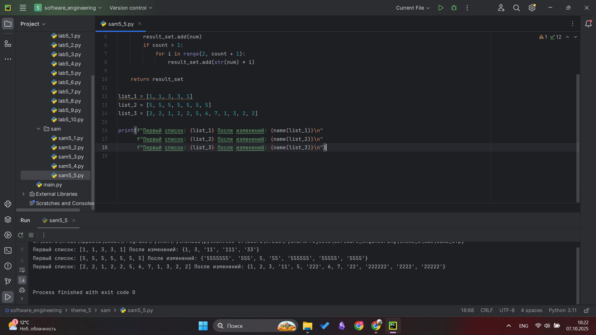

## Выводы
Написан простой дневник настроений, который имеет следующие функции:
1. Просмотр всего дневника
2. Добавление новых записей: реализован ввод даты с помощью библиотеки datetime, оценка настроения, заметка и тег(для поиска)
3. Поиск данных
   3.1 По тексу
   3.2 По тегу

Данная задача очень хороша тем, что её реализацию можно бессчетное кол-во раз улучшать и добавлять новое, тем самым получится пет-проект, которые так важны)

## Общие выводы по теме
# Тема 7. Работа с файлами(ввод, вывод)
Отчет по Теме #7 выполнил(а):
- Фомин Владислав Андреевич
- ПИЭ-23-1

| Задание | Лаб_раб | Сам_раб |
| ------ | ------ | ------ |
| Задание 1 | + | + |
| Задание 2 | + | + |
| Задание 3 | + | + |
| Задание 4 | + | + |
| Задание 5 | + | + |
| Задание 6 | + |  |
| Задание 7 | + |  |
| Задание 8 | + |  |
| Задание 9 | + |  |
| Задание 10 | + |  |

Работу проверили:
- к.э.н., доцент Панов М.А.

## Лабораторная работа №1
### Составьте текстовый файл и положите его в одну директорию с программой на Python. Текстовый файл должен состоять минимум из двух строк.

### Результат.


## Лабораторная работа №2
### Напишите программу, которая выведет только первую строку из вашего файла, при этом используйте конструкцию open()/close().
```python
f = open('input1.txt', 'r')
print(f.readline())
f.close()
```
### Текстовый файл
[input1.txt](./sam/input1.txt)

### Результат.


## Выводы
Изучили как открыть файл и прочитать первую его строку через readline, при данном способе чтения данные получаем как строку

## Лабораторная работа №3
### Напишите программу, которая выведет все строки из вашего файла в массиве, при этом используйте конструкцию open()/close().

```python
f = open('input1.txt', 'r')
print(f.readlines())
f.close()
```
### Текстовый файл
[input1.txt](./sam/input1.txt)

### Результат.


## Выводы
Изучили как получить данные из файла при помощи readlines(), в таком случае данные в виде списка

## Лабораторная работа №4
### Напишите программу, которая выведет все строки из вашего файла в массиве, при этом используйте конструкцию with open().

```python
with open('input1.txt') as f:
    print(f.readlines())
```
### Текстовый файл
[input1.txt](./sam/input1.txt)

### Результат.


## Выводы
Изучена конструкция with open() для работы с файлами

## Лабораторная работа №5
### Напишите программу, которая выведет каждую строку из вашего файла отдельно, при этом используйте конструкцию with open().

```python
with open('input1.txt') as f:
    for line in f:
        print(line)
```
### Текстовый файл
[input1.txt](./sam/input1.txt)

### Результат.


## Выводы
Изучен один из способов вывода содержимого файла построчно при помощи конструкции with open()

## Лабораторная работа №6
### Напишите программу, которая будет добавлять новую строку в ваш файл, а потом выведет полученный файл в консоль. Вывод можно осуществлять любым способом. Обязательно проверьте сам файл, чтобы изменения в нем тоже отображались.
```python
with open('input1.txt', 'a+') as f:
    f.write('\nIm additional line')

with open('input.txt', 'r') as f:
    result = f.readlines()
    print(result)
```
### Текстовый файл
[input1.txt](./sam/input1.txt)

### Результат.


## Выводы
Изучен способ добавления значений в файл через write() + при объявлении файла указываем 'a' для добавления значений

## Лабораторная работа №7
### Напишите программу, которая перепишет всю информацию, которая была у вас в файле до этого, например напишет любые данные из произвольно вами составленного списка. Также не забудьте проверить что измененная вами информация сохранилась в файле.
```python
lines = ['one', 'two', 'three']
with open('input2.txt', 'w') as f:
    for line in lines:
        f.write('\nCycle run ' + line)
    print('Done!')
```
### Текстовый файл
## До [input1.txt](./sam/input1.txt)
## После [input2.txt](./sam/input2.txt)

### Результат.


## Выводы
Изучили как перезаписать данные файла и добавить значения из массива в файл посторочно

## Лабораторная работа №8
### Выберите любую папку на своем компьютере, имеющую вложенные директории. Выведите на печать в терминал ее содержимое, как и всех подкаталогов при помощи функции print_docs(directory).
```python
import os
def print_docs(directory):
    all_files = os.walk(directory)
    for catalog in all_files:
        print(f'Папка {catalog[0]} содержит:')
    print(f'Директории: {", ".join([folder for folder in catalog[1]])}')
    print(f'Файлы: {", ".join([file for file in catalog[2]])}')
    print('-' * 40)

print_docs('C:/Users/kfzic/PycharmProjects/software_engineering/theme_7')
```
### Результат.


## Выводы
Изучил как работает библиотека os и некоторые ее возможности

## Лабораторная работа №9
### Требуется реализовать функцию, которая выводит слово, имеющее максимальную длину (или список слов, если таковых несколько).

```python
def longest_words(file):
    with open(file, encoding='utf-8') as f:
        words = f.read().split()
        max_length = len(max(words, key = len))
        for word in words:
            if len(word) == max_length:
                sought_words = word

        if len(sought_words) == 1:
            return sought_words[0]
        return sought_words

print(longest_words('input3.txt'))
```
### Текстовый файл
[input3.txt](./sam/input3.txt)

### Результат.


## Выводы
Более обширно поработал с файлом благодаря этой задаче

## Лабораторная работа №10
### Требуется создать csv-файл «rows_300.csv» со следующими столбцами:
№ - номер по порядку (от 1 до 300);
Секунда - текущая секунда на вашем ПК;
Микросекунда текущая миллисекунда на часах.
Для наглядности на каждой итерации цикла искусственно приостанавливайте скрипт на 0,01 секунды.
```python
import csv
import datetime
import time

with open('rows_300.csv', 'w', encoding='utf-8', newline='') as f:
    writer = csv.writer(f)
    writer.writerow(['№', 'Секунда', 'Микросекунда'])
    for line in range(1, 301):
        writer.writerow([line, datetime.datetime.now().second,
                         datetime.datetime.now().microsecond])
        time.sleep(0.01)
```
### Результат.


## Выводы
В ходе решения данной задачи я изучил работу с модулем CSV для записи данных в файл, получение текущего времени и использование функции задержки выполнения программы

## Самостоятельная работа №1
### Найдите в интернете любую статью (объем статьи не менее 200 слов), скопируйте ее содержимое в файл и напишите программу, которая считает количество слов в текстовом файле и определит самое часто встречающееся слово. Результатом выполнения задачи будет: скриншот файла со статьей, листинг кода, и вывод в консоль, в котором будет указана вся необходимая информация.
```python
with open('article.txt', 'r', encoding='utf-8') as f:
    text = f.read()

words = text.split()
count_words = len(words)
cleaned_words = []
for word in words:
    cleaned_word = word.strip('.,!?;:"()[]{}«»—_- \n\t')
    cleaned_word = cleaned_word.lower()
    if cleaned_word:
        cleaned_words.append(cleaned_word)

word_frequency = {}
for word in cleaned_words:
    if word in word_frequency:
        word_frequency[word] += 1
    else:
        word_frequency[word] = 1

most_word = None
max = 0

for word, count in word_frequency.items():
    if count > max:
        max = count
        most_word = word

print(f"Количество слов - {count_words}")

if most_word:
    print(f"\nСамое частое слово: '{most_word}'")
    print(f"Количество повторений: {max}")
```
### Текстовый файл
[article.txt](./sam/article.txt)

### Результат.


## Выводы
В ходе решения задачи были применены только полученные знания по теме - работа с файлами, а именно: чтение файла

## Самостоятельная работа №2
### У вас появилась потребность в ведении книги расходов, посмотрев все существующие варианты вы пришли к выводу что вас ничего не устраивает и нужно все делать самому. Напишите программу для учета расходов. Программа должна позволять вводить информацию о расходах, сохранять ее в файл и выводить существующие данные в консоль. Ввод информации происходит через консоль. Результатом выполнения задачи будет: скриншот файла с учетом расходов, листинг кода, и вывод в консоль, с демонстрацией работоспособности программы.

```python
def readFile(file):
    with open(file, 'r', encoding='utf-8') as f:
        text = [line.strip() for line in f]
    return text

def updateFile(file):
    new_text = input("Введите новые данные: ")
    with open(file, 'a', encoding='utf-8') as f:
        f.write(new_text + '\n')
    return readFile(file)

while True:
    print('1 - Посмотреть файл')
    print('2 - Добавить данные')
    print('3 - Выход')
    choice = input("Выберите действие: ")
    if choice == '1':
        print(readFile('sam7_2.txt'))
    elif choice == '2':
        print(updateFile('sam7_2.txt'))
    elif choice == '3':
        break
    else:
        print("Неверный выбор")

```
### Текстовый файл
[sam7_2.txt](./sam/sam7_2.txt)

### Результат.


## Выводы
В ходе решения задачи были применены только полученные знания по теме - работа с файлами, а именно: чтение файла, запись в файл. Написан небольшой алгоритм позволяющий вносить новые данные и отслеживать текущие записи файла

## Самостоятельная работа №3
### Имеется файл input.txt с текстом на латинице. Напишите программу, которая выводит следующую статистику по тексту: количество букв латинского алфавита; число слов; число строк.
```python
def file_statistics(file):
    with open(file, 'r') as f:
        text = f.read()

    letter_count = 0
    for char in text:
        if char.isalpha():
            letter_count += 1
    word_count = len(text.split())
    line_count = text.count('\n') + 1 if text else 0

    print('Статистика файла:')
    print(letter_count, 'букв')
    print(word_count, 'слов')
    print(line_count, 'строк')

file_statistics('test.txt')
```
### Текстовый файл
[test.txt](./sam/test.txt)
### Результат.


## Выводы
Написан алгоритм позволяющий отслеживать статистику файла, а именно: количество букв, слов и строк.

## Самостоятельная работа №4
### Напишите программу, которая получает на вход предложение, выводит его в терминал, заменяя все запрещенные слова звездочками * (количество звездочек равно количеству букв в слове). Запрещенные слова, разделенные символом пробела, хранятся в текстовом файле input.txt. Все слова в этом файле записаны в нижнем регистре. Программа должна заменить запрещенные слова, где бы они ни встречались, даже в середине другого слова. Замена производится независимо от регистра.
```python
def readFile(file):
    with open(file, 'r') as f:
        text = f.read().strip()
        words = text.split()
    return words
def censor_text(text, forbidden_words):
    new_text = []
    i = 0
    while i < len(text):
        found = False
        for word in forbidden_words:
            forbidden_lower = word.lower()
            if i + len(word) <= len(text):
                substring = text[i:i + len(word)].lower()
                if substring == forbidden_lower:
                    new_text.append('*' * len(word))
                    i += len(word)
                    found = True
                    break
        if not found:
            new_text.append(text[i])
            i += 1

    return ''.join(new_text)

forbidden_words = readFile('sam7_4.txt')
print("Запрещенные слова:", forbidden_words)
text = input("Введите предложение: ")
censored_text = censor_text(text, forbidden_words)
print(f"Результат после цензуры: {censored_text}")
```
### Текстовый файл
[sam7_4.txt](./sam/sam7_4.txt)
### Результат.


## Выводы
Написан алгоритм который проверяет наличие запрещенных слов, которые написанные в файле, читается файл через программу соответсвенно. Для решения вопросом с регистром, мы переводим всю строку в нижний регистр.

## Самостоятельная работа №5
### Создайте программу для ведения дневника настроения

```python
import datetime

def show_diary():
    with open('diary.txt', 'r', encoding='utf-8') as file:
        entries = file.readlines()

    print("\nМОЙ ДНЕВНИК")
    for i, entry in enumerate(entries, 1):
        parts = entry.strip().split('|')
        if len(parts) == 4:
            date, mood, text, tag = parts
            if tag:
                print(f"{i}. {date} [{tag}] - {text} (настроение: {mood}/5)")
            else:
                print(f"{i}. {date} - {text} (настроение: {mood}/5)")
        else:  # Старый формат без тега
            date, mood, text = parts[0], parts[1], ' '.join(parts[2:])
            print(f"{i}. {date} - {text} (настроение: {mood}/5)")

def add_entry():
    print("\nНОВАЯ ЗАПИСЬ")
    date = input("Дата (дд.мм.гггг или Enter для сегодня): ")
    if not date:
        date = datetime.datetime.now().strftime("%d.%m.%Y")

    mood = input("Настроение (1-5): ")
    text = input("Опишите ваш день: ")
    tag = input("Добавить тег (Enter чтобы пропустить): ")

    with open('diary.txt', 'a', encoding='utf-8') as file:
        file.write(f"{date}|{mood}|{text}|{tag}\n")

    print("Запись добавлена!")

def search_entries():
    with open('diary.txt', 'r', encoding='utf-8') as file:
        entries = file.readlines()

    print("\n1 - Поиск по тексту")
    print("2 - Поиск по тегу")
    choice = input("Выберите тип поиска: ")

    if choice == '1':
        keyword = input("Поиск по тексту: ").lower()
    elif choice == '2':
        keyword = input("Поиск по тегу: ").lower()
    else:
        print("Неверный выбор!")
        return

    print("\nРЕЗУЛЬТАТЫ ПОИСКА:")
    for entry in entries:
        if keyword in entry.lower():
            parts = entry.strip().split('|')
            if len(parts) == 4:
                date, mood, text, tag = parts
                if tag:
                    print(f"{date} [{tag}] - {text}")
                else:
                    print(f"{date} - {text}")
            else:
                date, mood, text = parts[0], parts[1], ' '.join(parts[2:])
                print(f"{date} - {text}")

while True:
    print("\n1 - Показать дневник")
    print("2 - Добавить запись")
    print("3 - Поиск")
    print("4 - Выйти")

    choice = input("Выберите: ")

    if choice == '1':
        show_diary()
    elif choice == '2':
        add_entry()
    elif choice == '3':
        search_entries()
    elif choice == '4':
        break
```
### Текстовый файл
[diary.txt](./sam/diary.txt)
### Результат.
.png)
.png)
.png)

## Выводы
Написан простой дневник настроений, который имеет следующие функции:
1. Просмотр всего дневника
2. Добавление новых записей: реализован ввод даты с помощью библиотеки datetime, оценка настроения, заметка и тег(для поиска)
3. Поиск данных
   3.1 По тексу
   3.2 По тегу

Данная задача очень хороша тем, что её реализацию можно бессчетное кол-во раз улучшать и добавлять новое, тем самым получится пет-проект, которые так важны)

## Общие выводы по теме
В ходе изучения темы я освоил основные операции чтения и записи файлов в Python, научился работать с различными форматами данных (текстовые файлы, CSV), а также реализовал практические задачи по обработке текстовой информации и организации данных в файловой системе. Полученные навыки позволяют эффективно управлять файлами и данными в программных проектах
