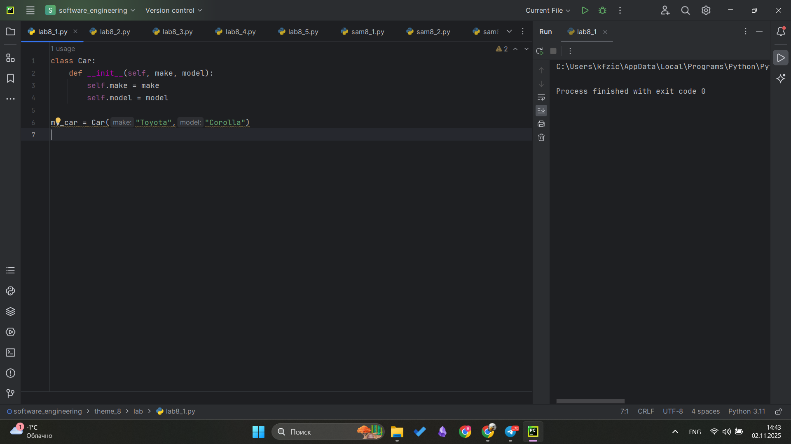
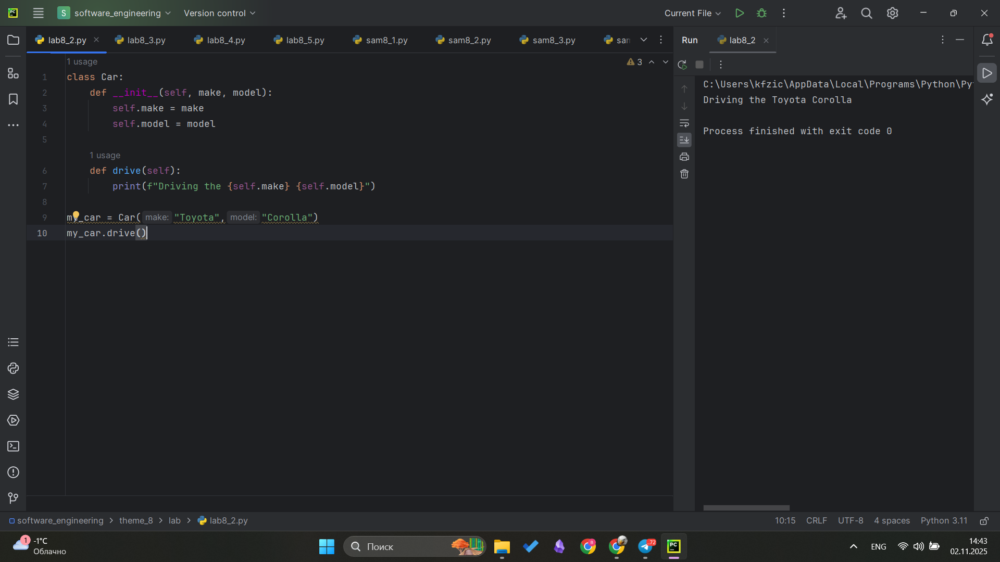
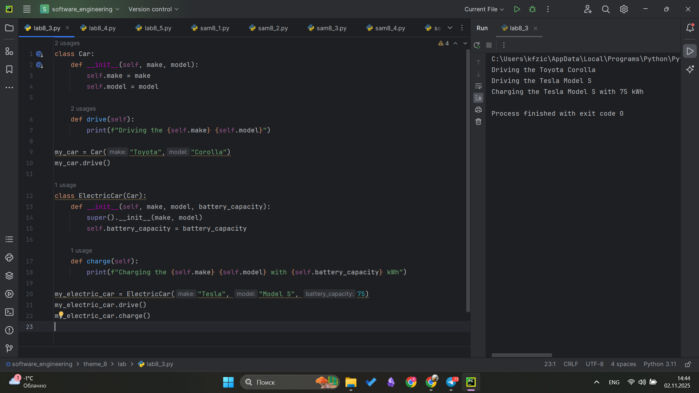
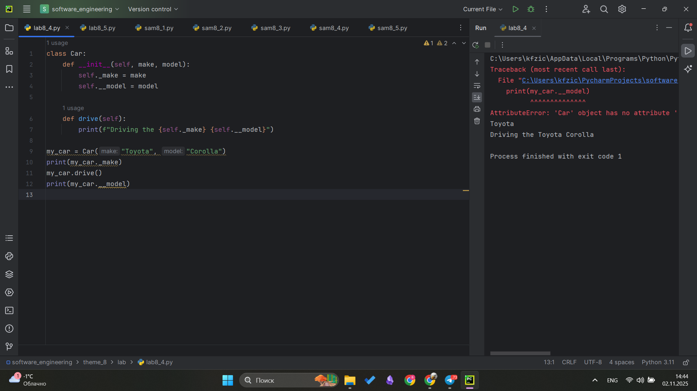
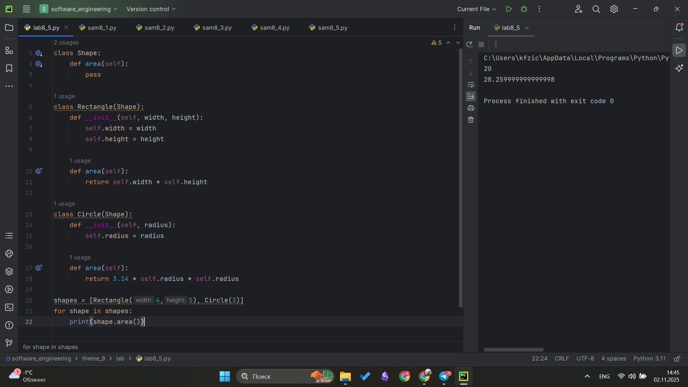
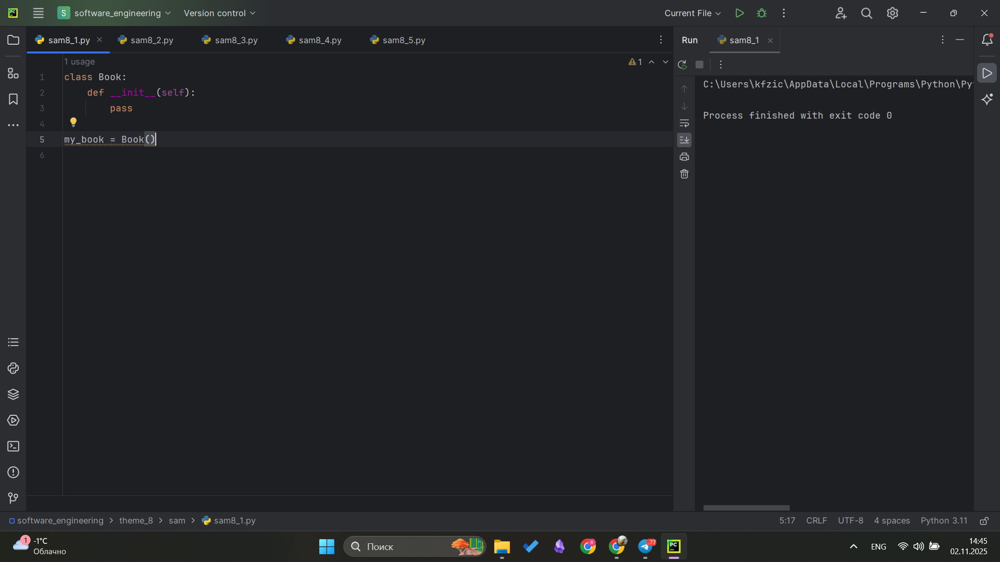
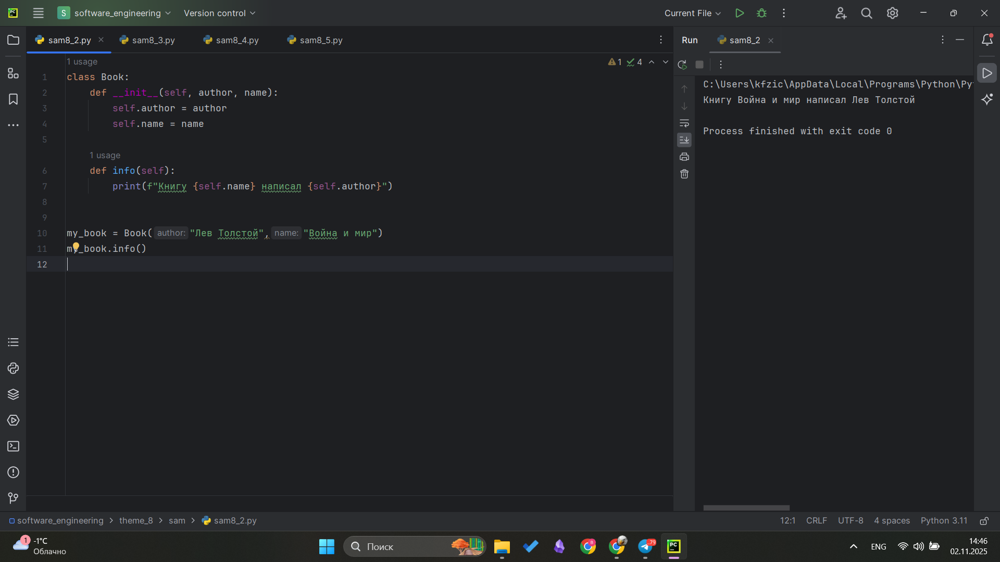
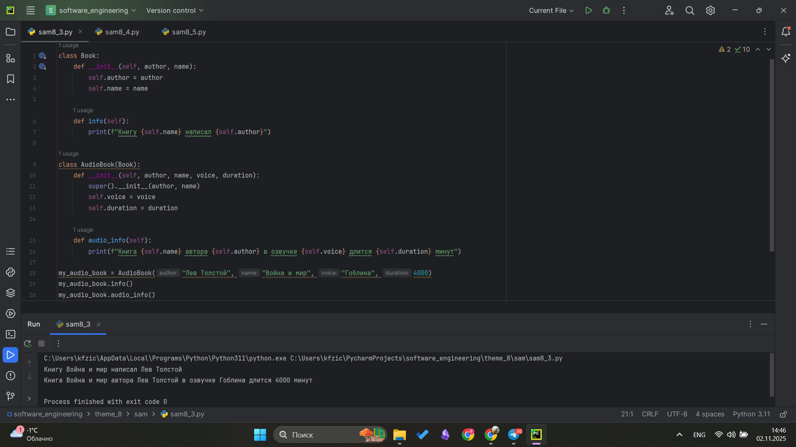
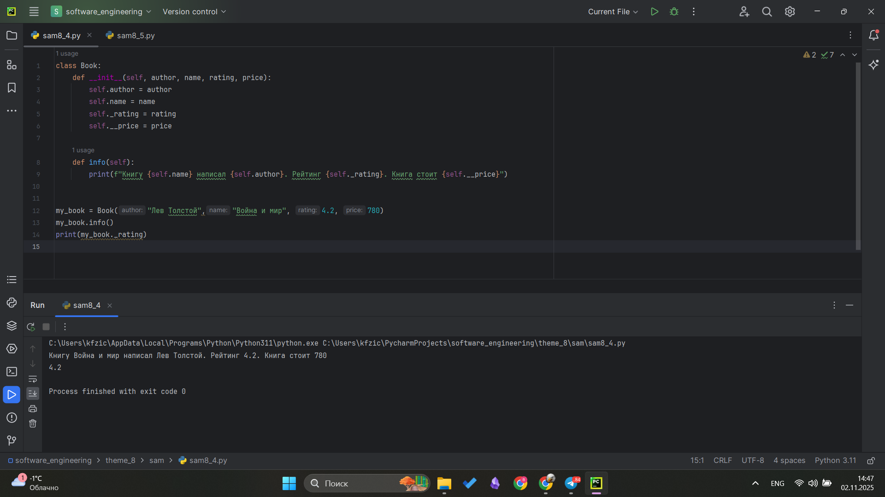
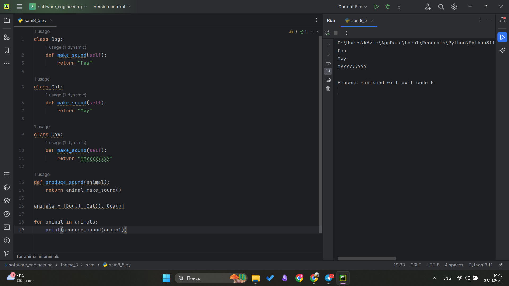

# Тема 8. Базовые коллекции: словари, кортежи
Отчет по Теме #8 выполнил(а):
- Фомин Владислав Андреевич
- ПИЭ-23-1

| Задание | Лаб_раб | Сам_раб |
| ------ | ------ | ------ |
| Задание 1 | + | + |
| Задание 2 | + | + |
| Задание 3 | + | + |
| Задание 4 | + | + |
| Задание 5 | + | + |


Работу проверили:
- к.э.н., доцент Панов М.А.

## Лабораторная работа №1
### Создайте класс "Car" с атрибутами производитель и модель. Создайте объект этого класса. Напишите комментарии для кода, объясняющие его работу. Результатом выполнения задания будет листинг кода с комментариями.
```python
class Car:
    def __init__(self, make, model):
        self.make = make
        self.model = model

my_car = Car("Toyota","Corolla")
```
### Результат.


## Выводы
Создан класс Car, который имеет атрибуты make-произовдитель и model-модель. программа принимает значения при вызове класса и подставляет их в атрибуты

## Лабораторная работа №2
### Дополните код из первого задания, добавив в него атрибуты и методы класса, заставьте машину “поехать”. Напишите комментарии для кода, объясняющие его работу. Результатом выполнения задания будет листинг кода с комментариями и получившийся вывод в консоль.
```python
class Car:
    def __init__(self, make, model):
        self.make = make
        self.model = model

    def drive(self):
        print(f"Driving the {self.make} {self.model}")

my_car = Car("Toyota","Corolla")
my_car.drive()
```
### Результат.


## Выводы
К прошлой программе добавлена часть кода, в которой написана функция с выводом, выводит значения атрибутов и не только

## Лабораторная работа №3
### Создайте новый класс "ElectricCar" с методом "charge" и атрибутом емкость батареи. Реализуйте его наследование от класса, созданного в первом задании. Заставьте машину поехать, а потом заряжаться. Напишите комментарии для кода, объясняющие его работу. Результатом выполнения задания будет листинг кода с комментариями и получившийся вывод в консоль.

```python
class Car:
    def __init__(self, make, model):
        self.make = make
        self.model = model

    def drive(self):
        print(f"Driving the {self.make} {self.model}")

my_car = Car("Toyota","Corolla")
my_car.drive()

class ElectricCar(Car):
    def __init__(self, make, model, battery_capacity):
        super().__init__(make, model)
        self.battery_capacity = battery_capacity

    def charge(self):
        print(f"Charging the {self.make} {self.model} with {self.battery_capacity} kWh")

my_electric_car = ElectricCar("Tesla", "Model S", 75)
my_electric_car.drive()
my_electric_car.charge()
```
### Результат.


## Выводы
Изучено наследование, super()

## Лабораторная работа №4
### Реализуйте инкапсуляцию для класса, созданного в первом задании. Создайте защищенный атрибут производителя и приватный атрибут модели. Вызовите защищенный атрибут и заставьте машину поехать. Напишите комментарии для кода, объясняющие его работу. Результатом выполнения задания будет листинг кода с комментариями и получившийся вывод в консоль.

```python
class Car:
    def __init__(self, make, model):
        self._make = make
        self.__model = model

    def drive(self):
        print(f"Driving the {self._make} {self.__model}")

my_car = Car("Toyota", "Corolla")
print(my_car._make)
my_car.drive()
print(my_car.__model)
```
### Результат.


## Выводы
Изучена инкапсуляция, защищенные и приватные атрибуты

## Лабораторная работа №5
### Реализуйте полиморфизм создав основной (общий) класс "Shape", а также еще два класса "Rectangle" и "Circle". Внутри последних двух классов реализуйте методы для подсчета площади фигуры. После этого создайте массив с фигурами, поместите туда круг и прямоугольник, затем при помощи цикла выведите их площади. Напишите комментарии для кода, объясняющие его работу. Результатом Результатом выполнения задания будет листинг кода с комментариями и получившийся вывод в консоль.

```python
class Shape:
    def area(self):
        pass

class Rectangle(Shape):
    def __init__(self, width, height):
        self.width = width
        self.height = height

    def area(self):
        return self.width * self.height

class Circle(Shape):
    def __init__(self, radius):
        self.radius = radius

    def area(self):
        return 3.14 * self.radius * self.radius

shapes = [Rectangle(4,5), Circle(3)]
for shape in shapes:
    print(shape.area())
```
### Результат.


## Выводы
Изучили что такое полиморфизм и как его реализовать

## Самостоятельная работа №1
### Самостоятельно создайте класс и его объект. Они должны отличаться, от тех, что указаны в теоретическом материале (методичке) и лабораторных заданиях. Результатом выполнения задания будет листинг кода и получившийся вывод консоли.
```python
class Book:
    def __init__(self):
        pass

my_book = Book()
```
### Результат.


## Выводы
#Реализация класса и его объекта my_book

## Самостоятельная работа №2
### Самостоятельно создайте атрибуты и методы для ранее созданного класса. Они должны отличаться, от тех, что указаны в теоретическом материале (методичке) и лабораторных заданиях. Результатом выполнения задания будет листинг кода и получившийся вывод консоли.
```python
class Book:
    def __init__(self, author, name):
        self.author = author
        self.name = name

    def info(self):
        print(f"Книгу {self.name} написал {self.author}")


my_book = Book("Лев Толстой","Война и мир")
my_book.info()
```
### Результат.


## Выводы
В класс написанный ранее добавили несколько атрибутов характеристик и метод по выводу информации

## Самостоятельная работа №3
### Самостоятельно реализуйте наследование, продолжая работать с ранее созданным классом. Оно должно отличаться, от того, что указано в теоретическом материале (методичке) и лабораторных заданиях. Результатом выполнения задания будет листинг кода и получившийся вывод консоли.
```python
class Book:
    def __init__(self, author, name):
        self.author = author
        self.name = name

    def info(self):
        print(f"Книгу {self.name} написал {self.author}")

class AudioBook(Book):
    def __init__(self, author, name, voice, duration):
        super().__init__(author, name)
        self.voice = voice
        self.duration = duration

    def audio_info(self):
        print(f"Книга {self.name} автора {self.author} в озвучке {self.voice} длится {self.duration} минут")

my_audio_book = AudioBook("Лев Толстой", "Война и мир", "Гоблина", 4000)
my_audio_book.info()
my_audio_book.audio_info()
```
### Результат.


## Выводы
К предыдущему коду добавили наследование реализовав класс AudioBook, который наследует родительский класс Book

## Самостоятельная работа №4
### Самостоятельно реализуйте инкапсуляцию, продолжая работать с ранее созданным классом. Она должна отличаться, от того, что указана в теоретическом материале (методичке) и лабораторных заданиях. Результатом выполнения задания будет листинг кода и получившийся вывод консоли.

```python
class Book:
    def __init__(self, author, name, rating, price):
        self.author = author
        self.name = name
        self._rating = rating
        self.__price = price

    def info(self):
        print(f"Книгу {self.name} написал {self.author}. Рейтинг {self._rating}. Книга стоит {self.__price}")


my_book = Book("Лев Толстой","Война и мир", 4.2, 780)
my_book.info()
print(my_book._rating)
```
### Результат.


## Выводы
К классу Book добавили инкапсуляцию: защищенный атрибут - rating и приватный атрибут - price

## Самостоятельная работа №5
### Самостоятельно реализуйте полиморфизм. Он должен отличаться, от того, что указан в теоретическом материале (методичке) и лабораторных заданиях. Результатом выполнения задания будет листинг кода и получившийся вывод консоли.

```python
class Dog:
    def make_sound(self):
        return "Гав"

class Cat:
    def make_sound(self):
        return "Мяу"

class Cow:
    def make_sound(self):
        return "МУУУУУУУУУ"

def produce_sound(animal):
    return animal.make_sound()

animals = [Dog(), Cat(), Cow()]

for animal in animals:
    print(produce_sound(animal))
```
### Результат.


## Выводы
Реализовали полиморфизм. Все классы содержат один метод но разные выводы

## Общие выводы по теме
# Тема 8. Базовые коллекции: словари, кортежи
Отчет по Теме #8 выполнил(а):
- Фомин Владислав Андреевич
- ПИЭ-23-1

| Задание | Лаб_раб | Сам_раб |
| ------ | ------ | ------ |
| Задание 1 | + | + |
| Задание 2 | + | + |
| Задание 3 | + | + |
| Задание 4 | + | + |
| Задание 5 | + | + |


Работу проверили:
- к.э.н., доцент Панов М.А.

## Лабораторная работа №1
### Создайте класс "Car" с атрибутами производитель и модель. Создайте объект этого класса. Напишите комментарии для кода, объясняющие его работу. Результатом выполнения задания будет листинг кода с комментариями.
```python
class Car:
    def __init__(self, make, model):
        self.make = make
        self.model = model

my_car = Car("Toyota","Corolla")
```
### Результат.


## Выводы
Создан класс Car, который имеет атрибуты make-произовдитель и model-модель. программа принимает значения при вызове класса и подставляет их в атрибуты

## Лабораторная работа №2
### Дополните код из первого задания, добавив в него атрибуты и методы класса, заставьте машину “поехать”. Напишите комментарии для кода, объясняющие его работу. Результатом выполнения задания будет листинг кода с комментариями и получившийся вывод в консоль.
```python
class Car:
    def __init__(self, make, model):
        self.make = make
        self.model = model

    def drive(self):
        print(f"Driving the {self.make} {self.model}")

my_car = Car("Toyota","Corolla")
my_car.drive()
```
### Результат.


## Выводы
К прошлой программе добавлена часть кода, в которой написана функция с выводом, выводит значения атрибутов и не только

## Лабораторная работа №3
### Создайте новый класс "ElectricCar" с методом "charge" и атрибутом емкость батареи. Реализуйте его наследование от класса, созданного в первом задании. Заставьте машину поехать, а потом заряжаться. Напишите комментарии для кода, объясняющие его работу. Результатом выполнения задания будет листинг кода с комментариями и получившийся вывод в консоль.

```python
class Car:
    def __init__(self, make, model):
        self.make = make
        self.model = model

    def drive(self):
        print(f"Driving the {self.make} {self.model}")

my_car = Car("Toyota","Corolla")
my_car.drive()

class ElectricCar(Car):
    def __init__(self, make, model, battery_capacity):
        super().__init__(make, model)
        self.battery_capacity = battery_capacity

    def charge(self):
        print(f"Charging the {self.make} {self.model} with {self.battery_capacity} kWh")

my_electric_car = ElectricCar("Tesla", "Model S", 75)
my_electric_car.drive()
my_electric_car.charge()
```
### Результат.


## Выводы
Изучено наследование, super()

## Лабораторная работа №4
### Реализуйте инкапсуляцию для класса, созданного в первом задании. Создайте защищенный атрибут производителя и приватный атрибут модели. Вызовите защищенный атрибут и заставьте машину поехать. Напишите комментарии для кода, объясняющие его работу. Результатом выполнения задания будет листинг кода с комментариями и получившийся вывод в консоль.

```python
class Car:
    def __init__(self, make, model):
        self._make = make
        self.__model = model

    def drive(self):
        print(f"Driving the {self._make} {self.__model}")

my_car = Car("Toyota", "Corolla")
print(my_car._make)
my_car.drive()
print(my_car.__model)
```
### Результат.


## Выводы
Изучена инкапсуляция, защищенные и приватные атрибуты

## Лабораторная работа №5
### Реализуйте полиморфизм создав основной (общий) класс "Shape", а также еще два класса "Rectangle" и "Circle". Внутри последних двух классов реализуйте методы для подсчета площади фигуры. После этого создайте массив с фигурами, поместите туда круг и прямоугольник, затем при помощи цикла выведите их площади. Напишите комментарии для кода, объясняющие его работу. Результатом Результатом выполнения задания будет листинг кода с комментариями и получившийся вывод в консоль.

```python
class Shape:
    def area(self):
        pass

class Rectangle(Shape):
    def __init__(self, width, height):
        self.width = width
        self.height = height

    def area(self):
        return self.width * self.height

class Circle(Shape):
    def __init__(self, radius):
        self.radius = radius

    def area(self):
        return 3.14 * self.radius * self.radius

shapes = [Rectangle(4,5), Circle(3)]
for shape in shapes:
    print(shape.area())
```
### Результат.


## Выводы
Изучили что такое полиморфизм и как его реализовать

## Самостоятельная работа №1
### Самостоятельно создайте класс и его объект. Они должны отличаться, от тех, что указаны в теоретическом материале (методичке) и лабораторных заданиях. Результатом выполнения задания будет листинг кода и получившийся вывод консоли.
```python
class Book:
    def __init__(self):
        pass

my_book = Book()
```
### Результат.


## Выводы
#Реализация класса и его объекта my_book

## Самостоятельная работа №2
### Самостоятельно создайте атрибуты и методы для ранее созданного класса. Они должны отличаться, от тех, что указаны в теоретическом материале (методичке) и лабораторных заданиях. Результатом выполнения задания будет листинг кода и получившийся вывод консоли.
```python
class Book:
    def __init__(self, author, name):
        self.author = author
        self.name = name

    def info(self):
        print(f"Книгу {self.name} написал {self.author}")


my_book = Book("Лев Толстой","Война и мир")
my_book.info()
```
### Результат.


## Выводы
В класс написанный ранее добавили несколько атрибутов характеристик и метод по выводу информации

## Самостоятельная работа №3
### Самостоятельно реализуйте наследование, продолжая работать с ранее созданным классом. Оно должно отличаться, от того, что указано в теоретическом материале (методичке) и лабораторных заданиях. Результатом выполнения задания будет листинг кода и получившийся вывод консоли.
```python
class Book:
    def __init__(self, author, name):
        self.author = author
        self.name = name

    def info(self):
        print(f"Книгу {self.name} написал {self.author}")

class AudioBook(Book):
    def __init__(self, author, name, voice, duration):
        super().__init__(author, name)
        self.voice = voice
        self.duration = duration

    def audio_info(self):
        print(f"Книга {self.name} автора {self.author} в озвучке {self.voice} длится {self.duration} минут")

my_audio_book = AudioBook("Лев Толстой", "Война и мир", "Гоблина", 4000)
my_audio_book.info()
my_audio_book.audio_info()
```
### Результат.


## Выводы
К предыдущему коду добавили наследование реализовав класс AudioBook, который наследует родительский класс Book

## Самостоятельная работа №4
### Самостоятельно реализуйте инкапсуляцию, продолжая работать с ранее созданным классом. Она должна отличаться, от того, что указана в теоретическом материале (методичке) и лабораторных заданиях. Результатом выполнения задания будет листинг кода и получившийся вывод консоли.

```python
class Book:
    def __init__(self, author, name, rating, price):
        self.author = author
        self.name = name
        self._rating = rating
        self.__price = price

    def info(self):
        print(f"Книгу {self.name} написал {self.author}. Рейтинг {self._rating}. Книга стоит {self.__price}")


my_book = Book("Лев Толстой","Война и мир", 4.2, 780)
my_book.info()
print(my_book._rating)
```
### Результат.


## Выводы
К классу Book добавили инкапсуляцию: защищенный атрибут - rating и приватный атрибут - price

## Самостоятельная работа №5
### Самостоятельно реализуйте полиморфизм. Он должен отличаться, от того, что указан в теоретическом материале (методичке) и лабораторных заданиях. Результатом выполнения задания будет листинг кода и получившийся вывод консоли.

```python
class Dog:
    def make_sound(self):
        return "Гав"

class Cat:
    def make_sound(self):
        return "Мяу"

class Cow:
    def make_sound(self):
        return "МУУУУУУУУУ"

def produce_sound(animal):
    return animal.make_sound()

animals = [Dog(), Cat(), Cow()]

for animal in animals:
    print(produce_sound(animal))
```
### Результат.


## Выводы
Реализовали полиморфизм. Все классы содержат один метод но разные выводы

## Общие выводы по теме
В ходе выполнения работы были изучены основные принципы объектно-ориентированного программирования в Python: создание классов и объектов, наследование, инкапсуляция и полиморфизм. На практике реализованы классы с атрибутами и методами, продемонстрированы механизмы наследования и переопределения методов. Также освоены способы ограничения доступа к атрибутам через инкапсуляцию и применение полиморфизма для работы с разными типами объектов через единый интерфейс.
