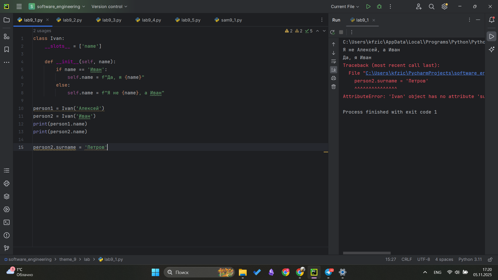
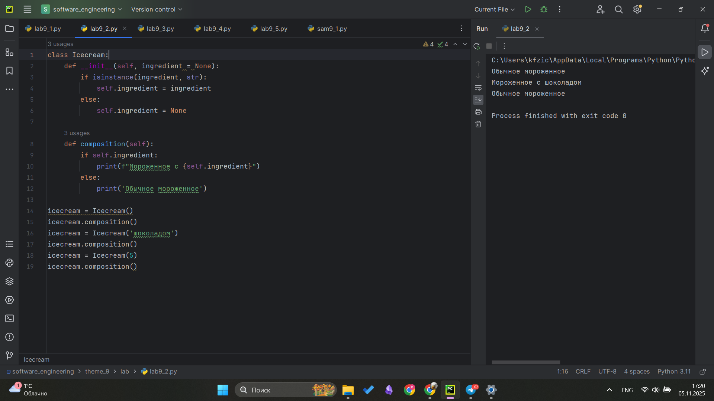
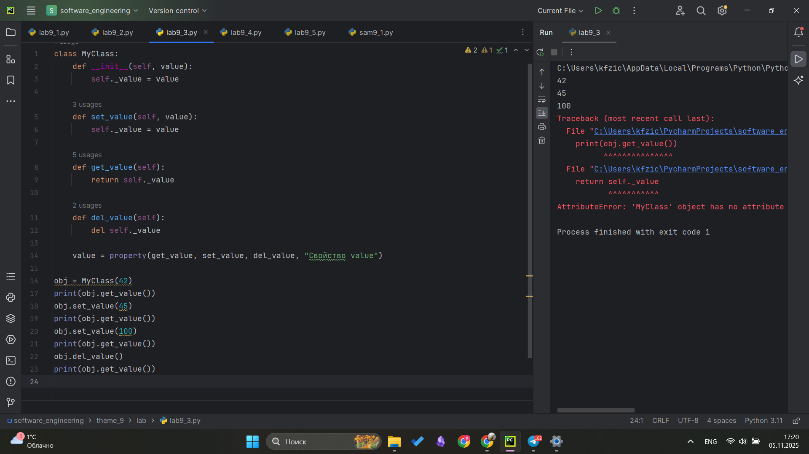
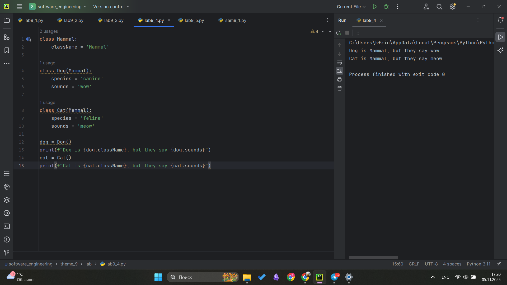
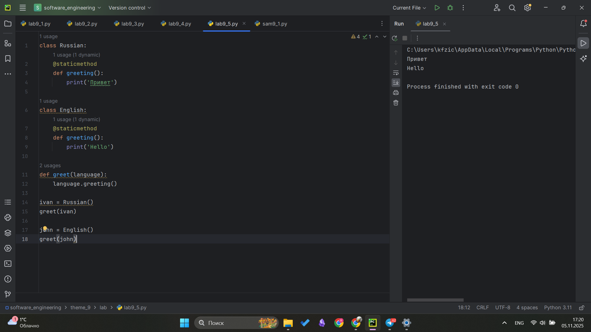
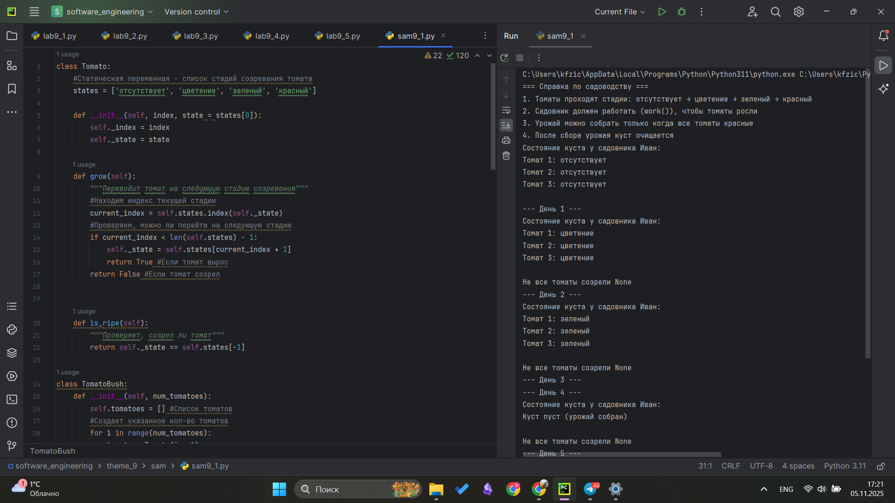
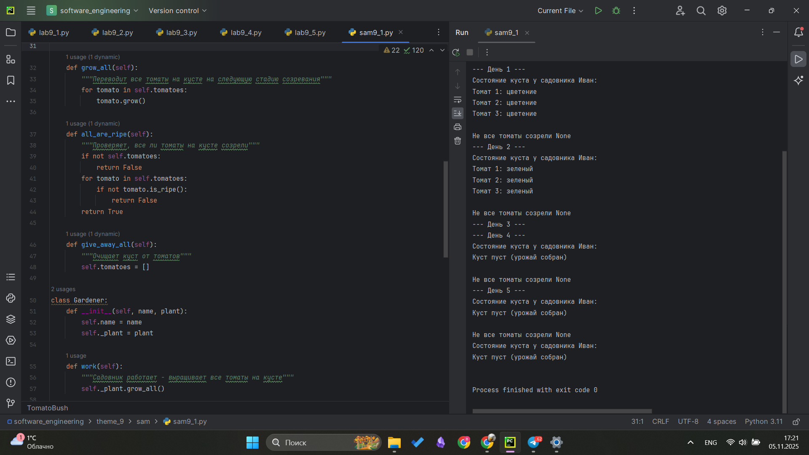
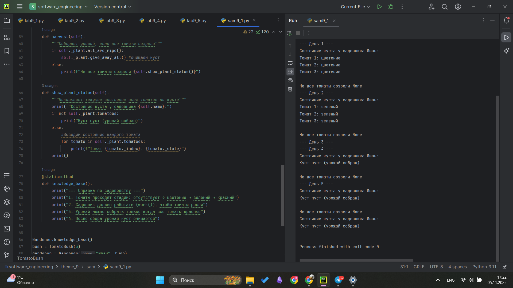

# Тема 9. Концепции и принципы ООП
Отчет по Теме #9 выполнил(а):
- Фомин Владислав Андреевич
- ПИЭ-23-1

| Задание | Лаб_раб | Сам_раб |
| ------ | ------ | ------ |
| Задание 1 | + | + |
| Задание 2 | + |  |
| Задание 3 | + |  |
| Задание 4 | + |  |
| Задание 5 | + |  |


Работу проверили:
- к.э.н., доцент Панов М.А.

## Лабораторная работа №1
### Допустим, что вы решили оригинально и немного странно познакомится с человеком. Для этого у вас должен быть написан свой класс на Python, который будет проверять угадал ваше имя человек или нет. Для этого создайте класс, указав в свойствах только имя. Дальше создайте функцию_init__(), а в ней сделайте проверку на то угадал человек ваше имя или нет. Также можете проверить что будет, если в этой функции указав атрибут, который не указан в вашем классе, например, попробуйте вызвать фамилию.
```python
class Ivan:
    __slots__ = ['name']

    def __init__(self, name):
        if name == 'Иван':
            self.name = f"Да, я {name}"
        else:
            self.name = f"Я не {name}, а Иван"

person1 = Ivan('Алексей')
person2 = Ivan('Иван')
print(person1.name)
print(person2.name)

person2.surname = 'Петров'
```
### Результат.


## Выводы
Изучено строение класса, созданы атрибуты в методе __init__ - служит для инициализации класса, созданы 2 объекта класса, которые проверяютс в классе

## Лабораторная работа №2
### Вам дали важное задание, написать продавцу мороженого программу, которая будет писать добавили ли топпинг в мороженое и цену после возможного изменения. Для этого вам нужно написать класс, в котором будет определяться изменили ли состав мороженого или нет. В этом классе реализуйте метод, выводящий на печать «Мороженое с {ТОППИНГ}» в случае наличия добавки, а иначе отобразится следующая фраза: «Обычное мороженое». При этом программа должна воспринимать как топпинг только атрибуты типа string.
```python
class Icecream:
    def __init__(self, ingredient = None):
        if isinstance(ingredient, str):
            self.ingredient = ingredient
        else:
            self.ingredient = None

    def composition(self):
        if self.ingredient:
            print(f"Мороженное с {self.ingredient}")
        else:
            print('Обычное мороженное')

icecream = Icecream()
icecream.composition()
icecream = Icecream('шоколадом')
icecream.composition()
icecream = Icecream(5)
icecream.composition()
```
### Результат.


## Выводы
Создан класс мороженное который имеет атрибут ингридиенты, который по умолчанию задан как None, в методе __init__ проверяется что объект класса str, если да то инициализируется атрибут. в методе composition если объект инициализирован, выводим атрибут объекта

## Лабораторная работа №3
### Петя – начинающий программист и на занятиях ему сказали реализовать икапсу...что-то. А вы хороший друг Пети и ко всему прочему прекрасно знаете, что икапсу... что-то - это инкапсуляция, поэтому решаете помочь вашему другу с написанием класса с инкапсуляцией. Ваш класс будет не просто инкапсуляцией, а классом с сеттером, геттером и деструктором. После написания класса вам необходимо продемонстрировать что все написанные вами функции работают. Также вас необходимо объяснить Пете почему на скриншоте ниже в консоли выводится ошибка.
```python
class MyClass:
    def __init__(self, value):
        self._value = value

    def set_value(self, value):
        self._value = value

    def get_value(self):
        return self._value

    def del_value(self):
        del self._value

    value = property(get_value, set_value, del_value, "Свойство value")

obj = MyClass(42)
print(obj.get_value())
obj.set_value(45)
print(obj.get_value())
obj.set_value(100)
print(obj.get_value())
obj.del_value()
print(obj.get_value())
```
### Результат.


## Выводы
Написаны: сетер, гетер и деструктор с использованием инкапсуляции

## Лабораторная работа №4
### Вам кошки И собаки являются прекрасно известно, что млекопитающими, но компьютер этого не понимает, поэтому вам нужно написать три класса: Кошки, Собаки, Млекопитающие. И при помощи "наследования" объяснить компьютеру что кошки и собаки это млекопитающие. Также добавьте какой-нибудь свой атрибут для кошек и собак, чтобы показать, что они чем-то отличаются друг от друга.
```python
class Mammal:
    className = 'Mammal'

class Dog(Mammal):
    species = 'canine'
    sounds = 'wow'

class Cat(Mammal):
    species = 'feline'
    sounds = 'meow'

dog = Dog()
print(f"Dog is {dog.className}, but they say {dog.sounds}")
cat = Cat()
print(f"Cat is {cat.className}, but they say {cat.sounds}")
```
### Результат.


## Выводы
Изучено наследование классов

## Лабораторная работа №5
### На разных языках здороваются по-разному, HO суть остается одинаковой, люди друг с другом здороваются. Давайте вместе с вами реализуем программу с полиморфизмом, которая будет описывать всю суть первого предложения задачи. Для этого мы можем выбрать два языка, например, русский и английский и написать для них отдельные классы, в которых будет в виде атрибута слово, которым здороваются на этих языках. А также напишем функцию, которая будет выводить информацию о том, как на этих языках здороваются. Заметьте, что для решения поставленной задачи мы использовали декоратор @staticmethod, поскольку нам не нужны обязательные параметры-ссылки вроде self.
```python
class Russian:
    @staticmethod
    def greeting():
        print('Привет')

class English:
    @staticmethod
    def greeting():
        print('Hello')

def greet(language):
    language.greeting()

ivan = Russian()
greet(ivan)

john = English()
greet(john)
```
### Результат.


## Выводы
Изучены статичекие методы внутри класса и полиморфизм

## Самостоятельная работа №1
### Класс Tomato:
1) Создайте класс Tomato
2) Создайте статическое свойство states, которое будет содержать все стадии созревания помидора
3) Создайте метод __init__(), внутри которого будут определены два динамических свойства: _index (передается параметром) и _state (принимает первое значение из словаря states). После написания этого блока кода в комментарии к нему укажите какими являются эти два свойств
4) Создайте метод grow(), который будет переводить томат на следующую стадию созревания
5) Создайте метод is_ripe(), который будет проверять, что томат созрел

Класс TomatoBush:
1) Создайте класс TomatoBush
2) Определите метод __init__(), который будет принимать в качестве параметра количество томатов и на его основе будет создавать список объектов класса Тоmato. Данный список будет храниться внутри динамического свойства tomatoes
3) Создайте метод grow_all(), который будет переводить все объекты из списка томатов на следующий этап созревания
4) Создайте метод all_are_ripe(), который будет возвращать True, если все томаты из списка стали спелыми.
5) Создайте метод give_away_all(), который будет чистить список томатов после сбора урожая

Класс Gardener:
1) Создайте класс Gardener
2) Создайте метод __init__(), внутри которого будут определены два динамических свойства: name (передается параметром, является публичным) и _plant (принимает объект класса TomatoBush). После написания этого блока кода в комментарии к нему укажите какими являются эти два свойства
3) Создайте метод work(), который заставляет садовника работать, что позволяет растению становиться более зрелым
4) Создайте метод harvest(), который проверяет, все ли плоды созрели. Если все, то садовник собирает урожай. Если нет, то метод печатает предупреждение
5) Создайте статический метод knowledge_base(), который выведет в консоль справку по садоводству

Тесты:
1) Вызовите справку по садоводству
2) Создайте объекты классов TomatoBush и Gardener
3) Используя объект класса Gardener, поухаживайте за кустом с помидорами
4) Попробуйте собрать урожай, когда томаты еще не дозрели. Продолжайте ухаживать за ними
5) Соберите урожай

```python
class Tomato:
    #Статическая переменная - список стадий созревания томата
    states = ['отсутствует', 'цветение', 'зеленый', 'красный']

    def __init__(self, index, state = states[0]):
        self._index = index
        self._state = state

    def grow(self):
        """Переводит томат на следующую стадию созревания"""
        #Находим индекс текущей стадии
        current_index = self.states.index(self._state)
        #Проверяем, можно ли перейти на следующую стадию
        if current_index < len(self.states) - 1:
            self._state = self.states[current_index + 1]
            return True #Если томат вырос
        return False #Если томат созрел


    def is_ripe(self):
        """Проверяет, созрел ли томат"""
        return self._state == self.states[-1]

class TomatoBush:
    def __init__(self, num_tomatoes):
        self.tomatoes = [] #Список томатов
        #Создает указанное кол-во томатов
        for i in range(num_tomatoes):
            tomato = Tomato(i + 1)
            self.tomatoes.append(tomato)

    def grow_all(self):
        """Переводит все томаты на кусте на следующую стадию созревания"""
        for tomato in self.tomatoes:
            tomato.grow()

    def all_are_ripe(self):
        """Проверяет, все ли томаты на кусте созрели"""
        if not self.tomatoes:
            return False
        for tomato in self.tomatoes:
            if not tomato.is_ripe():
                return False
        return True

    def give_away_all(self):
        """Очищает куст от томатов"""
        self.tomatoes = []

class Gardener:
    def __init__(self, name, plant):
        self.name = name
        self._plant = plant

    def work(self):
        """Садовник работает - выращивает все томаты на кусте"""
        self._plant.grow_all()

    def harvest(self):
        """Собирает урожай, если все томаты созрели"""
        if self._plant.all_are_ripe():
            self._plant.give_away_all() #очищаем куст
        else:
            print(f"Не все томаты созрели {self.show_plant_status()}")

    def show_plant_status(self):
        """Показывает текущее состояние всех томатов на кусте"""
        print(f"Состояние куста у садовника {self.name}:")
        if not self._plant.tomatoes:
            print("Куст пуст (урожай собран)")
        else:
            #Выводим состояние каждого томата
            for tomato in self._plant.tomatoes:
                print(f"Томат {tomato._index}: {tomato._state}")
        print()

    @staticmethod
    def knowledge_base():
        print("=== Справка по садоводству ===")
        print("1. Томаты проходят стадии: отсутствует → цветение → зеленый → красный")
        print("2. Садовник должен работать (work()), чтобы томаты росли")
        print("3. Урожай можно собрать только когда все томаты красные")
        print("4. После сбора урожая куст очищается")


Gardener.knowledge_base()
bush = TomatoBush(3)
gardener = Gardener("Иван", bush)
gardener.show_plant_status()

# Цикл выращивания томатов
for day in range(1, 6):
    print(f"--- День {day} ---")
    gardener.work()
    if gardener.harvest():
        break   #если урожай собран - выходим из цикла
gardener.show_plant_status()
```
### Результат.




## Выводы
Применены все полученные знания, объектно ориентированного программирования на python. Все комментарии есть в коде

## Общие выводы по теме
В ходе выполнения работы были изучены основные принципы объектно-ориентированного программирования в Python: инкапсуляция, наследование и полиморфизм. Также освоены практические аспекты создания классов, работы со статическими и динамическими свойствами, использования методов и декораторов. Полученные знания позволили реализовать сложную систему классов для моделирования процесса выращивания томатов.
